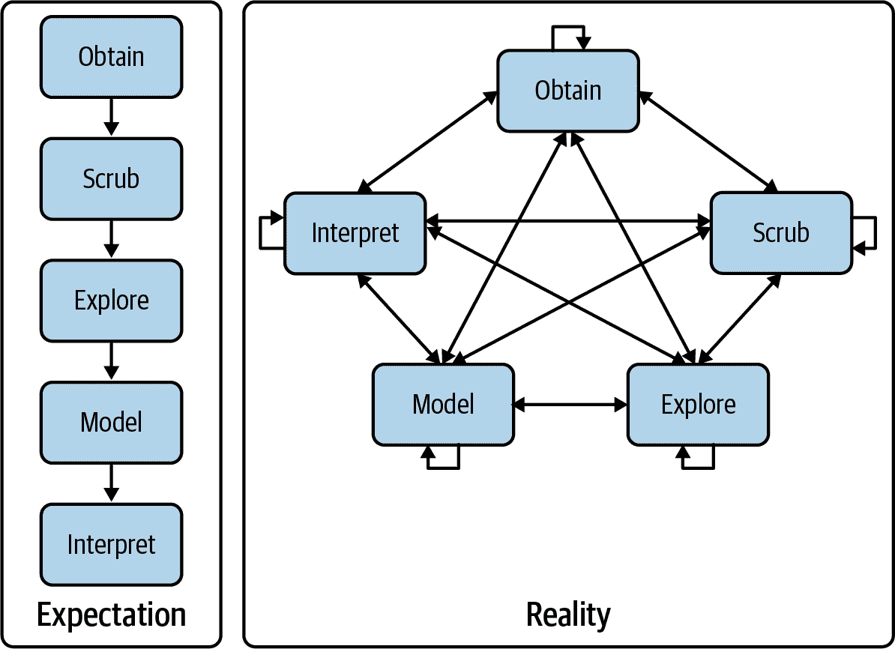
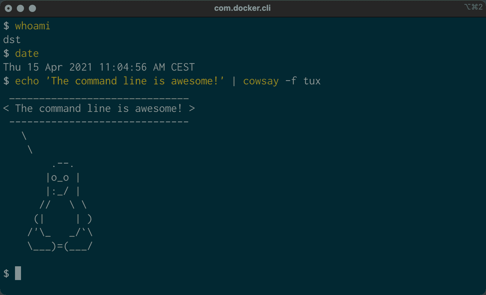
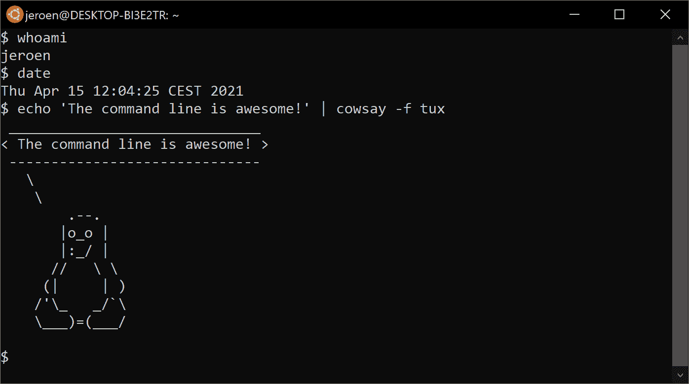

# 1 简介

> 原文：<https://datascienceatthecommandline.com/2e/chapter-1-introduction.html>
> 
> 贡献者：[Ting-xin](https://github.com/Ting-xin)

这本书是关于如何利用命令行做数据科学的。我的目标是通过教你使用命令行的力量，让自己成为一名更高效和多产的数据科学家。

在标题中同时使用的术语*数据科学*和*命令行*需要解释一下，命令行作为一项超过 50 年历史的技术，怎么会对一个只有几年历史的领域有帮助呢？

今天，数据科学家有大量激动人心的技术和编程语言选择，比如 Python、R、Julia 和 Apache Spark 等等，你可能已经有使用过一个或多个这方面技术的经验了。如果是，那你为什么还要在意命令行能在数据科学领域做一些什么呢？命令行是不是有什么东西是其他技术和编程语言所没有的呢？

这些都是真实存在的问题。在第一章，我将如下回答这些问题。首先，我提出了数据科学的实用定义，它将成为本书的指南。其次，我将列出命令行的 5 个优点。在这一章结束时，我希望能够说服你：对于数据科学这个领域来说命令行是值得学习的。

## 1.1 数据科学是 OSEMN

数据科学领域仍处于起步阶段，因此，它包含这各种各样的定义。在本书中，我借用了 [Hilary Mason 和 Chris H. Wiggins](https://datascienceatthecommandline.com/2e/chapter-1-introduction.html#ref-Mason2010) 提出的非常实用的定义，他们按照以下 5 个步骤定义数据科学：（1）获取数据，（2）擦洗数据，（3）探索数据，（4）数据建模，（5）解释数据，这些步骤共同构成了 OSEMN 模型（发音为`awesome`）。这个模型是本书的指南，因为每一步（除了第 5 步，解释数据，我将在下面解释） 都有属于自己的章节。

虽然这五个步骤是以线性和递增的方式讨论的，但实际上这些步骤之间是来回重复执行或多个步骤同时进行的。图 1.1 说明了做数据科学是一个迭代的非线性过程。比如说，假如你对你的数据进行了建模，你看了看结果，你可能会决定回到擦洗数据的步骤，以调整数据集的特征。



图 1.1: 数据科学是一个迭代的非线性过程

接下来我将会解释每一步具体做什么。

### 1.1.1 获取数据

没有数据就没有数据科学。所以我们第一步都是获取数据，除非你足够幸运已经拥有了所有的数据，否则你可能需要执行以下一项或多项操作：

*   从其它地方（例如，网页或服务器）下载数据
*   从数据库或 API（如 MySQL 或 Twitter）中查询数据
*   从另一个文件（例如，HTML 文件或电子表格）中提取数据
*   自己生成的数据（例如，读取传感器或进行调查）

在第三章中，我讨论了几种使用命令行获取数据的方法。获得的数据很可能是纯文本、CSV、JSON、HTML 或 XML 等格式，所以下一步是擦洗这些数据。

### 1.1.2 擦洗数据

获得的数据可能会存在缺失值、数据不一致、错误和奇怪的字符或者有不感兴趣的列等情况。在这些情况下，你必须先*擦洗*数据，然后才能对它做任何有趣的事情。常见的擦洗操作包括：

*   过滤数据
*   提取某些列
*   替换值
*   提取值
*   处理缺失值和重复值
*   将数据从一种格式转换为另一种格式

虽然我们数据科学家都喜欢创建令人兴奋的数据可视化图表和有洞察力的模型（步骤 3 和 4），但我们通常需要先花费大量精力来获取和清理所需的数据（步骤 1 和 2）。在《Data Jujitsu》中， DJ Patil  指出 “ 在任何数据项目中，80%的工作都是在清理数据。”在第五章 ， 我演示了命令行如何帮助擦洗数据的工作。

### 1.1.3 探索数据

清理完数据后，你就可以开始探索它了。这也是数据科学有趣的地方，因为当你在探索时，你将真正的了解你的数据。在第七章中，我们将使用命令行做一下工作：

*   查看你的数据
*   从数据中获取统计数据
*   创建有洞察力的可视化信息

第七章中介绍的命令行工具有：`csvstat`和`rush`。

### 1.1.4 建模数据

如果你想要解释数据或预测将会发生什么，你可能想为你的数据创建一个统计模型。创建模型的技术包括但不限于聚类、分类、回归和降维等。命令行不适合从头开始编程一个新类型的模型。然而，从命令行构建一个模型是非常有用的。在第九章中，我将介绍几个命令行工具，它们要么在本地构建模型，要么使用 API 在云中执行计算。

### 1.1.5 解释数据

OSEMN 模式中最后也可能是最重要的一步就是解释数据，这一步骤包括：

*   从你的数据中得出结论
*   求值你的结果意味着什么
*   沟通你的结果

说实话，电脑在这一步的用处不大，同样命令行在这个阶段也没有什么作用。一旦你走到这一步，一切就取决于你了。这也是是 OSEMN 模型中唯一没有自己章节的步骤。取而代之的是，我向你推荐 Max Shron 的[《Thinking with Data》](https://datascienceatthecommandline.com/2e/chapter-1-introduction.html#ref-Shron2014)这本书。

## 1.2 其它章节

除了涵盖 OSEMN 步骤的章节外，还有四个其它的章节。它们每一篇都讨论了一个关于数据科学的常见的主题，以及如何使用命令行来实现这个目标。这些主题适用于数据科学过程中的任何步骤。

在第四章中，我们将讨论如何为命令行创建可重用的工具。这些工具既可以来自于你在命令行上输入的长命令，也可以来自于你用 Python 或 r 编写的现有代码。创建属于自己的工具会让你变得更加高效和多产。

由于命令行是一个进行数据科学的交互式环境，因此要跟踪你的工作流程可能会变得很有挑战性。 在第六章中，我演示了一个叫做 make 的命令行工具，它允许你用任务和任务之间的依赖关系来定义你数据科学的工作流。这个工具可以提高你工作流程的可重复性，不仅对你，对你的同事和同行也是如此。

在第八章，我解释了如何通过并行运行来加快你的命令行和工具的速度。使用一个叫做 GNU Parallel7 的命令行工具，你可以将命令行工具应用于非常大的数据集，并在多个核心甚至是远程机器上运行它们。

在第十章，我们将讨论如何在其他环境和编程语言中使用命令行的强大功能，比如 R、RStudio、Python、Jupyter Notebooks，甚至是 Apache Spark。

## 1.3 什么是命令行？

在讨论“为什么你应该将命令行用于数据科学”之前，让我们先来看看“命令行实际上是什么样子”（你可能已经很熟悉了）。图 1.2 和图 1.3 分别显示了 macOS 和 Ubuntu 上默认出现的命令行工具的屏幕截图。Ubuntu 是 GNU/Linux 的一个特殊发行版，也是我在本书中要使用的一个版本。



 图 1.2：maxOS 上的命令行工具



图 1.3：Ubuntu 上的命令行工具

两张截图中显示的窗口称为*终端*。这是使你能够与 shell 进行交互的程序。执行我输入的命令的就是 shell。在第二章中，我会更详细地解释这两个术语。

我没有展示 MicrosoftWindows 的终端（它被叫做命令提示符或 PowerShell），因为它与本书介绍的命令有本质的不同，它们之间不兼容。好消息是，你可以在 Microsoft 上安装一个 Docker 镜像，这样你就能跟着做了。如何安装 Docker 镜像将在第二章讲解。

与通过图形用户界面 （GUI）相比，输入命令是一种非常不同的与计算机交互的方式。如果你通常习惯于在 Microsoft Excel 中处理数据，那么这种方法一开始可能看起来有些吓人。不要害怕。相信我，你会很快习惯在命令行上工作。

在本书中，我所输入的命令和它们所产生的输出都以文本形式显示。例如，两张截图中终端的内容会是这样的。：

```sh
$ whoami
dst

$ date
Thu Mar  3 10:38:33 AM CET 2022

$ echo 'The command line is awesome!' | cowsay -f tux
 ______________________________
< The command line is awesome! >
 ------------------------------
   \
    \
        .--.
       |o_o |
       |:_/ |
      //   \ \
     （|     | ）
    /'\_   _/`\
    \___）=（___/

$
```

你还会注意到每个命令前面都有一个美元符号（`$`），这个就是一个提示符。这两张截图中显示了很多信息：用户名、日期和一只企鹅。在示例中显示美元符号是一种惯例，提示符有以下特点：（1）在会话中会改变（当你进入不同的目录），（2）可以由用户定制（例如，它还可以显示时间或你正在处理的当前`git`分支），（3）与命令本身无关。

在下一章，我将更多地解释基本的命令行概念。现在是时候首先解释一下“为什么你应该学习使用命令行进行数据科学研究”了。

## 1.4 为什么在命令行中进行数据科学？

命令行有许多巨大的优势，它可以使你真正成为一个更有效率和生产力的数据科学家。粗略地对这些优势进行分组，命令行是：灵活的、不断增强的、可重复的、可扩展的和无处不在的。下面我将对每个优势进行阐述。

### 1.4.1 灵活的命令行

命令行的第一个优点是用起来灵活。数据科学具有很强的交互性和探索性，你的工作环境需要考虑到这一点，命令行通过两种方式实现这一点。

首先，命令行提供了一个所谓的*读取-求值-打印循环*（REPL，交互式解释器）。这意味着当你输入命令，按下`Enter`，命令就会立即被执行。与脚本、大型程序和 Hadoop 作业相关的编辑-编译-运行-调试周期相比，REPL 通常更便于进行数据科学研究。你的命令是立即执行的，可以随意停止，可以快速更改。这个短的迭代周期可以真正的让你玩转你的数据。

第二，命令行可以很方便的操作文件系统。因为数据是数据科学的主要组成部分，所以能够轻松地处理包含你的数据集的文件是很重要的。命令行为此提供了许多方便的工具。

### 1.4.2 命令行正在不断增强

命令行与其他技术集成得很好。无论目前你现在的数据科学工作流包含什么技术（无论是 R、Python 还是 Excel），请知道我并不是建议你放弃该工作流。 相反，把命令行看作是一种辅助的技术，它可以增强你目前正在使用的技术的功能，主要通过以下三种方式：

首先，命令行可以充当许多不同数据科学工具之间的粘合剂。粘合工具的一种方法是将第一个工具的输出连接到第二个工具的输入。在第二章中，我解释了这是如何工作的。

其次，你通常可以从自己的环境中将任务委派给命令行。例如，Python、R 和 Apache Spark 允许你运行命令行工具并捕获它们的输出。我在第十章中用例子证明了这一点。

第三，你可以将你的代码（例如，Python 或 R 脚本）转换成可重用的命令行工具。这样，用什么语言写就不再重要了。现在，可以从命令行直接使用它，或者从前面提到的与命令行集成的任何环境中使用它。我在第四章.中解释了如何做到这一点。

最后，每种技术都有其优势和劣势，多了解几种技术并使用最适合手头任务的技术才是正道。有时这应该使用 R，有时是命令行，有时甚至是笔和纸。到本书结束时，你将对何时应该使用命令行、何时继续使用你最喜欢的编程语言或统计计算的环境有一个基本的理解。

### 1.4.3 可重复的命令行

正如我以前说过的，在命令行上工作与使用 GUI 有很大的不同。在命令行上，你通过输入来做事情，而在 GUI 上，你通过点击鼠标来做事情。

你在命令行上手动输入的所有内容也可以通过脚本和工具实现自动化。很多时候我们需要重新运行自己的命令行，比如我犯了一个错误、输入数据变了或者我的同事想要进行同样的分析，通过自动化脚本或者工具我们可以很容易的重新运行我们曾经输入的内容。此外，你的命令可以以一个特定的时间间隔运行，在远程服务器上运行，并在许多数据块上并行运行（更多信息请参见第八章）。

因为命令行是自动化的，所以它变得可伸缩和可重复。但是自动化 GUI 中的指向和点击并不简单，这使得 GUI 成为一个不太适合做可扩展和可重复的数据科学的环境。

### 1.4.4 可扩展的命令行

命令行本身是 50 多年前发明的，但是它的核心功能基本保持不变，但是它的*工具*，命令行的主力，每天都在被开发。

命令行本身是语言无关的，这允许用许多不同的编程语言来编写命令行工具。开源社区正在开发许多免费的高质量命令行工具，我们可以将它们用于数据科学。

这些命令行工具可以一起工作，这使得命令行非常灵活。你还可以创建自己的工具，让你扩展命令行的有效功能。

### 1.4.5 命令行无处不在

因为命令行是任何类 Unix 的操作系统自带的，包括 Ubuntu Linux 和 macOS，所以在很多地方都可以找到。另外，排名前 500 的超级计算机 100%都运行 Linux。因此，如果你曾经经手过一台超级计算机（或者如果你曾经发现自己在侏罗纪公园里门锁坏了），你最好知道如何使用命令行！

但是 Linux 不仅仅运行在超级计算机上。它也可以在服务器、笔记本电脑和嵌入式系统上运行。如今，许多公司都提供云计算，你可以很容易地在网络上启动新机器。如果你曾经登录过这样的机器（或一般的服务器），几乎可以肯定的是你将碰到命令行。

值得注意的是，命令行并不只是一种炒作。这项技术已经存在了五十多年，而且我相信它还会继续存在五十年。因此，学习如何使用命令行（对于数据科学和平时使用而言）是一项值得的投资。

## 1.5 总结

在这一章中，我向你介绍了做数据科学的 OSEMN 模型，并且我把它作为本书的指南。同时我也提供了一些关于 Unix 命令行的背景知识，希望能让你相信这是一个适合从事数据科学的环境。在下一章，我将向你展示如何开始安装数据集和工具，并解释它们的基本概念。

## 1.6 探索参考

*   Brian W. Kernighan 所著的《UNIX: A History and a Memoir》讲述了 UNIX 的故事，解释了它是什么，它是如何开发的，以及它为什么重要
*   2018 年，我在 Strata London 做了一个题为《50 个学习 Shell 做数据科学的理由》的演讲。如果你需要更多的说服力，你可以看看它的[幻灯片](https://datascienceatthecommandline.com/resources/50-reasons.pdf)。
*   由 Max Shron 撰写的《Thinking with Data》一书简短而温馨，它关注的是 "为什么 "而不是 "怎么做"，并提供了一个定义数据科学项目的框架，这将帮助你提出正确的问题并正确的解决问题。
