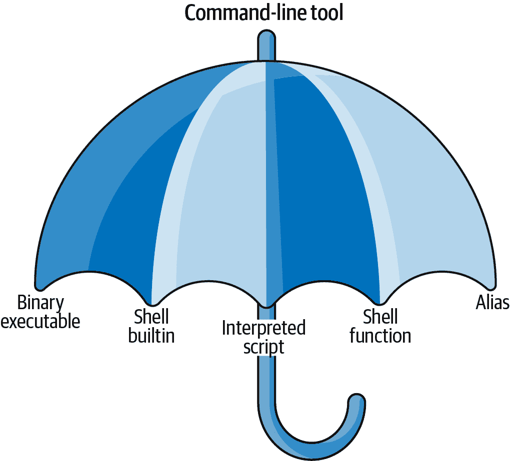
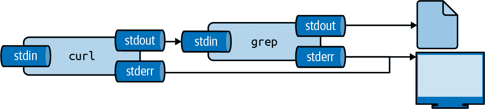
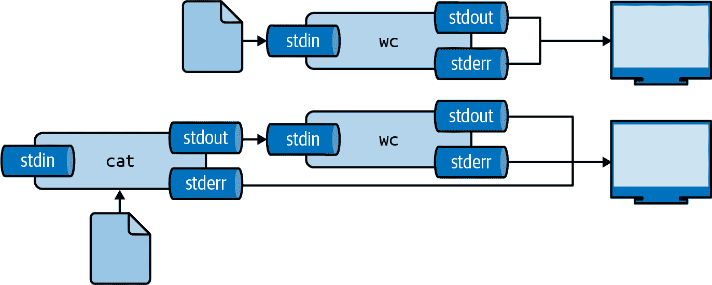

# 2 开始使用

> 原文：<https://datascienceatthecommandline.com/2e/chapter-2-getting-started.html>

在这一章中，我将确保你具备在命令行中进行数据科学研究的所有先决条件。先决条件分为三个部分:(1)拥有我在本书中使用的相同数据集，(2)拥有一个包含我在本书中使用的所有命令行工具的适当环境，以及(3)理解在使用命令行时发挥作用的基本概念。

首先，我描述了如何下载数据集。其次，我解释了如何安装 Docker 镜像，这是一个基于 Ubuntu Linux 的虚拟环境，包含所有必要的命令行工具。随后，我通过例子回顾了基本的 Unix 概念。

在本章结束时，你将拥有继续进行数据科学的第一步，即获取数据所需的一切。

## 2.1 获取数据

我在本书中使用的数据集可以如下下载:

1.  从[https://www.datascienceatthecommandline.com/2e/data.zip](https://www.datascienceatthecommandline.com/2e/data.zip)下载 ZIP 文件。
2.  创建一个新目录。您可以给这个目录起任何您想要的名字，但是我建议您坚持使用小写字母、数字，可能还有连字符或下划线，以便更容易在命令行中使用。比如: *dsatcl2e-data* 。记住这个目录在哪里。
3.  将 ZIP 文件移动到新的目录中，并将其解压缩。
4.  这个目录现在每章包含一个子目录。

在下一节中，我将解释如何安装包含处理这些数据的所有命令行工具的环境。

## 2.2 安装 Docker 镜像

在本书中，我们使用了许多不同的命令行工具。Unix 通常预装了许多命令行工具，并提供了许多包含更多相关工具的包。自己安装这些包通常不会太难。然而，我们也将使用软件包中没有的工具，这些工具需要更多的手动操作和更复杂的安装。为了获得必要的命令行工具而不必经历每个工具的安装过程，我鼓励您，无论您是在 Windows、macOS 还是 Linux 上，安装专门为本书创建的 Docker 映像。

Docker 映像是一个或多个应用程序及其所有依赖项的捆绑包。Docker 容器是一个运行映像的隔离环境。您可以使用`docker`命令行工具(这是您下面要做的)或 Docker GUI 来管理 Docker 图像和容器。在某种程度上，Docker 容器就像一个虚拟机，只是 Docker 容器使用的资源要少得多。在本章的最后，我推荐了一些资源来学习更多关于 Docker 的知识。

If you still prefer to run the command-line tools natively rather than inside a Docker container, then you can, of course, install the command-line tools individually yourself. Please be aware that this is a very time-consuming process. The Appendix lists all the command-line tools used in the book. The installation instructions are for Ubuntu only. The scripts and data sets used in the book can be obtained by cloning this book’s [GitHub repository](https://github.com/datasciencetoolbox/datasciencetoolbox).

要安装 Docker 镜像，首先需要从[Docker 网站](https://www.docker.com/products/docker)下载并安装 Docker 本身。安装 Docker 后，您可以在终端或命令提示符下调用以下命令来下载 Docker 映像(不要键入美元符号):

```sh
$ docker pull datasciencetoolbox/dsatcl2e
```

您可以运行 Docker 映像，如下所示:

```sh
$ docker run --rm -it datasciencetoolbox/dsatcl2e
```

您现在处于一个隔离的环境中——称为 *Docker 容器*——安装了所有必要的命令行工具。如果下面的命令产生了一头热情的母牛，那么您知道一切都正常工作:

```sh
$ cowsay "Let's moove\!"
 ______________
< Let's moove! >
 --------------
        \   ^__^
         \  (oo)\_______
            (__)\       )\/\
                ||----w |
                ||     ||
```

如果您想在容器中进出数据，可以添加一个卷，这意味着本地目录被映射到容器内的一个目录。我建议您首先创建一个新目录，导航到这个新目录，然后在 macOS 或 Linux 上运行以下命令:

```sh
$ docker run --rm -it -v "$(pwd)":/data datasciencetoolbox/dsatcl2e
```

或者在 Windows 上使用命令提示符(也称为`cmd`)时出现以下情况:

```sh
C:\> docker run --rm -it -v "%cd%":/data datasciencetoolbox/dsatcl2e
```

或者当您使用 Windows PowerShell 时出现以下情况:

```sh
PS C:\> docker run --rm -it -v ${PWD}:/data datasciencetoolbox/dsatcl2e
```

在上面的命令中，选项`-v`指示`docker`将当前目录映射到容器内的*/数据*目录，因此这是将数据进出 Docker 容器的地方。

If you would like to know more about the Docker image you can [visit it on Docker Hub](https://hub.docker.com/r/datasciencetoolbox/dsatcl2e).

完成后，您可以通过键入`exit`关闭 Docker 容器。

## 2.3 基本的 Unix 概念

在[第 1 章](chapter-1-introduction.html#chapter-1-introduction)中，我简单给大家展示了命令行是什么。现在您正在运行 Docker 映像，我们可以真正开始了。在这一节中，我将讨论几个概念和工具，您需要了解这些概念和工具，以便在命令行中轻松地进行数据科学研究。如果到目前为止，您一直主要使用图形用户界面，那么这可能是一个相当大的变化。但是不要担心，我会从头开始，然后逐渐进入更高级的主题。

This section is not a complete course in Unix. I will only explain the concepts and tools that are relevant for to doing data science. One of the advantages of the Docker image is that a lot is already set up. If you wish to know more, consult the Further Reading Section at the end of this chapter.

### 2.3.1 环境

所以你刚刚进入了一个全新的环境。在做任何事情之前，有必要对这个环境有一个高层次的了解。大致定义为四层，我从上到下简单讨论一下。

Command-line tools

首先，也是最重要的，是您使用的命令行工具。我们通过键入相应的命令来使用它们。有不同类型的命令行工具，我将在下一节讨论。工具的例子有:`ls`  ，`cat`，`jq`。

Terminal

终端是第二层，是我们输入命令的应用程序。如果你看到书中提到的以下文字:

```sh
$ seq 3
1
2
3
```

然后你可以在你的终端上输入`seq 3`，按下 **`Enter`** 。(命令行工具`seq`  ，可以看到，生成了一个数字序列。)不要输入美元符号。它只是告诉你这是一个你可以在终端输入的命令。这个美元符号被称为提示。`seq 3`下面的文本是命令的输出。

Shell

第三层是外壳。一旦我们输入命令并按下 **`Enter`** ，终端就将命令发送给 shell。 *shell* 是一个解释命令的程序。我使用 Z shell，但是还有许多其他可用的 shell，比如 Bash 和 Fish。

Operating system

第四层是操作系统，在我们的例子中是 GNU/Linux。Linux 是内核的名字，内核是操作系统的心脏。内核与 CPU、磁盘和其他硬件直接接触。内核还执行我们的命令行工具。GNU，代表 GNU 的非 UNIX，指的是基本工具的集合。Docker 镜像基于一个名为 Ubuntu 的特定 GNU/Linux 发行版。

### 2.3.2 执行命令行工具

现在您已经对环境有了基本的了解，是时候尝试一些命令了。在您的终端中键入以下内容(不带美元符号)，然后按 **`Enter`** :

```sh
$ pwd
/home/dst
```

您刚刚执行了一个包含单个命令行工具的命令。工具`pwd`  输出你当前所在目录的名称。默认情况下，当您登录时，这是您的主目录。

Z shell 内置的命令行工具`cd`允许您导航到不同的目录:

```sh
$ cd /data/ch02 ➊

$ pwd ➋
/data/ch02

$ cd .. ➌

$ pwd ➍
/data

$ cd ch02 ➎
```

➊ 导航到目录 */data/ch02* 。
t5】➋打印当前目录。
➌ 导航到父目录。
➍ 再次打印当前目录。
➎ 导航到子目录 *ch02* 。

`cd`之后的部分指定您想要导航到哪个目录。命令后面的值被称为*命令行参数*或*选项*。两个点表示父目录。顺便说一下，一个点指的是当前目录。虽然`cd .`不会有任何影响，但你仍然会看到一个点被用在其他地方。让我们尝试一个不同的命令:

```sh
$ head -n 3 movies.txt
Matrix
Star Wars
Home Alone
```

这里我们将三个命令行参数传递给`head`  。第一个是选项。这里我使用了短选项`-n`。有时一个空头期权有一个多头期权，在这个例子中就是`--lines`。第二个是属于选项的值。第三个是文件名。这个特定的命令输出文件 */data/ch02/movies.txt* 的前三行。

### 2.3.3 五种命令行工具

我经常使用术语*命令行工具*，但是到目前为止，我还没有解释它的真正含义。我将它作为一个总括术语，用于描述任何可以从命令行执行的*(见图 [2.1](chapter-2-getting-started.html#fig:umbrella) )。实际上，每个命令行工具都是以下五种类型之一:*

 **   二进制可执行文件
*   内置的外壳
*   经过翻译的剧本
*   外壳函数
*   化名



图 2.1:我将术语命令行工具作为一个总括术语使用 

知道类型之间的区别是很好的。Docker 映像预安装的命令行工具主要包括前两种类型(二进制可执行文件和 shell 内置文件)。其他三种类型(解释脚本、shell 函数和别名)允许我们进一步构建我们的数据科学工具箱，并成为更高效、更高产的数据科学家。

Binary Executable

二进制可执行文件是传统意义上的程序。二进制可执行文件是通过将源代码编译成机器码来创建的。这意味着当您在文本编辑器中打开文件时，您无法阅读它。

Shell Builtin

Shell 内置是 shell 提供的命令行工具，在我们的例子中是 Z shell(或`zsh`)。例子包括`cd`和`pwd`。不同外壳的外壳内置可能不同。像二进制可执行文件一样，它们不容易检查或更改。

Interpreted Script

解释脚本是由二进制可执行文件执行的文本文件。例子包括:Python、R 和 Bash 脚本。解释脚本的一个很大的优点是你可以阅读和修改它。下面的脚本被 Python 解释不是因为文件扩展名*。py* ，但是因为脚本的第一行定义了应该执行它的二进制。

```sh
$ bat fac.py
───────┬──────────────────────────────────────────────────────────────
       │ File: fac.py
───────┼──────────────────────────────────────────────────────────────
   1   │ #!/usr/bin/env python
   2   │
   3   │ def factorial(x):
   4   │     result = 1
   5   │     for i in range(2, x + 1):
   6   │         result *= i
   7   │     return result
   8   │
   9   │ if __name__ == "__main__":
  10   │     import sys
  11   │     x = int(sys.argv[1])
  12   │     sys.stdout.write(f"{factorial(x)}\n")
───────┴──────────────────────────────────────────────────────────────
```

这个脚本计算我们作为参数传递的整数的阶乘。可以从命令行调用它，如下所示:

```sh
$ ./fac.py 5
120
```

在第 4 章中，我将详细讨论如何使用解释脚本创建可重用的命令行工具。

Shell Function

在我们的例子中，shell 函数是由`zsh`执行的函数。它们提供了与脚本相似的功能，但是它们通常(但不一定)比脚本小。他们也更倾向于个人化。下面的命令定义了一个名为`fac`的函数，就像上面解释的 Python 脚本一样，它计算我们作为参数传递的整数的阶乘。它通过使用`seq`生成一个数字列表，使用`paste`  将这些数字放在一行中作为分隔符，并将该等式传递给`bc`，后者对其求值并输出结果。

```sh
$ fac() { (echo 1; seq $1) | paste -s -d\* - | bc; }

$ fac 5
120
```

文件 *~/。zshrc* ，它是 Z shell 的配置文件，是定义 shell 函数的好地方，这样它们总是可用的。

Alias

别名就像宏。如果您经常发现自己使用相同的参数(或部分参数)执行某个命令，您可以为它定义一个别名以节省时间。当你继续拼错某个命令时，别名也非常有用(克里斯·维金斯维护了一个[有用的别名列表](https://github.com/chrishwiggins/mise/blob/master/sh/aliases-public.sh))。以下命令定义了这样一个别名:

```sh
$ alias l='ls --color -lhF --group-directories-first'

$ alias les=less
```

现在，如果您在命令行上键入以下内容，shell 将用它的值替换它找到的每个别名:

```sh
$ cd /data

$ l
total 40K
drwxr-xr-x 2 dst dst 4.0K Mar  3 10:38 ch02/
drwxr-xr-x 2 dst dst 4.0K Mar  3 10:38 ch03/
drwxr-xr-x 3 dst dst 4.0K Mar  3 10:38 ch04/
drwxr-xr-x 2 dst dst 4.0K Mar  3 10:38 ch05/
drwxr-xr-x 2 dst dst 4.0K Mar  3 10:38 ch06/
drwxr-xr-x 2 dst dst 4.0K Mar  3 10:38 ch07/
drwxr-xr-x 2 dst dst 4.0K Mar  3 10:38 ch08/
drwxr-xr-x 2 dst dst 4.0K Mar  3 10:38 ch09/
drwxr-xr-x 4 dst dst 4.0K Mar  3 10:38 ch10/
drwxr-xr-x 3 dst dst 4.0K Mar  3 10:38 csvconf/

$ cd ch02
```

别名比 shell 函数简单，因为它们不允许参数。由于参数的原因，无法使用别名定义函数`fac`。尽管如此，别名可以让你节省大量的击键次数。像 shell 函数一样，别名通常在文件*中定义。zshrc* ，位于你的主目录下。要查看当前定义的所有别名，可以不带参数地运行`alias`。试试看。你看到了什么？

在本书中，我将主要关注最后三种类型的命令行工具:解释脚本、shell 函数和别名。这是因为这些很容易改变。命令行工具的目的是使您的生活更加轻松，并使您成为更有生产力和效率的数据科学家。您可以通过`type`找到命令行工具的类型(它本身是一个 shell 内置的):

```sh
$ type -a pwd
pwd is a shell builtin
pwd is /usr/bin/pwd
pwd is /bin/pwd

$ type -a cd
cd is a shell builtin

$ type -a fac
fac is a shell function

$ type -a l
l is an alias for ls --color -lhF --group-directories-first
```

`type`为`pwd`返回三个命令行工具。在这种情况下，当您键入`pwd`时，将使用第一个报告的命令行工具。在下一节中，我们将看看如何组合命令行工具。*  *### 2.3.4 组合命令行工具

因为大多数命令行工具遵循 Unix 哲学  ，它们被设计成只做一件事，而且做得很好。例如，命令行工具`grep`可以过滤线条，`wc`可以统计线条，`sort`可以对线条进行排序。命令行的强大之处在于它能够组合这些小而强大的命令行工具。

通过管理这些工具的通信流，这种能力成为可能。每个工具都有三个标准的通信流:标准输入、标准输出和标准错误。这些往往缩写为*`stdin`**`stdout`**`stderr`*。

默认情况下，标准输出和标准错误都被重定向到终端，因此正常输出和任何错误消息都显示在屏幕上。图 [2.2](chapter-2-getting-started.html#fig:diagram-essential-streams) 对`pwd`和`rev`都进行了说明。如果你运行`rev`，你会发现什么都没发生。这是因为`rev`期望输入，默认情况下，是键盘上的任何按键。试着键入一个句子，然后按下 **`Enter`** 。`rev`立即以相反的方式回应您的输入。按下 **`Ctrl-D`** 可以停止发送输入，之后`rev`将停止。


图 2.2:每个工具都有三个标准流:标准输入( *`stdin`* )、标准输出( *`stdout`* )、标准误差( *`stderr`* ) 

实际上，您不会使用键盘作为输入源，而是使用其他工具生成的输出和文件内容。例如，用`curl`我们可以下载 Lewis Carrol 的书*爱丽丝漫游奇境记*，然后用*管道*到下一个工具。(我会在第三章的[中更详细地讨论`curl`。)这是使用管道操作符(`|`)完成的。](chapter-3-obtaining-data.html#chapter-3-obtaining-data)


图 2.3:一个工具的输出可以通过管道传输到另一个工具 

我们可以通过*管道*将`curl`的输出传输到`grep`来过滤图案上的线条。假设我们希望看到目录中列出的章节；我们可以将`curl`和`grep`组合如下:

```sh
$ curl -s "https://www.gutenberg.org/files/11/11-0.txt" | grep " CHAPTER"
 CHAPTER I.     Down the Rabbit-Hole
 CHAPTER II.    The Pool of Tears
 CHAPTER III.   A Caucus-Race and a Long Tale
 CHAPTER IV.    The Rabbit Sends in a Little Bill
 CHAPTER V.     Advice from a Caterpillar
 CHAPTER VI.    Pig and Pepper
 CHAPTER VII.   A Mad Tea-Party
 CHAPTER VIII.  The Queen’s Croquet-Ground
 CHAPTER IX.    The Mock Turtle’s Story
 CHAPTER X.     The Lobster Quadrille
 CHAPTER XI.    Who Stole the Tarts?
 CHAPTER XII.   Alice’s Evidence
```

如果我们想知道*这本书有多少*章节，我们可以使用`wc`，它非常擅长计数:

```sh
$ curl -s "https://www.gutenberg.org/files/11/11-0.txt" |
> grep " CHAPTER" |
> wc -l ➊
12
```

➊ 选项`-l`指定`wc`应该只输出传递给它的行数。默认情况下，它还返回字符数和字数。

您可以将管道视为自动复制和粘贴。一旦您掌握了使用管道操作符组合工具的诀窍，您会发现这实际上是没有限制的。

### 2.3.5 重定向输入和输出

除了将输出从一个工具传输到另一个工具，您还可以将其保存到文件中。该文件将被保存在当前目录下，除非给出了完整的路径。这被称为*输出重定向*，工作原理如下:

```sh
$ curl "https://www.gutenberg.org/files/11/11-0.txt" | grep " CHAPTER" > chapter
s.txt
  % Total    % Received % Xferd  Average Speed   Time    Time     Time  Current
                                 Dload  Upload   Total   Spent    Left  Speed
100  170k  100  170k    0     0   183k      0 --:--:-- --:--:-- --:--:--  184k

$ cat chapters.txt
 CHAPTER I.     Down the Rabbit-Hole
 CHAPTER II.    The Pool of Tears
 CHAPTER III.   A Caucus-Race and a Long Tale
 CHAPTER IV.    The Rabbit Sends in a Little Bill
 CHAPTER V.     Advice from a Caterpillar
 CHAPTER VI.    Pig and Pepper
 CHAPTER VII.   A Mad Tea-Party
 CHAPTER VIII.  The Queen’s Croquet-Ground
 CHAPTER IX.    The Mock Turtle’s Story
 CHAPTER X.     The Lobster Quadrille
 CHAPTER XI.    Who Stole the Tarts?
 CHAPTER XII.   Alice’s Evidence
```

这里，我们将`grep`的输出保存到 */data/ch02* 目录下的一个名为 *chapters.txt* 的文件中。如果该文件尚不存在，将会创建它。如果该文件已经存在，其内容将被覆盖。图 [2.4](chapter-2-getting-started.html#fig:diagram-essential-redirect-stdout) 从概念上说明了输出重定向的工作原理。请注意，标准错误仍然被重定向到终端。



图 2.4:工具的输出可以重定向到一个文件 

您还可以使用`>>`将输出附加到文件中，这意味着输出被添加到原始内容之后:

```sh
$ echo -n "Hello" > greeting.txt

$ echo " World" >> greeting.txt
```

工具`echo`输出您指定的值。代表*换行符*的`-n`选项指定`echo`不应该输出尾随换行符。

如果您需要存储中间结果，将输出保存到文件中是非常有用的，例如在以后的阶段继续分析。要再次使用文件 *greeting.txt* 的内容，我们可以使用`cat`，它读取一个文件并打印它。

```sh
$ cat greeting.txt
Hello World

$ cat greeting.txt | wc -w ➊
2
```

➊`-w`选项表示`wc`只统计字数。

使用小于号(`<`)可以获得相同的结果:

```sh
$ < greeting.txt wc -w
2
```

通过这种方式，您可以直接将文件传递到标准输入端`wc`，而无需运行额外的进程  。图 [2.5](chapter-2-getting-started.html#fig:diagram-essential-stdin-cat) 说明了这两种方式的工作原理。同样，最终输出是相同的。



图 2.5:使用文件内容作为输入的两种方式 

像许多命令行工具一样，`wc`允许将一个或多个文件名指定为参数。例如:

```sh
$ wc -w greeting.txt movies.txt
 2 greeting.txt
11 movies.txt
13 total
```

注意，在这种情况下，`wc`也输出文件的名称。

您可以通过将任何工具的输出重定向到一个名为 */dev/null* 的特殊文件来抑制它。我经常这样做来抑制错误消息(参见图 [2.6](chapter-2-getting-started.html#fig:diagram-essential-redirect-devnull) 中的图解)。由于找不到文件 *404.txt* ，以下原因导致`cat`产生错误信息:

```sh
$ cat movies.txt 404.txt
Matrix
Star Wars
Home Alone
Indiana Jones
Back to the Future
/usr/bin/cat: 404.txt: No such file or directory
```

您可以将标准错误重定向到 */dev/null* ，如下所示:

```sh
$ cat movies.txt 404.txt 2> /dev/null ➊
Matrix
Star Wars
Home Alone
Indiana Jones
Back to the Future
```

➊*`2`*指标准误差。


图 2.6:将 *`stderr`* 重定向到 */dev/null* 

注意不要读写同一个文件。如果你这样做，你会得到一个空文件。这是因为输出被重定向的工具会立即打开该文件进行写入，从而清空它。对此有两种解决方法:(1)写入不同的文件，然后用`mv`重命名，或者(2)使用`sponge`  ，在写入文件之前吸收所有输入。图 [2.7](chapter-2-getting-started.html#fig:diagram-essential-sponge) 说明了其工作原理。


图 2.7:除非您使用`sponge`，否则您不能在一个管道中读取和写入同一个文件 

例如，假设您已经使用`dseq`  生成了一个文件 *dates.txt* ，现在您想使用`nl`添加行号。如果运行下面的代码，文件 *dates.txt* 将会是空的。

```sh
$ dseq 5 > dates.txt

$ < dates.txt nl > dates.txt

$ bat dates.txt
───────┬────────────────────────────────────────────────────────────────────────
       │ File: dates.txt   <EMPTY>
───────┴────────────────────────────────────────────────────────────────────────
```

相反，您可以使用我刚刚描述的解决方法之一:

```sh
$ dseq 5 > dates.txt 
$ < dates.txt nl > dates-nl.txt

$ bat dates-nl.txt
───────┬────────────────────────────────────────────────────────────────────────
       │ File: dates-nl.txt
───────┼────────────────────────────────────────────────────────────────────────
   1   │      1  2022-03-04
   2   │      2  2022-03-05
   3   │      3  2022-03-06
   4   │      4  2022-03-07
   5   │      5  2022-03-08
───────┴────────────────────────────────────────────────────────────────────────

$ dseq 5 > dates.txt 
$ < dates.txt nl | sponge dates.txt

$ bat dates.txt
───────┬────────────────────────────────────────────────────────────────────────
       │ File: dates.txt
───────┼────────────────────────────────────────────────────────────────────────
   1   │      1  2022-03-04
   2   │      2  2022-03-05
   3   │      3  2022-03-06
   4   │      4  2022-03-07
   5   │      5  2022-03-08
───────┴────────────────────────────────────────────────────────────────────────
```

### 2.3.6 使用文件和目录

作为数据科学家，我们处理大量数据。这些数据通常存储在文件中。了解如何在命令行上处理文件(以及它们所在的目录)是很重要的。使用 GUI 可以做的每一个动作，都可以用命令行工具来完成(等等)。在这一节中，我将介绍列出、创建、移动、复制、重命名和删除文件和目录的最重要的方法。

用`ls`可以列出一个目录的内容。如果不指定目录，它会列出当前目录的内容。我更喜欢`ls`有一个长列表格式，目录在文件之前分组。我使用别名`l`，而不是每次都输入相应的选项。

```sh
$ ls /data/ch10
alice.txt  count.py  count.R  __pycache__  Untitled1337.ipynb

$ alias l
l='ls --color -lhF --group-directories-first'

$ l /data/ch10
total 180K
drwxr-xr-x 2 dst dst 4.0K Mar  3 10:38 __pycache__/
-rw-r--r-- 1 dst dst 164K Mar  3 10:38 alice.txt
-rwxr--r-- 1 dst dst  408 Mar  3 10:38 count.py*
-rw-r--r-- 1 dst dst  460 Mar  3 10:38 count.R
-rw-r--r-- 1 dst dst 1.7K Mar  3 10:38 Untitled1337.ipynb
```

您已经看到了我们如何通过使用`>`或`>>`重定向输出来创建新文件。如果您需要将文件移动到不同的目录，您可以使用`mv`  :

```sh
$ mv hello.txt /data/ch02
```

您也可以使用`mv`重命名文件:

```sh
$ cd data
$ mv hello.txt bye.txt
```

您也可以重命名或移动整个目录。如果你不再需要一个文件，你用`rm`  删除它:

```sh
$ rm bye.txt
```

如果您想要删除整个目录及其所有内容，请指定`-r`选项，它代表递归:

```sh
$ rm -r /data/ch02/old
```

如果要复制一个文件，使用`cp`  。这对于创建备份非常有用:

```sh
$ cp server.log server.log.bak
```

您可以使用`mkdir`  创建目录:

```sh
$ cd /data

$ mkdir logs

$ l
total 44K
drwxr-xr-x 2 dst dst 4.0K Mar  3 10:39 ch02/
drwxr-xr-x 2 dst dst 4.0K Mar  3 10:38 ch03/
drwxr-xr-x 3 dst dst 4.0K Mar  3 10:38 ch04/
drwxr-xr-x 2 dst dst 4.0K Mar  3 10:38 ch05/
drwxr-xr-x 2 dst dst 4.0K Mar  3 10:38 ch06/
drwxr-xr-x 2 dst dst 4.0K Mar  3 10:38 ch07/
drwxr-xr-x 2 dst dst 4.0K Mar  3 10:38 ch08/
drwxr-xr-x 2 dst dst 4.0K Mar  3 10:38 ch09/
drwxr-xr-x 4 dst dst 4.0K Mar  3 10:38 ch10/
drwxr-xr-x 3 dst dst 4.0K Mar  3 10:38 csvconf/
drwxr-xr-x 2 dst dst 4.0K Mar  3 10:39 logs/
```

Using the command-line tools to manage your files can be scary at first, because you have no graphical overview of the file system to provide immediate feedback. There are a few visual file managers that can help with this, such as GNU Midnight Commander, Ranger, and Vifm. These are not installed in the Docker image, but you can install one yourself by running `sudo apt install` followed by either `mc`, `ranger`, or `vifm`.

上面所有的命令行工具都接受代表 verbose 的`-v`选项，这样它们就可以输出正在发生的事情。例如:

```sh
$ mkdir -v backup
/usr/bin/mkdir: created directory 'backup'

$ cp -v * backup
/usr/bin/cp: -r not specified; omitting directory 'backup'
/usr/bin/cp: -r not specified; omitting directory 'ch02'
/usr/bin/cp: -r not specified; omitting directory 'ch03'
/usr/bin/cp: -r not specified; omitting directory 'ch04'
/usr/bin/cp: -r not specified; omitting directory 'ch05'
/usr/bin/cp: -r not specified; omitting directory 'ch06'
/usr/bin/cp: -r not specified; omitting directory 'ch07'
/usr/bin/cp: -r not specified; omitting directory 'ch08'
/usr/bin/cp: -r not specified; omitting directory 'ch09'
/usr/bin/cp: -r not specified; omitting directory 'ch10'
/usr/bin/cp: -r not specified; omitting directory 'csvconf'
/usr/bin/cp: -r not specified; omitting directory 'logs'
```

除了`mkdir`之外的所有工具也接受`-i`选项，它代表交互，并使工具要求您确认。例如:

```sh
$ rm -i *
zsh: sure you want to delete all 12 files in /data [yn]? n
```

### 2.3.7 管理输出

有时一个工具或一系列工具会产生太多的输出，以至于无法包含在书中。与其手动修改这样的输出，我更喜欢通过一个助手工具来实现透明。您不一定要这样做，尤其是如果您对完整的输出感兴趣的话。

以下是我用来管理输出的工具:

如果经常使用`trim`来限制输出给定的高度和宽度。默认情况下，输出被修剪为 10 行和终端的宽度。传递一个负数以禁止修剪高度和/或宽度。例如:

```sh
$ cat /data/ch07/tips.csv | trim 5 25
bill,tip,sex,smoker,day,…
16.99,1.01,Female,No,Sun…
10.34,1.66,Male,No,Sun,D…
21.01,3.5,Male,No,Sun,Di…
23.68,3.31,Male,No,Sun,D…
… with 240 more lines
```

我用来按摩输出的其他工具有:`head`、`tail`、`fold`、`paste`和`column`。附录中包含了每种方法的示例。

如果输出是逗号分隔的值，我通常通过`csvlook`将它转换成一个好看的表格。如果您运行`csvlook`，您将看到完整的表格。我重新定义了`csvlook`，这样表格就缩短了`trim`:

```sh
$ which csvlook
csvlook () {
        /usr/bin/csvlook "$@" | trim | sed 's/- | -/──┼──/g;s/| -/├──/g;s/- |/──
┤/;s/|/│/g;2s/-/─/g'
}

$ csvlook /data/ch07/tips.csv
│  bill │   tip │ sex    │ smoker │ day  │ time   │ size │
├───────┼───────┼────────┼────────┼──────┼────────┼──────┤
│ 16.99 │  1.01 │ Female │  False │ Sun  │ Dinner │    2 │
│ 10.34 │  1.66 │ Male   │  False │ Sun  │ Dinner │    3 │
│ 21.01 │  3.50 │ Male   │  False │ Sun  │ Dinner │    3 │
│ 23.68 │  3.31 │ Male   │  False │ Sun  │ Dinner │    2 │
│ 24.59 │  3.61 │ Female │  False │ Sun  │ Dinner │    4 │
│ 25.29 │  4.71 │ Male   │  False │ Sun  │ Dinner │    4 │
│  8.77 │  2.00 │ Male   │  False │ Sun  │ Dinner │    2 │
│ 26.88 │  3.12 │ Male   │  False │ Sun  │ Dinner │    4 │
… with 236 more lines
```

我使用`bat`来显示文件的内容，其中行号和语法突出显示很重要。例如源代码:

```sh
$ bat /data/ch04/stream.py
───────┬────────────────────────────────────────────────────────────────────────
       │ File: /data/ch04/stream.py
───────┼────────────────────────────────────────────────────────────────────────
   1   │ #!/usr/bin/env python
   2   │ from sys import stdin, stdout
   3   │ while True:
   4   │     line = stdin.readline()
   5   │     if not line:
   6   │         break
   7   │     stdout.write("%d\n" % int(line)**2)
   8   │     stdout.flush()
───────┴────────────────────────────────────────────────────────────────────────
```

有时，当我想明确指出文件中的空格、制表符和换行符时，我会添加`-A`选项。

有时将中间输出写到文件中很有用。这允许您在管道中的任何步骤完成后对其进行检查。你可以在你的管道中插入工具`tee`。我经常用它来检查最终输出的一部分，同时将完整的输出写入文件(见图 [2.8](chapter-2-getting-started.html#fig:diagram-essential-tee) )。这里，完整的输出被写入 *even.txt* ，前 5 行被使用`trim`打印:

```sh
$ seq 0 2 100 | tee even.txt | trim 5
0
2
4
6
8
… with 46 more lines
```


图 2.8:使用`tee`，您可以将中间输出写入文件 

最后，为了插入由命令行工具生成的图像(除了截图和图表之外的所有图像)，我使用了`display`。如果你运行`display`你会发现它不起作用。在[第 7 章](chapter-7-exploring-data.html#chapter-7-exploring-data)中，我解释了从命令行显示生成图像的四个选项。

### 2.3.8 救命！

当您在命令行中摸索时，可能会需要帮助。即使是最有经验的用户在某些时候也需要帮助。不可能记住所有不同的命令行工具及其可能的参数。幸运的是，命令行提供了几种获得帮助的方法。

获得帮助最重要的命令或许是`man`  ，是*手动*的简称。它包含大多数命令行工具的信息。如果我忘记了工具`tar`的选项，这种情况经常发生，我只需使用以下命令访问它的手册页:

```sh
$ man tar | trim 20
TAR(1)                          GNU TAR Manual                          TAR(1)

NAME
       tar - an archiving utility

SYNOPSIS
   Traditional usage
       tar {A|c|d|r|t|u|x}[GnSkUWOmpsMBiajJzZhPlRvwo] [ARG...]

   UNIX-style usage
       tar -A [OPTIONS] ARCHIVE ARCHIVE

       tar -c [-f ARCHIVE] [OPTIONS] [FILE...]

       tar -d [-f ARCHIVE] [OPTIONS] [FILE...]

       tar -t [-f ARCHIVE] [OPTIONS] [MEMBER...]

       tar -r [-f ARCHIVE] [OPTIONS] [FILE...]

… with 1147 more lines
```

并非每个命令行工具都有手册页。以`cd`为例:

```sh
$ man cd
No manual entry for cd
```

对于像`cd`这样的 shell 内置，您可以参考*zshbuildins*手册页:

```sh
$ man zshbuiltins | trim
ZSHBUILTINS(1)              General Commands Manual             ZSHBUILTINS(1)

NAME
       zshbuiltins - zsh built-in commands

SHELL BUILTIN COMMANDS
       Some shell builtin commands take options as described in individual en‐
       tries; these are often referred to in the  list  below  as  `flags'  to
       avoid  confusion  with  shell options, which may also have an effect on
       the behaviour of builtin commands.  In this introductory section,  `op‐
… with 2735 more lines
```

按 **`/`** 可以搜索，按 **`q`** 可以退出。尝试为`cd`找到合适的部分。

较新的命令行工具通常也没有手册页。在这种情况下，最好的办法是使用`--help`(或`-h`)选项调用工具。例如:

```sh
$ jq --help | trim
jq - commandline JSON processor [version 1.6]

Usage:  /usr/bin/jq [options] <jq filter> [file...]
        /usr/bin/jq [options] --args <jq filter> [strings...]
        /usr/bin/jq [options] --jsonargs <jq filter> [JSON_TEXTS...]

jq is a tool for processing JSON inputs, applying the given filter to
its JSON text inputs and producing the filter's results as JSON on
standard output.

… with 37 more lines
```

指定`--help`选项也适用于命令行工具，比如`cat`。但是，相应的手册页通常会提供更多信息。如果在尝试了这三种方法后，你仍然停滞不前，那么咨询互联网是完全可以接受的。在附录中，列出了本书中使用的所有命令行工具。除了如何安装每个命令行工具，它还显示了如何获得帮助。

手册页可能非常冗长，难以阅读。工具`tldr`  是一个由社区维护的命令行工具帮助页面的集合，旨在成为传统手册页面的一个更简单、更易用的补充。下面是一个显示`tar`的 tldr 页面的示例:

```sh
$ tldr tar | trim 20

  tar

  Archiving utility.
  Often combined with a compression method, such as gzip or bzip2.
  More information: https://www.gnu.org/software/tar.

  - [c]reate an archive and write it to a [f]ile:
    tar cf target.tar file1 file2 file3

  - [c]reate a g[z]ipped archive and write it to a [f]ile:
    tar czf target.tar.gz file1 file2 file3

  - [c]reate a g[z]ipped archive from a directory using relative paths:
    tar czf target.tar.gz --directory=path/to/directory .

  - E[x]tract a (compressed) archive [f]ile into the current directory [v]erbos…
    tar xvf source.tar[.gz|.bz2|.xz]

  - E[x]tract a (compressed) archive [f]ile into the target directory:
… with 12 more lines
```

如你所见，`tldr`没有像`man`经常做的那样按字母顺序列出许多选项，而是通过给你一个实际例子的列表切入正题。*  *## 2.4 总结

在本章中，你学习了如何通过安装 Docker 镜像来获得所有需要的命令行工具。我还介绍了一些基本的命令行概念以及如何获得帮助。现在您已经具备了所有必要的要素，您已经为 OSEMN 数据科学模型的第一步做好了准备:获取数据。

## 2.5 进行进一步探索

*   这本书的副标题向 Jerry Peek、Shelley Powers、Tim O'Reilly 和 Mike Loukides 的史诗般的 Unix 电动工具致敬。理应如此。在 51 章和 1000 多页中，它涵盖了关于 Unix 的所有知识。它的重量超过 4 磅，所以你可能会考虑买本电子书。
*   网站 [explainshell](https://explainshell.com/) 解析一个命令或命令序列，并提供每个部分的简短解释。有助于快速理解新命令或选项，而不必浏览相关手册页。
*   Docker 确实是一款出色的软件。在这一章中，我已经简要地解释了如何下载 Docker 镜像和运行 Docker 容器，但是学习如何创建你自己的 Docker 镜像可能是值得的。肖恩·凯恩和卡尔·马提亚斯的书《T2 码头工人:T4》也是一个很好的资源。*