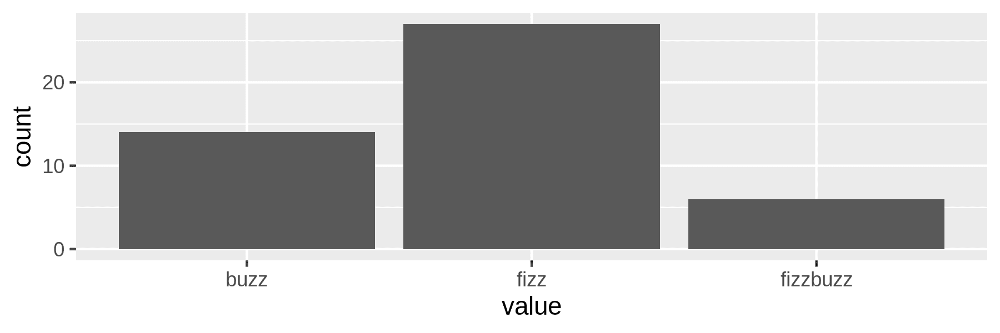

# 5 清理数据

> 原文：<https://datascienceatthecommandline.com/2e/chapter-5-scrubbing-data.html>

两章前，在 OSEMN 数据科学模型的第一步，我们看到了从各种来源获取数据。这一章讲的都是第二步:*擦洗*数据。你看，你很少能立即继续*探索*甚至*建模*数据。您的数据首先需要清理或擦洗的原因有很多。

首先，数据可能不是期望的格式。例如，您可能已经从一个 API 获得了一些 JSON 数据，但是您需要以 CSV 格式创建可视化。其他常见的格式包括纯文本、HTML 和 XML。大多数命令行工具只能处理一种或两种格式，因此将数据从一种格式转换成另一种格式非常重要。

一旦数据采用了所需的格式，仍然可能会出现丢失值、不一致、奇怪的字符或不必要的部分等问题。您可以通过应用过滤器、替换值以及合并多个文件来解决这些问题。命令行特别适合这类转换，因为有许多专门的工具可用，其中大多数可以处理大量数据。在本章中，我将讨论经典工具，如`grep`和`awk`，以及更新的工具，如`jq`和`pup`。

有时，您可以使用同一个命令行工具来执行多个操作，或者使用多个工具来执行同一个操作。本章的结构更像一本食谱，重点是问题或食谱，而不是深入探究命令行工具本身。

## 5.1 概述

在本章中，您将学习如何:

*   将数据从一种格式转换成另一种格式
*   将 SQL 查询直接应用于 CSV
*   过滤线
*   提取和替换值
*   拆分、合并和提取列
*   合并多个文件

本章从以下文件开始:

```sh
$ cd /data/ch05

$ l
total 200K
-rw-r--r-- 1 dst dst 164K Mar  3 10:43 alice.txt
-rw-r--r-- 1 dst dst 4.5K Mar  3 10:43 iris.csv
-rw-r--r-- 1 dst dst  179 Mar  3 10:43 irismeta.csv
-rw-r--r-- 1 dst dst  160 Mar  3 10:43 names-comma.csv
-rw-r--r-- 1 dst dst  129 Mar  3 10:43 names.csv
-rw-r--r-- 1 dst dst 7.8K Mar  3 10:43 tips.csv
-rw-r--r-- 1 dst dst 5.1K Mar  3 10:43 users.json
```

获取这些文件的说明在[第 2 章](chapter-2-getting-started.html#chapter-2-getting-started)中。任何其他文件都是使用命令行工具下载或生成的。

在我深入实际的转换之前，我想演示一下在命令行工作时它们的普遍性。

## 5.2 变换，变换无处不在

在第一章中，我提到过，在实践中，OSEMN 模型的步骤很少是线性的。在这种情况下，虽然清理是 OSEMN 模型的第二步，但我希望您知道，需要清理的不仅仅是*而仅仅是*获得的数据。您将在本章中学习的转换在您的管道的任何部分以及 OSEMN 模型的任何步骤中都是有用的。一般来说，如果一个命令行工具生成的输出可以被下一个工具立即使用，您可以使用管道操作符(`|`)将这两个工具链接在一起。否则，首先需要通过在管道中插入一个中间工具来对数据进行转换。

让我通过一个例子让你更具体。假设您已经获得了一个`fizzbuzz`序列的前 100 个条目(参见[第 4 章](chapter-4-creating-command-line-tools.html#chapter-4-creating-command-line-tools)，并且您想要使用条形图来可视化词语`fizz`、`buzz`和`fizzbuzz`出现的频率。如果这个例子使用了您可能还不熟悉的工具，请不要担心，稍后会更详细地介绍它们。

首先，通过生成序列获得数据，并将其写入`fb.seq`:

```sh
$ seq 100 |
> /data/ch04/fizzbuzz.py | ➊
> tee fb.seq | trim
1
2
fizz
4
buzz
fizz
7
8
fizz
buzz
… with 90 more lines
```

➊ 自定义工具`fizzbuzz.py`来自第四章的[。](chapter-4-creating-command-line-tools.html#chapter-4-creating-command-line-tools)

然后你使用`grep`来保存匹配模式*嘶嘶*或*嗡嗡*的行，并使用`sort`和`uniq`来计算每个单词出现的频率:

```sh
$ grep -E "fizz|buzz" fb.seq | ➊
> sort | uniq -c | sort -nr > fb.cnt ➋

$ bat -A fb.cnt
───────┬────────────────────────────────────────────────────────────────────────
       │ File: fb.cnt
───────┼────────────────────────────────────────────────────────────────────────
   1   │ ·····27·fizz␊
   2   │ ·····14·buzz␊
   3   │ ······6·fizzbuzz␊
───────┴────────────────────────────────────────────────────────────────────────
```

➊ 这个正则表达式也匹配`fizzbuzz`。
➋ 使用`sort`和`uniq`这种方式是一种常见的行计数和降序排序方式。是`-c`选项增加了计数。

请注意，`sort`使用了两次:第一次是因为`uniq`假设其输入数据被排序，第二次是对计数进行数字排序。在某种程度上，这是一个中间的转变，尽管很微妙。

下一步是使用`rush`来可视化计数。然而，由于`rush`期望输入数据是 CSV 格式的，这首先需要一个不太微妙的转换。`awk`可以添加一个标题，翻转两个字段，并在一个咒语中插入逗号:

```sh
$ < fb.cnt awk 'BEGIN { print "value,count" } { print $2","$1 }' > fb.csv

$ bat fb.csv
───────┬────────────────────────────────────────────────────────────────────────
       │ File: fb.csv
───────┼────────────────────────────────────────────────────────────────────────
   1   │ value,count
   2   │ fizz,27
   3   │ buzz,14
   4   │ fizzbuzz,6
───────┴────────────────────────────────────────────────────────────────────────

$ csvlook fb.csv
│ value    │ count │
├──────────┼───────┤
│ fizz     │    27 │
│ buzz     │    14 │
│ fizzbuzz │     6 │
```

现在您已经准备好使用`rush`来创建一个条形图。结果见图 [5.1](chapter-5-scrubbing-data.html#fig:fb-image) 。(我会在[第七章](chapter-7-exploring-data.html#chapter-7-exploring-data)中详细讲述`rush`的这个语法。)

```sh
$ rush plot -x value -y count --geom col --height 2 fb.csv > fb.png

$ display fb.png
```



图 5.1:计数嘶嘶声、嗡嗡声和嘶嘶声 

虽然这个例子有点做作，但它揭示了在命令行工作时的一种常见模式。关键工具，例如获取数据、创建可视化或训练模型的工具，通常需要中间转换才能链接到管道中。从这个意义上说，编写管道就像解决一个难题，其中的关键部分通常需要辅助部分来配合。

现在您已经看到了清理数据的重要性，您已经准备好了解一些实际的转换。

## 5.3 纯文本

从形式上来说，*纯文本*是指一系列人类可读的字符，也可以是一些特定类型的控制字符，如制表符和换行符  。例如日志、电子书、电子邮件和源代码。纯文本比二进制数据  有很多好处，包括:

*   可以使用任何文本编辑器打开、编辑和保存它
*   它是自描述的，并且独立于创建它的应用程序
*   它将比其他形式的数据寿命长，因为不需要额外的知识或应用程序来处理它

但最重要的是，Unix 哲学认为纯文本是命令行工具  之间的通用接口。也就是说，大多数工具接受纯文本作为输入，生成纯文本作为输出。

这足以让我从纯文本开始。我在本章中讨论的其他格式，CSV、JSON、XML 和 HTML 也确实是纯文本。目前，我假设纯文本没有清晰的表格结构(像 CSV 那样)或嵌套结构(像 JSON、XML 和 HTML 那样)。在本章的后面，我将介绍一些专门用于处理这些格式的工具。

### 5.3.1 过滤线

第一个擦洗操作是过滤线条。这意味着从输入数据中，将评估每一行是被保留还是被丢弃。

#### 5.3.1.1 基于位置

过滤线的最直接方法是基于它们的位置。当您想要检查某个文件的前 10 行时，或者当您从另一个命令行工具的输出中提取特定行时，这可能会很有用。为了说明如何基于位置进行过滤，让我们创建一个包含 10 行的虚拟文件:

```sh
$ seq -f "Line %g" 10 | tee lines
Line 1
Line 2
Line 3
Line 4
Line 5
Line 6
Line 7
Line 8
Line 9
Line 10
```

您可以使用`head`  、`sed`或`awk`打印前 3 行:

```sh
$ < lines head -n 3
Line 1
Line 2
Line 3

$ < lines sed -n '1,3p'
Line 1
Line 2
Line 3

$ < lines awk 'NR <= 3' ➊
Line 1
Line 2
Line 3
```

`awk`、`NR`中的 ➊ 是指到目前为止看到的输入记录的总数。

同样，您可以使用`tail`打印最后 3 行:

```sh
$ < lines tail -n 3
Line 8
Line 9
Line 10
```

你也可以使用`sed`和`awk`来实现，但是`tail`要快得多。删除前 3 行如下所示:

```sh
$ < lines tail -n +4
Line 4
Line 5
Line 6
Line 7
Line 8
Line 9
Line 10

$ < lines sed '1,3d' Line 4
Line 5
Line 6
Line 7
Line 8
Line 9
Line 10

$ < lines sed -n '1,3!p'
Line 4
Line 5
Line 6
Line 7
Line 8
Line 9
Line 10
```

注意，用`tail`你必须指定行数加 1。把它想象成你要开始打印的那一行。使用`head`可以删除最后 3 行:

```sh
$ < lines head -n -3
Line 1
Line 2
Line 3
Line 4
Line 5
Line 6
Line 7
```

您可以使用`sed`、`awk`或`head`和`tail`的组合来打印特定的行。这里我打印了第 4、5 和 6 行:

```sh
$ < lines sed -n '4,6p'
Line 4
Line 5
Line 6

$ < lines awk '(NR>=4) && (NR<=6)'
Line 4
Line 5
Line 6

$ < lines head -n 6 | tail -n 3
Line 4
Line 5
Line 6
```

您可以通过指定起点和步长，用`sed`打印奇数行，或者通过使用模运算符，用`awk`打印奇数行:

```sh
$ < lines sed -n '1~2p'
Line 1
Line 3
Line 5
Line 7
Line 9

$ < lines awk 'NR%2' Line 1
Line 3
Line 5
Line 7
Line 9
```

打印偶数行的工作方式类似:

```sh
$ < lines sed -n '0~2p'
Line 2
Line 4
Line 6
Line 8
Line 10

$ < lines awk '(NR+1)%2'
Line 2
Line 4
Line 6
Line 8
Line 10
```

这些许多例子以小于 (`<`)号开头，后面跟着文件的名称. 我这样做的原因是这样可以让我从左到右的读取命令行. 这只是我个人的习惯. 你也可以使用`cat`去传递文件的内容. 同样, 许多命令行工具也接受文件的名称作为一个参数.

#### 5.3.1.2 基于一种模式

有时，您希望根据行的内容保留或丢弃行。使用用于过滤行的规范命令行工具`grep`，您可以打印匹配特定模式或正则表达式的每一行。例如，从*爱丽丝漫游奇境记*中提取所有章节标题:

```sh
$ < alice.txt grep -i chapter ➊
CHAPTER I. Down the Rabbit-Hole
CHAPTER II. The Pool of Tears
CHAPTER III. A Caucus-Race and a Long Tale
CHAPTER IV. The Rabbit Sends in a Little Bill
CHAPTER V. Advice from a Caterpillar
CHAPTER VI. Pig and Pepper
CHAPTER VII. A Mad Tea-Party
CHAPTER VIII. The Queen's Croquet-Ground
CHAPTER IX. The Mock Turtle's Story
CHAPTER X. The Lobster Quadrille
CHAPTER XI. Who Stole the Tarts?
CHAPTER XII. Alice's Evidence
```

➊`-i`选项指定匹配应该不区分大小写。

您也可以指定正则表达式。例如，如果您只想打印以*和*开头的标题:

```sh
$ < alice.txt grep -E '^CHAPTER (.*)\. The'
CHAPTER II. The Pool of Tears
CHAPTER IV. The Rabbit Sends in a Little Bill
CHAPTER VIII. The Queen's Croquet-Ground
CHAPTER IX. The Mock Turtle's Story
CHAPTER X. The Lobster Quadrille
```

注意，为了启用正则表达式，您必须指定`-E`选项。否则，`grep`将模式解释为一个字符串，这很可能导致根本没有匹配:

```sh
$ < alice.txt grep '^CHAPTER (.*)\. The'
```

使用`-v`选项，您可以反转匹配，这样`grep`会打印出*与*不匹配的线条。下面的正则表达式只匹配包含空格的行。所以用逆运算，并使用`wc -l`，你可以计算非空行的数量:

```sh
$ < alice.txt grep -Ev '^\s$' | wc -l
2790
```

#### 5.3.1.3 基于随机性

当您在制定数据管道的过程中，并且拥有大量数据时，调试管道可能会很麻烦。在这种情况下，从数据中生成较小的样本可能会有用。这就是`sample`派上用场的地方。`sample`的主要目的是通过逐行输出输入的特定百分比来获得数据的子集。

```sh
$ seq -f "Line %g" 1000 | sample -r 1%
Line 5
Line 137
Line 323
Line 385
Line 391
Line 554
Line 580
Line 613
Line 803
Line 841
Line 899
```

在这里，每个输入行都有百分之一的机会被打印。这个百分比也可以指定为分数(即`1/100`)或概率(即`0.01`)。

有另外两个用途，在调试管道时会很有用。首先，可以给输出增加一些延迟。当输入是一个持续的流(例如，我们在[第 3 章](chapter-3-obtaining-data.html#chapter-3-obtaining-data)中看到的维基百科流)，并且数据进来得太快以至于看不到发生了什么时，这就很方便了。其次，可以在`sample`上放一个定时器，这样就不用手动杀死正在进行的进程了。例如，要在打印的每一行之间添加 1 秒钟的延迟，并且只运行 5 秒钟，您可以键入:

```sh
$ seq -f "Line %g" 1000 | sample -r 1% -d 1000 -s 5 | ts ➊
Mar 03 10:43:52 Line 38
Mar 03 10:43:53 Line 117
Mar 03 10:43:54 Line 455
Mar 03 10:43:55 Line 569
Mar 03 10:43:56 Line 613
Mar 03 10:43:57 Line 895
```

➊ 工具`ts`在每一行前面添加一个时间戳。

为了防止不必要的计算，请尽量将`sample`放在您的管道中。事实上，这个观点适用于任何减少数据的命令行工具，比如`head`和`tail`。一旦你确信你的管道工作正常，你就把它从管道中取出来。

### 5.3.2 提取数值

为了从前面的例子中提取实际的章节标题，您可以采用一种简单的方法，将`grep`的输出通过管道传输到`cut`:

```sh
$ grep -i chapter alice.txt | cut -d ' ' -f 3-
Down the Rabbit-Hole
The Pool of Tears
A Caucus-Race and a Long Tale
The Rabbit Sends in a Little Bill
Advice from a Caterpillar
Pig and Pepper
A Mad Tea-Party
The Queen's Croquet-Ground
The Mock Turtle's Story
The Lobster Quadrille
Who Stole the Tarts?
Alice's Evidence
```

在这里，传递给`cut`的每一行都被分隔成多个字段，然后打印第三个字段到最后一个字段。每个输入行的字段总数可以不同。有了`sed`，你可以用更复杂的方式完成同样的任务:

```sh
$ sed -rn 's/^CHAPTER ([IVXLCDM]{1,})\. (.*)$/\2/p' alice.txt | trim 3
Down the Rabbit-Hole
The Pool of Tears
A Caucus-Race and a Long Tale
… with 9 more lines
```

(因为输出是相同的，所以它被调整为三行。)这种方法使用正则表达式和反向引用。这里，`sed`也接管了`grep`所做的工作。我只建议在简单的方法不起作用时使用复杂的方法。例如，如果*章节*曾经是文本本身的一部分，而不仅仅是用来表示一个新章节的开始。当然，有许多复杂的层次可以解决这个问题，但这是为了说明一个非常严格的方法。在实践中，面临的挑战是提出一个在复杂性和灵活性之间取得良好平衡的管道。

值得注意的是`cut`也可以在人物位置上分割。当您希望在每个输入行提取(或删除)相同的字符集时，这很有用:

```sh
$ grep -i chapter alice.txt | cut -c 9-
I. Down the Rabbit-Hole
II. The Pool of Tears
III. A Caucus-Race and a Long Tale
IV. The Rabbit Sends in a Little Bill
V. Advice from a Caterpillar
VI. Pig and Pepper
VII. A Mad Tea-Party
VIII. The Queen's Croquet-Ground
IX. The Mock Turtle's Story
X. The Lobster Quadrille
XI. Who Stole the Tarts?
XII. Alice's Evidence
```

`grep`有一个很棒的特性，它使用`-o`选项将每场比赛输出到单独的一行上:

```sh
$ < alice.txt grep -oE '\w{2,}' | trim
Project
Gutenberg
Alice
Adventures
in
Wonderland
by
Lewis
Carroll
This
… with 28615 more lines
```

但是，如果你想创建一个包含所有以`a`开头，以`e`结尾的单词的数据集呢？当然，这也有一个管道:

```sh
$ < alice.txt tr '[:upper:]' '[:lower:]' | ➊
> grep -oE '\w{2,}' |
> grep -E '^a.*e$' |
> sort | uniq | sort -nr | trim
available
ate
assistance
askance
arise
argue
are
archive
applicable
apple
… with 25 more lines
```

➊ 这里我用`tr`使文本小写。我们将在下一节更仔细地看看`tr`。

两个`grep`命令可能被合并成一个，但是在这种情况下，我认为重用和修改之前的管道会更容易。为了完成工作而务实并不可耻！

### 5.3.3 替换和删除数值

您可以使用命令行工具`tr`  (代表*翻译* )来替换或删除个别字符。例如，空格可以替换为下划线，如下所示:

```sh
$ echo 'hello world!' | tr ' ' '_'
hello_world!
```

如果需要替换多个字符，您可以组合使用:

```sh
$ echo 'hello world!' | tr ' !' '_?'
hello_world?
```

`tr`也可以通过指定参数`-d`来删除单个字符:

```sh
$ echo 'hello world!' | tr -d ' !'
helloworld

$ echo 'hello world!' | tr -d -c '[a-z]' helloworld%
```

在这种情况下，这两个命令完成相同的事情。然而，第二个命令使用了两个额外的特性:它使用方括号和破折号(`[-]`)指定了字符的*范围* (全部是小写字母)，并且`-c`选项指示应该使用它的补码。换句话说，这个命令只保留小写字母。你甚至可以使用`tr`将文本转换成大写:

```sh
$ echo 'hello world!' | tr '[a-z]' '[A-Z]'
HELLO WORLD!

$ echo 'hello world!' | tr '[:lower:]' '[:upper:]'
HELLO WORLD!
```

但是，如果需要翻译非 ASCII 字符，那么`tr`可能无法工作，因为它只对单字节字符进行操作。在这些情况下，您应该使用`sed`来代替:

```sh
$ echo 'hello world!' | tr '[a-z]' '[A-Z]'
HELLO WORLD!

$ echo 'hallo wêreld!' | tr '[a-z]' '[A-Z]'
HALLO WêRELD!

$ echo 'hallo wêreld!' | tr '[:lower:]' '[:upper:]'
HALLO WêRELD!

$ echo 'hallo wêreld!' | sed 's/[[:lower:]]*/\U&/g'
HALLO WÊRELD!

$ echo 'helló világ' | tr '[:lower:]' '[:upper:]'
HELLó VILáG

$ echo 'helló világ' | sed 's/[[:lower:]]*/\U&/g'
HELLÓ VILÁG
```

如果您需要对多个字符进行操作，那么您可能会发现`sed`非常有用。你已经看到了一个从`alice.txt`中提取章节标题的例子。在`sed`中，提取、删除和替换实际上都是相同的操作。你只需要指定不同的正则表达式。例如，要更改一个单词，删除重复的空格，并删除前导空格:

```sh
$ echo ' hello     world!' |
> sed -re 's/hello/bye/' | ➊
> sed -re 's/\s+/ /g' | ➋
> sed -re 's/\s+//' ➌
bye world!
```

➊ 把*你好*换成*再见* 。➋用一个空格替换任何空格。标志`g`代表全局，意味着同一替换可以在同一行上应用多次。
➌ 这只删除了前导空格，因为我没有在这里指定标志`g`。

同样，正如前面的`grep`示例一样，这三个`sed`命令可以合并成一个:

```sh
$ echo ' hello     world!' |
> sed -re 's/hello/bye/;s/\s+/ /g;s/\s+//'
bye world!
```

但是告诉我，你觉得什么更容易读？

## 5.4 CSV

### 5.4.1 正文、标题和列，天哪！

我用来清理纯文本的命令行工具，比如`tr`和`grep`，并不总是适用于 CSV。原因是这些命令行工具没有标题、主体和列的概念。如果您想使用`grep`过滤行，但总是在输出中包含标题，该怎么办？或者，如果您只想使用`tr`大写特定列的值，而不改变其他列的值，该怎么办？

有多步骤的解决方法，但是非常麻烦。我有更好的东西。为了利用 CSV 的普通命令行工具，我将向您介绍三个命令行工具，它们被恰当地命名为:`body`  ，`header`，以及`cols`。

让我们从第一个命令行工具`body`开始。使用`body`,您可以将任何命令行工具应用于 CSV 文件的主体，即除了文件头之外的所有内容。例如:

```sh
$ echo -e "value\n7\n2\n5\n3" | body sort -n
value
2
3
5
7
```

它假设 CSV 文件的文件头只跨越一行。它是这样工作的:

*   从 standard in 中取出一行，并将其存储为名为`$header`的变量。
*   打印出标题。
*   对标准 in 中的剩余数据执行传递给`body`的所有命令行参数。

这是另一个例子。假设您想要计算以下 CSV 文件的行数:

```sh
$ seq 5 | header -a count
count
1
2
3
4
5
```

使用`wc -l`，您可以计算所有行的数量:

```sh
$ seq 5 | header -a count | wc -l
6
```

如果您只想考虑正文中的行(所以除了标题之外的所有内容)，您可以添加`body`:

```sh
$ seq 5 | header -a count | body wc -l
count
5
```

请注意，在输出中没有使用标题，也再次打印了标题。

第二个命令行工具`header`允许您操作 CSV 文件的文件头。如果没有提供参数，将打印 CSV 文件的文件头:

```sh
$ < tips.csv header
bill,tip,sex,smoker,day,time,size
```

这个和`head -n 1`一样。如果标题跨越多行，这是不推荐的，您可以指定`-n 2`。您也可以向 CSV 文件添加标题:

```sh
$ seq 5 | header -a count
count
1
2
3
4
5
```

这相当于`echo "count" | cat - <(seq 5)`。使用`-d`选项删除标题:

```sh
$ < iris.csv header -d | trim
5.1,3.5,1.4,0.2,Iris-setosa
4.9,3.0,1.4,0.2,Iris-setosa
4.7,3.2,1.3,0.2,Iris-setosa
4.6,3.1,1.5,0.2,Iris-setosa
5.0,3.6,1.4,0.2,Iris-setosa
5.4,3.9,1.7,0.4,Iris-setosa
4.6,3.4,1.4,0.3,Iris-setosa
5.0,3.4,1.5,0.2,Iris-setosa
4.4,2.9,1.4,0.2,Iris-setosa
4.9,3.1,1.5,0.1,Iris-setosa
… with 140 more lines
```

这个和`tail -n +2`差不多，但是更容易记一点。替换一个头，如果你看上面的源代码，基本上就是先删除一个头，然后再添加一个头，这是通过指定`-r`选项来完成的。这里，我们结合`body`:

```sh
$ seq 5 | header -a line | body wc -l | header -r count
count
5
```

最后但并非最不重要的一点是，您可以只对标题应用命令，类似于`body`命令行工具对正文所做的。例如:

```sh
$ seq 5 | header -a line | header -e "tr '[a-z]' '[A-Z]'"
LINE
1
2
3
4
5
```

第三个命令行工具叫做`cols`，它允许您将某个命令只应用于列的一个子集。例如，如果您想要大写 tips 数据集中的 day 列中的值(不影响其他列和标题)，您可以将`cols`与`body`结合使用，如下所示:

```sh
$ < tips.csv cols -c day body "tr '[a-z]' '[A-Z]'" | head -n 5 | csvlook
│        day │  bill │  tip │ sex    │ smoker │ time   │ size │
├────────────┼───────┼──────┼────────┼────────┼────────┼──────┤
│ 0001-01-07 │ 16.99 │ 1.01 │ Female │  False │ Dinner │    2 │
│ 0001-01-07 │ 10.34 │ 1.66 │ Male   │  False │ Dinner │    3 │
│ 0001-01-07 │ 21.01 │ 3.50 │ Male   │  False │ Dinner │    3 │
│ 0001-01-07 │ 23.68 │ 3.31 │ Male   │  False │ Dinner │    2 │
```

请注意，将多个命令行工具和参数作为命令传递给`header -e`、`body`和`cols`会导致复杂的引用。如果您遇到这样的问题，最好为此创建一个单独的命令行工具，并将其作为命令传递。

总之，虽然通常最好使用专门为 CSV 数据制作的命令行工具，但是如果需要的话，`body`、`header`和`cols`也允许您将经典的命令行工具应用于 CSV 文件。

### 5.4.2 对 CSV 执行 SQL 查询

如果本章提到的命令行工具不能提供足够的灵活性，那么还有另一种方法可以从命令行清除数据。工具`csvsql`可以让你直接对 CSV 文件执行 SQL 查询。SQL 是定义清理数据操作的强大语言；这是一种与使用单独的命令行工具非常不同的方式。

如果你的数据来自于关系数据库, 并且, 如果可以, 尝试在那个数据库上执行 SQL 查询并且接着将数据导出成 csv 格式. 像我在 [Chapter 3](chapter-3-obtaining-data.html#chapter-3-obtaining-data)讨论的那样, 你可以用命令行`sql2csv`来做这件事.当你第一次从数据库导出 CSV 文件, 并且接着执行 SQL 的时候, 它不仅仅会慢, 还有可能列的数据类型不能从 CSV 文件中推断出来.

在下面的清理任务中，我将包括几个涉及`csvsql`的解决方案。一个基本命令是这样的:

```sh
$ seq 5 | header -a val | csvsql --query "SELECT SUM(val) AS sum FROM stdin"
sum
15.0
```

如果将标准输入传递给`csvsql`，那么这个表就被命名为`stdin`。列的类型是从数据中自动推断出来的。正如您将在后面看到的，在合并 CSV 文件部分，您还可以指定多个 CSV 文件。请记住`csvsql`使用了 SQL 的 SQLite 方言，这与 SQL 标准有一些细微的差别。虽然 SQL 通常比其他解决方案更冗长，但它也更灵活。如果您已经知道如何用 SQL 解决清理问题，那么为什么不在命令行中使用它呢？

### 5.4.3 提取和重新排序列

可以使用命令行工具对列进行提取和重新排序:`csvcut`  。例如，为了只保留 Iris 数据集中包含数值*和*的列，对中间的两列进行重新排序:

```sh
$ < iris.csv csvcut -c sepal_length,petal_length,sepal_width,petal_width | csvlo
ok
│ sepal_length │ petal_length │ sepal_width │ petal_width │
├──────────────┼──────────────┼─────────────┼─────────────┤
│          5.1 │          1.4 │         3.5 │         0.2 │
│          4.9 │          1.4 │         3.0 │         0.2 │
│          4.7 │          1.3 │         3.2 │         0.2 │
│          4.6 │          1.5 │         3.1 │         0.2 │
│          5.0 │          1.4 │         3.6 │         0.2 │
│          5.4 │          1.7 │         3.9 │         0.4 │
│          4.6 │          1.4 │         3.4 │         0.3 │
│          5.0 │          1.5 │         3.4 │         0.2 │
… with 142 more lines
```

或者，您也可以用`-C`选项指定您想要省略的列，它代表*补码* :

```sh
$ < iris.csv csvcut -C species | csvlook │ sepal_length │ sepal_width │ petal_length │ petal_width │
├──────────────┼─────────────┼──────────────┼─────────────┤
│          5.1 │         3.5 │          1.4 │         0.2 │
│          4.9 │         3.0 │          1.4 │         0.2 │
│          4.7 │         3.2 │          1.3 │         0.2 │
│          4.6 │         3.1 │          1.5 │         0.2 │
│          5.0 │         3.6 │          1.4 │         0.2 │
│          5.4 │         3.9 │          1.7 │         0.4 │
│          4.6 │         3.4 │          1.4 │         0.3 │
│          5.0 │         3.4 │          1.5 │         0.2 │
… with 142 more lines
```

这里，包含的列保持相同的顺序。除了列名，您还可以指定列的索引，从 1 开始。例如，这允许您只选择奇数列(如果您需要的话！):

```sh
$ echo 'a,b,c,d,e,f,g,h,i\n1,2,3,4,5,6,7,8,9' |
> csvcut -c $(seq 1 2 9 | paste -sd,)
a,c,e,g,i
1,3,5,7,9
```

如果您确定任何值中都没有逗号，那么您也可以使用`cut`来提取列。请注意`cut`不会对列进行重新排序，如以下命令所示:

```sh
$ echo 'a,b,c,d,e,f,g,h,i\n1,2,3,4,5,6,7,8,9' | cut -d, -f 5,1,3
a,c,e
1,3,5
```

如您所见，用`-f`选项指定列的顺序并不重要；使用`cut`，它们将总是以原始顺序出现。为了完整起见，我们还来看一下提取和重新排序 Iris 数据集的数字列的 SQL 方法:

```sh
$ < iris.csv csvsql --query "SELECT sepal_length, petal_length, "\
> "sepal_width, petal_width FROM stdin" | head -n 5 | csvlook
│ sepal_length │ petal_length │ sepal_width │ petal_width │
├──────────────┼──────────────┼─────────────┼─────────────┤
│          5.1 │          1.4 │         3.5 │         0.2 │
│          4.9 │          1.4 │         3.0 │         0.2 │
│          4.7 │          1.3 │         3.2 │         0.2 │
│          4.6 │          1.5 │         3.1 │         0.2 │
```

### 5.4.4 过滤行

过滤 CSV 文件中的行与过滤纯文本文件中的行之间的区别在于，您可能只希望根据特定列中的值进行过滤。基于位置的过滤本质上是相同的，但是您必须考虑到 CSV 文件的第一行通常是文件头。请记住，如果您想保留标题，您可以随时使用`body`命令行工具:

```sh
$ seq 5 | sed -n '3,5p'
3
4
5

$ seq 5 | header -a count | body sed -n '3,5p'
count
3
4
5
```

当要对某一列中的某一模式进行过滤时，可以使用`csvgrep``awk`，当然，也可以使用`csvsql`。例如，要排除交易方规模小于 5 的所有账单:

```sh
$ csvgrep -c size -i -r "[1-4]" tips.csv bill,tip,sex,smoker,day,time,size
29.8,4.2,Female,No,Thur,Lunch,6
34.3,6.7,Male,No,Thur,Lunch,6
41.19,5.0,Male,No,Thur,Lunch,5
27.05,5.0,Female,No,Thur,Lunch,6
29.85,5.14,Female,No,Sun,Dinner,5
48.17,5.0,Male,No,Sun,Dinner,6
20.69,5.0,Male,No,Sun,Dinner,5
30.46,2.0,Male,Yes,Sun,Dinner,5
28.15,3.0,Male,Yes,Sat,Dinner,5
```

`awk`和`csvsql`都可以做数值比较。例如，要在周六或周日获得 40 美元以上的所有账单:

```sh
$ < tips.csv awk -F, 'NR==1 || ($1 > 40.0) && ($5 ~ /^S/)'
bill,tip,sex,smoker,day,time,size
48.27,6.73,Male,No,Sat,Dinner,4
44.3,2.5,Female,Yes,Sat,Dinner,3
48.17,5.0,Male,No,Sun,Dinner,6
50.81,10.0,Male,Yes,Sat,Dinner,3
45.35,3.5,Male,Yes,Sun,Dinner,3
40.55,3.0,Male,Yes,Sun,Dinner,2
48.33,9.0,Male,No,Sat,Dinner,4
```

`csvsql`解决方案更冗长，但也更健壮，因为它使用列名而不是它们的索引:

```sh
$ csvsql --query "SELECT * FROM tips WHERE bill > 40 AND day LIKE 'S%'" tips.csv 
bill,tip,sex,smoker,day,time,size
48.27,6.73,Male,0,Sat,Dinner,4.0
44.3,2.5,Female,1,Sat,Dinner,3.0
48.17,5.0,Male,0,Sun,Dinner,6.0
50.81,10.0,Male,1,Sat,Dinner,3.0
45.35,3.5,Male,1,Sun,Dinner,3.0
40.55,3.0,Male,1,Sun,Dinner,2.0
48.33,9.0,Male,0,Sat,Dinner,4.0
```

请注意，SQL 查询中的`WHERE`子句的灵活性不容易与其他命令行工具相匹配，因为 SQL 可以对日期和集合进行操作，并形成复杂的子句组合。

### 5.4.5 合并列

当感兴趣的值分布在多个列中时，合并列非常有用。日期(其中年、月和日可以是单独的列)或姓名(其中名和姓是单独的列)可能会出现这种情况。让我们考虑第二种情况。

输入 CSV 是作曲家列表。想象你的任务是把名和姓组合成一个全名。我将为这个任务提供四种不同的方法:`sed`、`awk`、`cols` + `tr`和`csvsql`。让我们看看输入 CSV:

```sh
$ csvlook -I names.csv
│ id │ last_name │ first_name │ born │
├────┼───────────┼────────────┼──────┤
│ 1  │ Williams  │ John       │ 1932 │
│ 2  │ Elfman    │ Danny      │ 1953 │
│ 3  │ Horner    │ James      │ 1953 │
│ 4  │ Shore     │ Howard     │ 1946 │
│ 5  │ Zimmer    │ Hans       │ 1957 │
```

第一种方法`sed`，使用了两条语句。第一个是替换标题，第二个是将反向引用应用于第二行以后的正则表达式:

```sh
$ < names.csv sed -re '1s/.*/id,full_name,born/g;2,$s/(.*),(.*),(.*),(.*)/\1,\3
\2,\4/g' |
> csvlook -I
│ id │ full_name     │ born │
├────┼───────────────┼──────┤
│ 1  │ John Williams │ 1932 │
│ 2  │ Danny Elfman  │ 1953 │
│ 3  │ James Horner  │ 1953 │
│ 4  │ Howard Shore  │ 1946 │
│ 5  │ Hans Zimmer   │ 1957 │
```

`awk`方法如下所示:

```sh
$ < names.csv awk -F, 'BEGIN{OFS=","; print "id,full_name,born"} {if(NR > 1) {pr
int $1,$3" "$2,$4}}' |
> csvlook -I
│ id │ full_name     │ born │
├────┼───────────────┼──────┤
│ 1  │ John Williams │ 1932 │
│ 2  │ Danny Elfman  │ 1953 │
│ 3  │ James Horner  │ 1953 │
│ 4  │ Howard Shore  │ 1946 │
│ 5  │ Hans Zimmer   │ 1957 │
```

与`tr`相结合的`cols`方法:

```sh
$ < names.csv |
> cols -c first_name,last_name tr \",\" \" \" |
> header -r full_name,id,born |
> csvcut -c id,full_name,born |
> csvlook -I
│ id │ full_name     │ born │
├────┼───────────────┼──────┤
│ 1  │ John Williams │ 1932 │
│ 2  │ Danny Elfman  │ 1953 │
│ 3  │ James Horner  │ 1953 │
│ 4  │ Howard Shore  │ 1946 │
│ 5  │ Hans Zimmer   │ 1957 │
```

请注意，`csvsql`使用 SQLite 作为数据库来执行查询，而`||`代表串联:

```sh
$ < names.csv csvsql --query "SELECT id, first_name || ' ' || last_name "\
> "AS full_name, born FROM stdin" | csvlook -I
│ id  │ full_name     │ born   │
├─────┼───────────────┼────────┤
│ 1.0 │ John Williams │ 1932.0 │
│ 2.0 │ Danny Elfman  │ 1953.0 │
│ 3.0 │ James Horner  │ 1953.0 │
│ 4.0 │ Howard Shore  │ 1946.0 │
│ 5.0 │ Hans Zimmer   │ 1957.0 │
```

如果*姓氏*包含逗号会怎样？为了清楚起见，让我们看一下原始输入 CSV:

```sh
$ cat names-comma.csv
id,last_name,first_name,born
1,Williams,John,1932
2,Elfman,Danny,1953
3,Horner,James,1953
4,Shore,Howard,1946
5,Zimmer,Hans,1957
6,"Beethoven, van",Ludwig,1770
```

看起来前三种方法都失败了。都是以不同的方式。只有`csvsql`能够组合名字和全名:

```sh
$ < names-comma.csv sed -re '1s/.*/id,full_name,born/g;2,$s/(.*),(.*),(.*),(.*)/
\1,\3 \2,\4/g' | tail -n 1
6,"Beethoven,Ludwig  van",1770
```

```sh
$ < names-comma.csv awk -F, 'BEGIN{OFS=","; print "id,full_name,born"} {if(NR >
1) {print $1,$3" "$2,$4}}' | tail -n 1
6, van" "Beethoven,Ludwig
```

```sh
$ < names-comma.csv | cols -c first_name,last_name tr \",\" \" \" |
> header -r full_name,id,born | csvcut -c id,full_name,born | tail -n 1
6,"Ludwig ""Beethoven  van""",1770
```

```sh
$ < names-comma.csv csvsql --query "SELECT id, first_name || ' ' || last_name AS
 full_name, born FROM stdin" | tail -n 1
6.0,"Ludwig Beethoven, van",1770.0
```

```sh
$ < names-comma.csv rush run -t 'unite(df, full_name, first_name, last_name, sep
 = " ")' - | tail -n 1
6,"Ludwig Beethoven, van",1770
```

等一下！最后一个命令是什么？那是 R 吗？嗯，事实上，是的。它是通过名为`rush`的命令行工具评估的 R 代码。此刻我所能说的是，这种方法也成功地合并了两列。稍后我将讨论这个漂亮的命令行工具。

### 5.4.6 合并多个 CSV 文件

#### 5.4.6.1 横向连接

假设您有三个想要并排放置的 CSV 文件。我们用`tee`保存流水线中间`csvcut`的结果:

```sh
$ < tips.csv csvcut -c bill,tip | tee bills.csv | head -n 3 | csvlook
│  bill │  tip │
├───────┼──────┤
│ 16.99 │ 1.01 │
│ 10.34 │ 1.66 │

$ < tips.csv csvcut -c day,time | tee datetime.csv |
> head -n 3 | csvlook -I
│ day │ time   │
├─────┼────────┤
│ Sun │ Dinner │
│ Sun │ Dinner │

$ < tips.csv csvcut -c sex,smoker,size | tee customers.csv |
> head -n 3 | csvlook
│ sex    │ smoker │ size │
├────────┼────────┼──────┤
│ Female │  False │    2 │
│ Male   │  False │    3 │
```

假设这些行排成一行，你可以将`paste`这些文件放在一起:

```sh
$ paste -d, {bills,customers,datetime}.csv | head -n 3 | csvlook -I
│ bill  │ tip  │ sex    │ smoker │ size │ day │ time   │
├───────┼──────┼────────┼────────┼──────┼─────┼────────┤
│ 16.99 │ 1.01 │ Female │ No     │ 2    │ Sun │ Dinner │
│ 10.34 │ 1.66 │ Male   │ No     │ 3    │ Sun │ Dinner │
```

这里，命令行参数`-d`指示`paste`使用逗号作为分隔符。

#### 5.4.6.2 加盟

有时数据不能通过垂直或水平连接来组合。在某些情况下，尤其是在关系数据库中，数据分布在多个表(或文件)中，以尽量减少冗余。假设您想用更多关于三种鸢尾花的信息来扩展 Iris 数据集，即 USDA 标识符。碰巧我有一个单独的 CSV 文件，包含这些标识符:

```sh
$ csvlook irismeta.csv
│ species         │ wikipedia_url                                │ usda_id │
├─────────────────┼──────────────────────────────────────────────┼─────────┤
│ Iris-versicolor │ http://en.wikipedia.org/wiki/Iris_versicolor │ IRVE2   │
│ Iris-virginica  │ http://en.wikipedia.org/wiki/Iris_virginica  │ IRVI    │
│ Iris-setosa     │                                              │ IRSE    │
```

这个数据集和 Iris 数据集的共同点是*物种*列。您可以使用`csvjoin`来连接两个数据集:

```sh
$ csvjoin -c species iris.csv irismeta.csv | csvcut -c sepal_length,sepal_width,
species,usda_id | sed -n '1p;49,54p' | csvlook
│ sepal_length │ sepal_width │ species         │ usda_id │
├──────────────┼─────────────┼─────────────────┼─────────┤
│          4.6 │         3.2 │ Iris-setosa     │ IRSE    │
│          5.3 │         3.7 │ Iris-setosa     │ IRSE    │
│          5.0 │         3.3 │ Iris-setosa     │ IRSE    │
│          7.0 │         3.2 │ Iris-versicolor │ IRVE2   │
│          6.4 │         3.2 │ Iris-versicolor │ IRVE2   │
│          6.9 │         3.1 │ Iris-versicolor │ IRVE2   │
```

当然，您也可以使用 SQL 方法，使用`csvsql`，这通常会更长一点(但可能更灵活):

```sh
$ csvsql --query 'SELECT i.sepal_length, i.sepal_width, i.species, m.usda_id FRO
M iris i JOIN irismeta m ON (i.species = m.species)' iris.csv irismeta.csv | sed
 -n '1p;49,54p' | csvlook
│ sepal_length │ sepal_width │ species         │ usda_id │
├──────────────┼─────────────┼─────────────────┼─────────┤
│          4.6 │         3.2 │ Iris-setosa     │ IRSE    │
│          5.3 │         3.7 │ Iris-setosa     │ IRSE    │
│          5.0 │         3.3 │ Iris-setosa     │ IRSE    │
│          7.0 │         3.2 │ Iris-versicolor │ IRVE2   │
│          6.4 │         3.2 │ Iris-versicolor │ IRVE2   │
│          6.9 │         3.1 │ Iris-versicolor │ IRVE2   │
```

## 5.5 使用 XML/HTML 和 JSON

在这一节中，我将演示几个可以将数据从一种格式转换为另一种格式的命令行工具。转换数据有两个原因。

首先，数据经常需要表格形式，就像数据库表或电子表格一样，因为许多可视化和机器学习算法都依赖于它。CSV 本质上是表格形式，但是 JSON 和 HTML/XML 数据可以有深度嵌套的结构。

第二，许多命令行工具，尤其是经典的工具，如`cut`和`grep`，是对纯文本进行操作的。这是因为文本被视为命令行工具之间的通用接口。此外，其他格式更年轻。这些格式中的每一种都可以被视为纯文本，这使得我们也可以将这样的命令行工具应用于其他格式。

有时，您可以将经典工具应用于结构化数据。例如，通过将下面的 JSON 数据视为纯文本，您可以使用`sed`将属性*性别*更改为*性别* :

```sh
$ sed -e 's/"gender":/"sex":/g' users.json | jq | trim
{
  "results": [
    {
      "sex": "male",
      "name": {
        "title": "mr",
        "first": "leevi",
        "last": "kivisto"
      },
      "location": {
… with 260 more lines
```

像许多其他命令行工具一样，`sed`不利用数据的结构。最好是使用利用数据结构的工具(比如我下面讨论的`jq`),或者首先将数据转换成表格格式，比如 CSV，然后应用适当的命令行工具。

我将通过一个真实的用例来演示如何将 XML/HTML 和 JSON 转换成 CSV。我将在这里使用的命令行工具有:`curl`、`pup`、、、`jq`和`json2csv`、、、。

维基百科拥有丰富的信息。这些信息中的大部分都以表格的形式排列，这些表格可以被视为数据集。例如，[这个页面](http://en.wikipedia.org/wiki/List_of_countries_and_territories_by_border/area_ratio)包含一个国家和地区的列表，以及它们的边界长度、面积和两者之间的比例。

假设您对分析这些数据感兴趣。在本节中，我将带您浏览所有必要的步骤及其相应的命令。我不会涉及每一个细节，所以可能你不会马上理解所有的事情。别担心，我相信你会明白它的要点。请记住，本节的目的是演示命令行。本节(及更多)中使用的所有工具和概念将在后续章节中解释。

您感兴趣的数据集嵌入在 HTML 中。您的目标是最终得到一个您可以使用的数据集的表示。第一步是使用`curl`下载 HTML:

```sh
$ curl -sL 'http://en.wikipedia.org/wiki/List_of_countries_and_territories_by_bo
rder/area_ratio' > wiki.html
```

HTML 被保存到一个名为`wiki.html`的文件中。让我们看看前 10 行是什么样子的:

```sh
$ < wiki.html trim
<!DOCTYPE html>
<html class="client-nojs" lang="en" dir="ltr">
<head>
<meta charset="UTF-8"/>
<title>List of countries and territories by border/area ratio - Wikipedia</titl…
<script>document.documentElement.className="client-js";RLCONF={"wgBreakFrames":…
"Border-related lists"],"wgPageContentLanguage":"en","wgPageContentModel":"wiki…
"wgGEAskQuestionEnabled":false,"wgGELinkRecommendationsFrontendEnabled":false};…
"ext.centralNotice.startUp","ext.centralauth.centralautologin","ext.popups","ex…
<script>(RLQ=window.RLQ||[]).push(function(){mw.loader.implement("user.options@…
… with 2578 more lines
```

那似乎是合乎规程的。您已经能够确定我们感兴趣的根 HTML 元素是一个带有类*的 *<表>**。这允许您使用`grep`查看您感兴趣的部分(`-A`选项指定您想要在匹配行之后打印的行数):

```sh
$ grep wikitable -A 21 wiki.html
<style data-mw-deduplicate="TemplateStyles:r1049062077">.mw-parser-output table.
static-row-numbers{counter-reset:rowNumber}body.skin-minerva .mw-parser-output .
static-row-numbers2.sortable{counter-reset:rowNumber -1}body.skin-minerva .mw-pa
rser-output .static-row-numbers2.sortable.static-row-header-two{counter-reset:ro
wNumber -2}.mw-parser-output table.static-row-numbers tr::before{display:table-c
ell;padding:0 0.5em;text-align:right}.mw-parser-output table.static-row-numbers
tr::before{content:""}body:not(.skin-minerva) .mw-parser-output .static-row-numb
ers.sortable tbody tr:not(.static-row-header):not(.static-row-numbers-norank)::b
efore,body.skin-minerva .mw-parser-output .static-row-numbers tbody tr:not(:firs
t-child):not(.static-row-header):not(.static-row-numbers-norank)::before,.mw-par
ser-output table.static-row-numbers:not(.sortable) tbody tr:not(:first-child):no
t(.static-row-header):not(.static-row-numbers-norank)::before{counter-increment:
rowNumber;content:counter(rowNumber);vertical-align:inherit}.mw-parser-output .s
tatic-row-header-hash thead tr::before{content:"#"}.mw-parser-output .static-row
-header-row thead tr::before{content:"Row"}.mw-parser-output .static-row-numbers
.wikitable tr::before{background-color:#eaecf0}body:not(.skin-minerva) .mw-parse
r-output .static-row-numbers.mw-datatable:not(.wikitable) tr::before{background-
color:#eaeeff}.mw-parser-output table.static-row-numbers.wikitable tbody tr:not(
.static-row-header)::before,body:not(.skin-minerva) .mw-parser-output .static-ro
w-numbers.mw-datatable:not(.wikitable) tbody tr::before{border:1px solid #a2a9b1
}.mw-parser-output .static-row-numbers-period2 tbody tr::before{content:counter(
rowNumber)"."}.mw-parser-output .srn-white-background{background:#fff}.mw-parser
-output .static-row-numbers tr:hover{background:#eaf3ff}</style>
<table class="wikitable sortable static-row-numbers">
<tbody><tr>
<th>Country or territory</th>
<th>Total length of land borders (km)</th>
<th>Total surface area (km<sup>2</sup>)</th>
<th>Border/area ratio (km/km<sup>2</sup>)
</th></tr>
<tr>
<td>Vatican City
</td>
<td>3.2
</td>
<td>0.44
</td>
<td>7.2727273
</td></tr>
<tr>
<td>Monaco
</td>
<td>4.4
</td>
<td>2
```

你现在可以看到这些国家和他们的价值观。下一步是从 HTML 文件中提取必要的元素。为此，您可以使用`pup`:

```sh
$ < wiki.html pup 'table.wikitable tbody' | tee table.html | trim
<tbody>
 <tr>
  <th>
   Country or territory
  </th>
  <th>
   Total length of land borders (km)
  </th>
  <th>
   Total surface area (km
… with 3458 more lines
```

传递给`pup`的表达式是一个 CSS 选择器。该语法通常用于样式化网页，但是您也可以使用它从 HTML 中选择某些元素。在这种情况下，您想要选择具有`wikitable`类的`table`的`tbody`。接下来是`xml2json`，它将 XML(和 HTML)转换成 JSON。

```sh
$ < table.html xml2json > table.json

$ jq . table.json | trim 20
{
  "tbody": {
    "tr": [
      {
        "th": [
          {
            "$t": "Country or territory"
          },
          {
            "$t": "Total length of land borders (km)"
          },
          {
            "$t": [
              "Total surface area (km",
              ")"
            ],
            "sup": {
              "$t": "2"
            }
          },
… with 3950 more lines
```

我将 HTML 转换成 JSON 的原因是因为有一个非常强大的工具叫做`jq`来处理 JSON 数据。以下命令提取 JSON 数据的某些部分，并将其重新整形为我们可以使用的形式:

```sh
$ < table.json jq -r '.tbody.tr[1:][] | [.td[]["$t"]] | @csv' | header -a rank,c
ountry,border,surface,ratio > countries.csv
```

数据现在处于您可以使用的形式。从维基百科页面到 CSV 数据集需要很多步骤。然而，当你把上面所有的命令组合成一个时，你会发现它实际上非常简洁和有表现力。

```sh
$ csvlook --max-column-width 28 countries.csv
│ rank                         │   country │        border │ surface │ ratio │
├──────────────────────────────┼───────────┼───────────────┼─────────┼───────┤
│ Vatican City                 │      3.20 │          0.44 │  7.273… │       │
│ Monaco                       │      4.40 │          2.00 │  2.200… │       │
│ San Marino                   │     39.00 │         61.00 │  0.639… │       │
│ Liechtenstein                │     76.00 │        160.00 │  0.465… │       │
│ Sint Maarten  (Netherlands)  │     10.20 │         34.00 │  0.300… │       │
│ Andorra                      │    120.30 │        468.00 │  0.257… │       │
│ Gibraltar  (United Kingdom)  │      1.20 │          6.00 │  0.200… │       │
│ Saint Martin (France)        │     10.20 │         54.00 │  0.189… │       │
… with 238 more lines
```

XML/HTML 到 JSON 再到 CSV 的转换演示到此结束。虽然`jq`可以执行更多的操作，并且有专门的工具来处理 XML 数据，但是根据我的经验，尽可能快地将数据转换成 CSV 格式会更好。这样，您可以花更多的时间来精通通用的命令行工具，而不是非常特殊的工具。

## 5.6 总结

在这一章中，我们已经了解了数据的清理。如您所见，没有一种工具可以神奇地摆脱所有杂乱的数据；您通常需要结合多种不同的工具来获得想要的结果。请记住，经典的命令行工具如`cut`和`sort`不能解释结构化数据。幸运的是，有一些工具可以将一种数据格式(比如 JSON 和 XML)转换成另一种数据格式(比如 CSV)。在下一章，也是间奏曲章节，我将向你展示如何使用`make`来管理你的项目。如果你迫不及待地想在第 7 章开始探索和可视化你的数据，你可以跳过这一章。

## 5.7 进行进一步探索

*   我希望我能解释更多关于`awk`的事情。它是如此强大的工具和编程语言。我强烈建议你花时间去学习它。两个很好的资源是多尔蒂和罗宾斯的书《sed & awk》和在线的 [GNU Awk 用户指南](https://www.gnu.org/software/gawk/manual/gawk.html)。
*   在这一章中，我在几个地方使用了正则表达式。不幸的是，关于它们的教程超出了本书的范围。因为正则表达式可以在许多不同的工具中使用，所以我建议您了解一下它们。一本好书是 Jan Goyvaerts 和 Steven Levithan 写的正则表达式食谱。