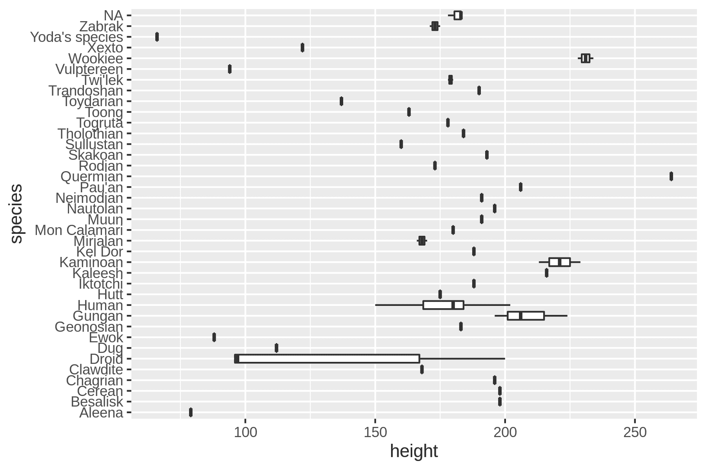
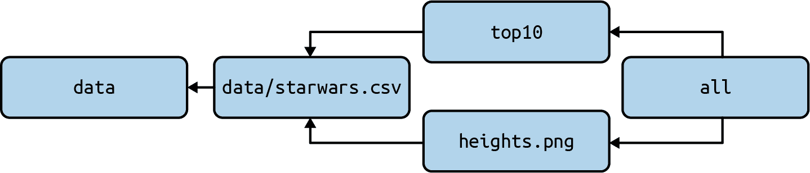

# 6 项目管理与`make`

> 原文：<https://datascienceatthecommandline.com/2e/chapter-6-project-management-with-make.html>

我希望现在您已经开始认识到命令行是一个非常方便的数据处理环境。您可能已经注意到，由于使用了命令行，我们:

*   调用许多不同的命令。
*   从不同的目录工作。
*   开发我们自己的命令行工具。
*   获取并生成许多(中间)文件。

由于这是一个探索性的过程，我们的工作流程往往相当混乱，这使得我们很难跟踪我们已经做了什么。重要的是，我们的步骤可以被自己或他人复制。当您继续以前的项目时，您可能已经忘记了运行了哪些命令、从哪个目录运行了哪些文件、使用了哪些参数以及运行的顺序。想象一下与合作者分享项目的挑战。

您可以通过挖掘`history`命令的输出来恢复一些命令，但是这当然不是一种可靠的方法。更好的方法是将命令保存到 shell 脚本中。至少这允许你和你的合作者复制这个项目。然而，shell 脚本也是一种次优方法，因为:

*   很难阅读和维护。
*   步骤之间的依赖关系不清楚。
*   每一步每次都要执行，这是低效的，有时也是不可取的。

这就是`make`真正闪耀的地方  。`make`是一个命令行工具，允许您:

*   根据输入和输出依赖关系形式化您的数据工作流步骤。
*   运行工作流程的特定步骤。
*   使用内联代码。
*   从外部来源存储和检索数据。

在第一版, 这章用`drake`代替`make`. Drake 在处理数据方面有很多新增的特性， 本来应该是`make`很好的继承者. 然而, Drake 在2016年的时候被它的创造者放弃了，因为有很多没有解决 bug. 所以我决定使用`make`.

一个重要的相关主题是*版本控制* ，它允许您跟踪项目的变更，将项目备份到服务器，与其他人协作，并在出现问题时检索早期版本。一个流行的做版本控制的命令行工具是`git`  。它经常与 GitHub 结合使用，GitHub 是一种分布式版本控制的在线服务。很多开源项目，包括[这本书](https://github.com/jeroenjanssens/data-science-at-the-command-line)，都托管在 GitHub 上。版本控制的主题已经超出了本书的范围，但是我强烈建议您研究一下，尤其是当您开始与他人合作的时候。在本章的最后，我推荐了一些资源来了解更多。

## 6.1 概述

使用`make`管理您的数据工作流是本章的主题。因此，您将了解:

*   用一个`Makefile`定义你的工作流。
*   从输入和输出依赖关系的角度思考工作流。
*   运行任务和构建目标。

```sh
$ cd /data/ch06

$ l
total 28K
-rw-r--r-- 1 dst dst  37 Mar  3 10:45 Makefile.test
-rw-r--r-- 1 dst dst  16 Mar  3 10:45 numbers.make
-rw-r--r-- 1 dst dst  26 Mar  3 10:45 numbers-write.make
-rw-r--r-- 1 dst dst  21 Mar  3 10:45 numbers-write-var.make
-rw-r--r-- 1 dst dst 432 Mar  3 10:45 starwars.make
-rw-r--r-- 1 dst dst 263 Mar  3 10:45 tasks.make
-rw-r--r-- 1 dst dst  27 Mar  3 10:45 template.make
```

获取这些文件的说明在[第 2 章](chapter-2-getting-started.html#chapter-2-getting-started)中。任何其他文件都是使用命令行工具下载或生成的。

## 6.2 介绍品牌

`make`围绕数据及其依赖关系组织命令执行。您的数据处理步骤在一个单独的文本文件(工作流)中被正式化。每一步都有输入和输出。`make`自动解析它们的依赖关系，并确定需要运行哪些命令以及运行的顺序。

这意味着，如果您有一个耗时 10 分钟的 SQL 查询，那么只有在结果丢失或查询后来发生变化时，才需要执行该查询。此外，如果您想要(重新)运行一个特定的步骤，`make`只会重新运行该步骤所依赖的步骤。这可以节省你很多时间。

拥有一个正式的工作流程可以让你在几个星期后轻松地拿起你的项目并与其他人合作。我强烈建议您这样做，即使您认为这将是一次性项目，因为您永远不知道何时需要再次运行某些步骤，或者在另一个项目中重用它们。

## 6.3 运行任务

默认情况下，`make`在当前目录中搜索名为`Makefile`的配置文件。它也可以被命名为`makefile`(小写)，但是我建议将您的文件命名为`Makefile`，因为它更常见，而且这样它会出现在目录列表的顶部。通常每个项目只有一个配置文件。因为这一章讨论了许多不同的文件，所以我没有给它们分别命名。进行*扩展*。让我们从下面的`Makefile`开始:

```sh
$ bat -A numbers.make
───────┬────────────────────────────────────────────────────────────────────────
       │ File: numbers.make
───────┼────────────────────────────────────────────────────────────────────────
   1   │ numbers:␊
   2   │ ├──────┤seq·7␊
───────┴────────────────────────────────────────────────────────────────────────
```

这个`Makefile`包含一个*目标*叫做 `numbers` 。一个*目标*就像一个任务。它通常是您想要创建的文件的名称，但也可以比它更通用。下面这条线， `seq 7` ，被称为*规则* 。把一个规则想象成一个食谱；一个或多个指定如何构建目标的命令。

规则前面的空格是一个制表符。对空格很挑剔。当心一些编辑在你按下`TAB`键时插入空格，称为软标签，这将导致`make`产生错误。以下代码通过将选项卡扩展到八个空格来说明这一点:

```sh
$ < numbers.make expand > spaces.make

$ bat -A spaces.make ───────┬────────────────────────────────────────────────────────────────────────
       │ File: spaces.make
───────┼────────────────────────────────────────────────────────────────────────
   1   │ numbers:␊
   2   │ ········seq·7␊
───────┴────────────────────────────────────────────────────────────────────────

$ make -f spaces.make ➊
spaces.make:2: *** missing separator (did you mean TAB instead of 8 spaces?).  S
top. ➋

$ rm spaces.make
```

➊ 我需要添加`-f`选项(简称`--makefile`选项)，因为配置文件不叫`Makefile`，这是默认的。
➋ 你可以在命令行找到的更有用的错误信息之一！

从现在开始，我将把适当的文件重命名为`Makefile`，因为这样更符合现实世界的使用。所以，如果我运行`make`:

```sh
$ cp numbers.make Makefile

$ make
seq 7
1
2
3
4
5
6
7
```

然后我们看到`make`首先打印规则本身( `seq 7` )，然后是规则生成的输出。这个过程被称为*建立*目标。如果你不指定一个目标的名字，那么`make`将构建第一个在`Makefile`中指定的目标。但是在实践中，您通常会指定您想要构建的目标:

```sh
$ make numbers
seq 7
1
2
3
4
5
6
7
```

`make`本来是为了协助进行源码汇编的, 解释了一些像`target`，`rule`和`building`的术语.

在这种情况下，我们实际上没有构建任何东西，因为我们没有创建任何新文件。`make`将愉快地*再次建造*我们的目标`numbers`，因为它没有找到一个叫做*的文件编号 *。在下一节中，我将深入探讨这一点。

有时，不管同名文件是否存在，都构建一个目标是很有用的。想想作为项目的一部分，您需要执行的任务。在你的`Makefile`的顶部使用一个名为`.PHONY`的特殊目标，后跟虚假目标的名字，这是一个很好的做法。这里有一个例子`Makefile`来说明如何使用假目标:

```sh
$ bat tasks.make
───────┬────────────────────────────────────────────────────────────────────────
       │ File: tasks.make
───────┼────────────────────────────────────────────────────────────────────────
   1   │ .PHONY: clean publish docker-run
   2   │
   3   │ clean:
   4   │         rm book/2e/book.md book/2e/render*.rds
   5   │
   6   │ publish:
   7   │         (cd www && hugo) && netlify deploy --prod --dir www/public
   8   │
   9   │ docker-run:
  10   │         docker run -it --rm -v $$(pwd)/book/2e/data:/data -p 8000:8000
       │ datasciencetoolbox/dsatcl2e:latest ➊
───────┴────────────────────────────────────────────────────────────────────────
```

➊ 注意 `$(pwd)` 前面多出来的美元符号。这是必要的，因为`make`使用一个美元符号来表示各种特殊变量，我将在后面解释。

以上摘自我写这本书时使用的`Makefile`。你可以说我把`make`作为一个荣耀的任务运行者。虽然这不是`make`的主要目的，但它仍然提供了很多价值，因为我不需要记住或查找我使用了什么咒语。相反，我输入`make publish`，这本书的最新版本就出版了。将长时间运行的命令放在一个`Makefile`中是非常好的。

并且可以为我们做更多的事情！

## 6.4 建筑，真实

让我们修改我们的`Makefile`，这样规则的输出被写到一个文件*编号*。

```sh
$ cp numbers-write.make Makefile

$ bat Makefile
───────┬────────────────────────────────────────────────────────────────────────
       │ File: Makefile
───────┼────────────────────────────────────────────────────────────────────────
   1   │ numbers:
   2   │         seq 7 > numbers
───────┴────────────────────────────────────────────────────────────────────────

$ make numbers
seq 7 > numbers

$ bat numbers
───────┬────────────────────────────────────────────────────────────────────────
       │ File: numbers
───────┼────────────────────────────────────────────────────────────────────────
   1   │ 1
   2   │ 2
   3   │ 3
   4   │ 4
   5   │ 5
   6   │ 6
   7   │ 7
───────┴────────────────────────────────────────────────────────────────────────
```

现在我们可以说`make`实际上是在建造什么东西。此外，如果我们再次运行它，我们会看到`make`报告目标 `numbers` 是最新的。

```sh
$ make numbers
make: 'numbers' is up to date.
```

没有必要重建目标 `numbers` ，因为文件*编号*已经存在。这很好，因为`make`通过不重复工作节省了我们的时间。

在`make`里，都是关于文件的。但是要记住`make`只关心目标的*名* 。它不检查规则是否实际创建了同名文件。如果我们要写入一个名为`nummers`的文件，它在荷兰语中是“数字”的意思，而目标仍然名为 `numbers` ，那么`make`将总是构建这个目标。反之亦然，如果文件*编号*是由其他进程创建的，不管是自动的还是手动的，那么`make`仍然会认为那个目标是最新的。

我们可以通过使用自动变量`$@`来避免一些重复，该变量被扩展为目标的名称:

```sh
$ cp numbers-write-var.make Makefile

$ bat Makefile
───────┬────────────────────────────────────────────────────────────────────────
       │ File: Makefile
───────┼────────────────────────────────────────────────────────────────────────
   1   │ numbers:
   2   │         seq 7 > $@
───────┴────────────────────────────────────────────────────────────────────────
```

让我们通过删除文件*编号*并再次调用`make`来验证这是否可行:

```sh
$ rm numbers

$ make numbers
seq 7 > numbers

$ bat numbers
───────┬────────────────────────────────────────────────────────────────────────
       │ File: numbers
───────┼────────────────────────────────────────────────────────────────────────
   1   │ 1
   2   │ 2
   3   │ 3
   4   │ 4
   5   │ 5
   6   │ 6
   7   │ 7
───────┴────────────────────────────────────────────────────────────────────────
```

`make`重建目标的另一个原因是它的依赖性，所以接下来让我们讨论一下。

## 6.5 添加依赖关系

到目前为止，我们已经研究了孤立存在的目标。在典型的数据科学工作流中，许多步骤都依赖于其他步骤。为了恰当地讨论 Makefile 中的依赖关系，让我们考虑两个与星战角色数据集相关的任务。

以下是该数据集的摘录:

```sh
$ curl -sL 'https://raw.githubusercontent.com/tidyverse/dplyr/master/data-raw/st
arwars.csv' |
> xsv select name,height,mass,homeworld,species |
> csvlook
│ name                  │ height │    mass │ homeworld      │ species        │
├───────────────────────┼────────┼─────────┼────────────────┼────────────────┤
│ Luke Skywalker        │    172 │    77.0 │ Tatooine       │ Human          │
│ C-3PO                 │    167 │    75.0 │ Tatooine       │ Droid          │
│ R2-D2                 │     96 │    32.0 │ Naboo          │ Droid          │
│ Darth Vader           │    202 │   136.0 │ Tatooine       │ Human          │
│ Leia Organa           │    150 │    49.0 │ Alderaan       │ Human          │
│ Owen Lars             │    178 │   120.0 │ Tatooine       │ Human          │
│ Beru Whitesun lars    │    165 │    75.0 │ Tatooine       │ Human          │
│ R5-D4                 │     97 │    32.0 │ Tatooine       │ Droid          │
… with 79 more lines
```

第一个任务计算十个最高的人:

```sh
$ curl -sL 'https://raw.githubusercontent.com/tidyverse/dplyr/master/data-raw/st
arwars.csv' |
> grep Human | ➊
> cut -d, -f 1,2 | ➋
> sort -t, -k2 -nr | # ➌
> head # ➍
Darth Vader,202
Qui-Gon Jinn,193
Dooku,193
Bail Prestor Organa,191
Raymus Antilles,188
Mace Windu,188
Anakin Skywalker,188
Gregar Typho,185
Jango Fett,183
Cliegg Lars,183
```

➊ 只保留包含图案 `Human` 的行。
➋ 提取前两列。
➌ 按第二列的数字顺序对行进行反向排序。
➍ 默认情况下，`head`打印前 10 行。您可以用`-n`选项覆盖它。

第二个任务是创建一个显示每个物种高度分布的箱线图(见图 [6.1](chapter-6-project-management-with-make.html#fig:starwars-image) ):

```sh
$ curl -sL 'https://raw.githubusercontent.com/tidyverse/dplyr/master/data-raw/st
arwars.csv' |
> rush plot --x height --y species --geom boxplot > heights.png

$ display heights.png
```



图 6.1:星球大战中每个物种的身高分布 

让我们把这两个任务放到一个`Makefile`中。我不想一步一步地做，我想先展示一个完整的`Makefile`是什么样子，然后一步一步地解释所有的语法。

```sh
$ cp starwars.make Makefile

$ bat Makefile
───────┬────────────────────────────────────────────────────────────────────────
       │ File: Makefile
───────┼────────────────────────────────────────────────────────────────────────
   1   │ SHELL := bash
   2   │ .ONESHELL:
   3   │ .SHELLFLAGS := -eu -o pipefail -c
   4   │
   5   │ URL = "https://raw.githubusercontent.com/tidyverse/dplyr/master/data-ra
       │ w/starwars.csv"
   6   │
   7   │ .PHONY: all top10
   8   │
   9   │ all: top10 heights.png
  10   │
  11   │ data:
  12   │         mkdir $@
  13   │
  14   │ data/starwars.csv: data
  15   │         curl -sL $(URL) > $@
  16   │
  17   │ top10: data/starwars.csv
  18   │         grep Human $< |
  19   │         cut -d, -f 1,2 |
  20   │         sort -t, -k2 -nr |
  21   │         head
  22   │
  23   │ heights.png: data/starwars.csv
  24   │         < $< rush plot --x height --y species --geom boxplot > $@
───────┴────────────────────────────────────────────────────────────────────────
```

让我们一步一步地看这个`Makefile`。前三行用于更改与`make`本身相关的一些默认设置:

1.  所有规则都在 shell 中执行，默认情况下，shell 是`sh`。用`SHELL`变量我们可以把它改成另一个 shell，就像`bash`。这样我们就可以使用 Bash 提供的所有东西，比如 for 循环。
2.  默认情况下，规则中的每一行都单独发送到 shell。对于特殊的目标`.ONESHELL` ，我们可以覆盖它，这样目标`top10`的规则就起作用了。
3.  `.SHELLFLAGS`线使得 Bash 更加严格，这被认为是[的最佳实践](http://redsymbol.net/articles/unofficial-bash-strict-mode/)。例如，由于这个原因，现在一旦出现错误，目标 `top10` 的规则中的管道就会停止。

我们定义一个自定义变量叫做`URL` 。尽管这仅使用一次，但我发现将这样的信息放在文件的开头很有帮助，这样您就可以很容易地对这些设置进行更改。

使用特殊目标 `.PHONY` 我们可以指出哪些目标没有被文件表示。在我们的例子中，目标为`all``top10`。无论目录中是否包含同名文件，这些目标都将被执行。

有五个目标:`all``data``data/starwars.csv``top10``heights.png`。图 [6.1](chapter-6-project-management-with-make.html#fig:starwars-image)概述了这些目标以及它们之间的依赖关系。



图 6.2:目标之间的依赖关系 

让我们依次讨论每个目标:

1.  目标 `all` 有两个依赖项，但没有规则。这就像是按指定顺序执行一个或多个目标的快捷方式。在这种情况下:`top10``heights.png`。目标 `all` 作为第一个目标出现在`Makefile`中，这意味着如果我们运行`make`，这个目标将被构建。
2.  目标 `data` 创建目录*数据* 。之前我说过`make`都是关于文件的。嗯，也是关于目录的。只有当目录*数据*尚不存在时，才会执行该目标。
3.  目标 `data/starwars.csv` 取决于目标 `data` 。如果没有 `data` 目录，它将首先被创建。一旦满足了所有的依赖关系，就会执行规则，包括下载一个文件，并将其保存到与目标同名的文件中。
4.  目标 `top10` 被标记为冒牌货，所以如果指定，它将始终被构建。这取决于 `data/starwars.csv` 目标。它使用了一个特殊的变量 `$<` ，该变量扩展为第一个先决条件的名称，即`data/starwars.csv`。
5.  目标 `heights.png` ，与目标 `top10` 一样，依赖于 `data/starwars.csv` ，并且利用了我们在本章中看到的两个自动变量。如果您想了解其他自动变量，请参见[在线文档](https://www.gnu.org/software/make/manual/html_node/Automatic-Variables.html)。

最后但同样重要的是，让我们验证这个`Makefile`是否有效:

```sh
$ make
mkdir data
curl -sL "https://raw.githubusercontent.com/tidyverse/dplyr/master/data-raw/star
wars.csv" > data/starwars.csv
grep Human data/starwars.csv |
cut -d, -f 1,2 |
sort -t, -k2 -nr |
head
Darth Vader,202
Qui-Gon Jinn,193
Dooku,193
Bail Prestor Organa,191
Raymus Antilles,188
Mace Windu,188
Anakin Skywalker,188
Gregar Typho,185
Jango Fett,183
Cliegg Lars,183
< data/starwars.csv rush plot --x height --y species --geom boxplot > heights.pn
g
```

这里没有惊喜。因为我们没有指定任何目标，所以将构建 `all` 目标，这又会导致构建 `top10` 和 `heights.png` 目标。前者的输出被打印成标准输出，后者创建一个文件`heights.png`。*数据*目录只创建一次，就像 CSV 文件只下载一次一样。

没有什么比只是玩你的数据而忘记其他一切更有趣的了。但是当我说使用`Makefile`来记录你所做的事情是值得的时候，你必须相信我。这不仅会让您的生活变得更轻松(双关语)，而且您还会开始按照步骤来考虑您的数据工作流。正如您自己的命令行工具箱一样，它会随着时间的推移而扩展，这同样适用于`make`工作流。您定义的步骤越多，就越容易继续做下去，因为通常您可以重用某些步骤。我希望你会习惯`make`，它会让你的生活更轻松。

## 6.6 总结

命令行的一个优点是它允许您处理数据。您可以轻松地执行不同的命令和处理不同的数据文件。这是一个非常互动和迭代的过程。过一段时间后，很容易忘记你采取了哪些步骤来获得想要的结果。因此，每隔一段时间记录你的步骤是非常重要的。这样，如果您或您的同事在一段时间后重新开始您的项目，通过执行相同的步骤可以再次产生相同的结果。

在这一章中，我已经向您展示了仅仅将每个命令放在一个 Bash 脚本中并不是最理想的。相反，我建议使用`make`作为命令行工具来管理您的数据工作流。下一章涵盖了 OSEMN 数据科学模型的第三步，即探索数据。

## 6.7 进行进一步探索

*   罗伯特·梅克伦堡的《用 GNU Make 管理项目》一书和在线的《GNU Make 手册*提供了对`make`的全面和高级的概述。*
**   除了`make`之外，还有很多其他的工作流管理器。尽管它们在语法和功能上有所不同，但它们也使用诸如目标、规则和依赖关系等概念。例子包括[路易吉](https://luigi.readthedocs.io)、[阿帕奇气流](https://airflow.apache.org)和 [Nextflow](https://www.nextflow.io) 。*   要了解更多关于版本控制的知识，特别是`git`和 GitHub，我推荐斯科特·沙孔和本·施特劳布的书《Pro Git》。免费提供的[。在线 GitHub 文档](https://git-scm.com/book/en/v2)也是一个很好的起点。*