# 7 探索数据

> 原文：<https://datascienceatthecommandline.com/2e/chapter-7-exploring-data.html>

在所有这些艰苦的工作之后(除非你已经有了干净的数据)，是时候享受一些乐趣了。现在您已经获得并清理了数据，您可以继续进行 OSEMN 模型的第三步，即探索数据。

探索是你熟悉数据的步骤。当您想要从中提取任何价值时，熟悉数据是必不可少的。例如，知道数据具有哪种特征，意味着您知道哪些特征值得进一步探索，哪些特征可以用来回答您的任何问题。

可以从三个角度探索您的数据。第一个视角是检查数据及其属性。在这里，您希望了解诸如原始数据的样子、数据集有多少个数据点以及数据集有哪些特征之类的信息。

第二是计算描述性统计。这种视角有助于了解更多关于单个特性的信息。输出通常是简短的文本，因此可以在命令行上打印。

第三个视角是创建数据的可视化。从这个角度，您可以深入了解多个功能是如何交互的。我将讨论一种创建可以在命令行上打印的可视化效果的方法。然而，可视化最适合在图形用户界面上显示。数据可视化优于描述性统计的一个优点是，它们更灵活，可以传达更多的信息。

## 7.1 概述

在本章中，您将学习如何:

*   检查数据及其属性
*   计算描述性统计
*   在命令行内外创建数据可视化

本章从以下文件开始:

```sh
$ cd /data/ch07

$ l
total 104K
-rw-r--r-- 1 dst dst  125 Mar  3 10:46 datatypes.csv
-rw-r--r-- 1 dst dst 7.8K Mar  3 10:46 tips.csv
-rw-r--r-- 1 dst dst  83K Mar  3 10:46 venture.csv
-rw-r--r-- 1 dst dst 4.6K Mar  3 10:46 venture-wide.csv
```

获取这些文件的说明在[第 2 章](chapter-2-getting-started.html#chapter-2-getting-started)中。任何其他文件都是使用命令行工具下载或生成的。

## 7.2 检查数据及其属性

在本节中，我将演示如何检查数据集及其属性。因为即将到来的可视化和建模技术期望数据是矩形的，所以我假设数据是 CSV 格式的。如有必要，您可以使用第 5 章中描述的技术将您的数据转换成 CSV 格式。

为了简单起见，我还假设您的数据有一个头。在第一小节中，我将展示一种方法来确定是否是这样。一旦你知道你有一个标题，你可以继续回答下列问题:

*   数据集有多少个数据点和特征？
*   原始数据是什么样的？
*   数据集有什么样的特征？
*   这些特征中的一些可以被视为绝对的吗？

### 7.2.1 头球与否，我来了

您可以通过使用`head`打印前几行来检查您的文件是否有标题:

```sh
$ head -n 5 venture.csv
FREQ,TIME_FORMAT,TIME_PERIOD,EXPEND,UNIT,GEO,OBS_STATUS,OBS_VALUE,FREQ_DESC,TIME
_FORMAT_DESC,TIME_PERIOD_DESC,OBS_STATUS_DESC,EXPEND_DESC,UNIT_DESC,GEO_DESC
A,P1Y,2015,INV_VEN,PC_GDP,CZ,,0.002,Annual,Annual,Year 2015,No data,"Venture cap
ital investment (seed, start-up and later stage) ",Percentage of GDP,Czechia
A,P1Y,2007,INV_VEN,PC_GDP,DE,,0.034,Annual,Annual,Year 2007,No data,"Venture cap
ital investment (seed, start-up and later stage) ",Percentage of GDP,Germany
A,P1Y,2008,INV_VEN,PC_GDP,DE,,0.039,Annual,Annual,Year 2008,No data,"Venture cap
ital investment (seed, start-up and later stage) ",Percentage of GDP,Germany
A,P1Y,2009,INV_VEN,PC_GDP,DE,,0.029,Annual,Annual,Year 2009,No data,"Venture cap
ital investment (seed, start-up and later stage) ",Percentage of GDP,Germany
```

如果这些行换行，使用`nl`添加行号:

```sh
$ head -n 3 venture.csv | nl
     1  FREQ,TIME_FORMAT,TIME_PERIOD,EXPEND,UNIT,GEO,OBS_STATUS,OBS_VALUE,FREQ_D
ESC,TIME_FORMAT_DESC,TIME_PERIOD_DESC,OBS_STATUS_DESC,EXPEND_DESC,UNIT_DESC,GEO_
DESC
     2  A,P1Y,2015,INV_VEN,PC_GDP,CZ,,0.002,Annual,Annual,Year 2015,No data,"Ven
ture capital investment (seed, start-up and later stage) ",Percentage of GDP,Cze
chia
     3  A,P1Y,2007,INV_VEN,PC_GDP,DE,,0.034,Annual,Annual,Year 2007,No data,"Ven
ture capital investment (seed, start-up and later stage) ",Percentage of GDP,Ger
many
```

或者，您可以使用`trim`:

```sh
$ < venture.csv trim 5
FREQ,TIME_FORMAT,TIME_PERIOD,EXPEND,UNIT,GEO,OBS_STATUS,OBS_VALUE,FREQ_DESC,TIM…
A,P1Y,2015,INV_VEN,PC_GDP,CZ,,0.002,Annual,Annual,Year 2015,No data,"Venture ca…
A,P1Y,2007,INV_VEN,PC_GDP,DE,,0.034,Annual,Annual,Year 2007,No data,"Venture ca…
A,P1Y,2008,INV_VEN,PC_GDP,DE,,0.039,Annual,Annual,Year 2008,No data,"Venture ca…
A,P1Y,2009,INV_VEN,PC_GDP,DE,,0.029,Annual,Annual,Year 2009,No data,"Venture ca…
… with 536 more lines
```

在这种情况下，很明显，第一行是一个标题，因为它只包含大写的名称，后面的行包含数字。这确实是一个相当主观的过程，由您决定第一行是标题还是已经是第一个数据点。当数据集不包含标题时，你最好使用`header`工具(在第 5 章的[中讨论)来纠正它。](chapter-5-scrubbing-data.html#chapter-5-scrubbing-data)

### 7.2.2 检查所有数据

如果你想按照自己的节奏检查原始数据，那么使用`cat`可能不是一个好主意，因为那样所有的数据都会被一次性打印出来。我推荐使用`less`  ，它允许您在命令行中交互式地检查您的数据。您可以通过指定`-S`选项来防止长行(如 *venture.csv* )换行:

```sh
$ less -S venture.csv
```

```sh
,GEO,OBS_STATUS,OBS_VALUE,FREQ_DESC,TIME_FORMAT_DESC,TIME_PERIOD_DESC,OBS_STATU> al,Annual,Year 2015,No data,"Venture capital investment (seed, start-up and lat> al,Annual,Year 2007,No data,"Venture capital investment (seed, start-up and lat> al,Annual,Year 2008,No data,"Venture capital investment (seed, start-up and lat> al,Annual,Year 2009,No data,"Venture capital investment (seed, start-up and lat> al,Annual,Year 2010,No data,"Venture capital investment (seed, start-up and lat> al,Annual,Year 2011,No data,"Venture capital investment (seed, start-up and lat> al,Annual,Year 2012,No data,"Venture capital investment (seed, start-up and lat> al,Annual,Year 2013,No data,"Venture capital investment (seed, start-up and lat> al,Annual,Year 2014,No data,"Venture capital investment (seed, start-up and lat> al,Annual,Year 2015,No data,"Venture capital investment (seed, start-up and lat> al,Annual,Year 2007,No data,"Venture capital investment (seed, start-up and lat> al,Annual,Year 2008,No data,"Venture capital investment (seed, start-up and lat> al,Annual,Year 2009,No data,"Venture capital investment (seed, start-up and lat> al,Annual,Year 2010,No data,"Venture capital investment (seed, start-up and lat> :                   
```

右边的大于号表示您可以水平滚动。按`Up`和`Down`可以上下滚动。按下`Space`向下滚动整个屏幕。水平滚动通过按`Left`和`Right`完成。按下`g`和`G`分别转到文件的开始和结束。按下`q`即可退出`less`。手册页列出了所有可用的键绑定。

`less`的一个优点是它不会将整个文件加载到内存中，这意味着它即使在查看大文件时也很快。

### 7.2.3 特征名称和数据类型

列(或特征)名称可以指示特征的含义。为此，您可以使用以下`head`和`tr`组合:

```sh
$ < venture.csv head -n 1 | tr , '\n'
FREQ
TIME_FORMAT
TIME_PERIOD
EXPEND
UNIT
GEO
OBS_STATUS
OBS_VALUE
FREQ_DESC
TIME_FORMAT_DESC
TIME_PERIOD_DESC
OBS_STATUS_DESC
EXPEND_DESC
UNIT_DESC
GEO_DESC
```

这个基本命令假设文件由逗号分隔。更健壮的方法是使用`csvcut`:

```sh
$ csvcut -n venture.csv
  1: FREQ
  2: TIME_FORMAT
  3: TIME_PERIOD
  4: EXPEND
  5: UNIT
  6: GEO
  7: OBS_STATUS
  8: OBS_VALUE
  9: FREQ_DESC
 10: TIME_FORMAT_DESC
 11: TIME_PERIOD_DESC
 12: OBS_STATUS_DESC
 13: EXPEND_DESC
 14: UNIT_DESC
 15: GEO_DESC
```

除了打印列名之外，您还可以更进一步。除了列名之外，了解每列包含什么类型的值也非常有用，比如字符串、数值或日期。假设您有以下玩具数据集:

```sh
$ bat -A datatypes.csv
───────┬────────────────────────────────────────────────────────────────────────
       │ File: datatypes.csv
───────┼────────────────────────────────────────────────────────────────────────
   1   │ a,b,c,d,e,f␊
   2   │ 1,0.0,FALSE,"""Yes!""",2011-11-11·11:00,2012-09-08␊
   3   │ 42,3.1415,TRUE,"OK,·good",2014-09-15,12/6/70␊
   4   │ 66,,False,2198,,␊
───────┴────────────────────────────────────────────────────────────────────────
```

其`csvlook`解释如下:

```sh
$ csvlook datatypes.csv
│  a │      b │     c │ d        │                   e │          f │
├────┼────────┼───────┼──────────┼─────────────────────┼────────────┤
│  1 │ 0.000… │ False │ "Yes!"   │ 2011-11-11 11:00:00 │ 2012-09-08 │
│ 42 │ 3.142… │  True │ OK, good │ 2014-09-15 00:00:00 │ 1970-12-06 │
│ 66 │        │ False │ 2198     │                     │            │
```

我已经在第 5 章的[中使用了`csvsql`来直接对 CSV 数据执行 SQL 查询。当没有传递命令行参数时，它会生成必要的 SQL 语句，如果要将这些数据插入到实际的数据库中，就需要用到这些语句。您还可以使用输出来检查推断的列类型。如果一列在数据类型后打印了 *NOT NULL* 字符串，那么该列不包含缺失值。](chapter-5-scrubbing-data.html#chapter-5-scrubbing-data)

```sh
$ csvsql datatypes.csv
CREATE TABLE datatypes (
        a DECIMAL NOT NULL,
        b DECIMAL,
        c BOOLEAN NOT NULL,
        d VARCHAR NOT NULL,
        e TIMESTAMP,
        f DATE
);
```

当您使用`csvkit`套件中的其他工具时，例如`csvgrep`、`csvsort`和`csvsql`，这个输出特别有用。对于 *venture.csv* ，各列推断如下:

```sh
$ csvsql venture.csv CREATE TABLE venture (
        "FREQ" VARCHAR NOT NULL,
        "TIME_FORMAT" VARCHAR NOT NULL,
        "TIME_PERIOD" DECIMAL NOT NULL,
        "EXPEND" VARCHAR NOT NULL,
        "UNIT" VARCHAR NOT NULL,
        "GEO" VARCHAR NOT NULL,
        "OBS_STATUS" BOOLEAN,
        "OBS_VALUE" DECIMAL NOT NULL,
        "FREQ_DESC" VARCHAR NOT NULL,
        "TIME_FORMAT_DESC" VARCHAR NOT NULL,
        "TIME_PERIOD_DESC" VARCHAR NOT NULL,
        "OBS_STATUS_DESC" VARCHAR NOT NULL,
        "EXPEND_DESC" VARCHAR NOT NULL,
        "UNIT_DESC" VARCHAR NOT NULL,
        "GEO_DESC" VARCHAR NOT NULL
);
```

### 7.2.4 唯一标识符、连续变量和因子

仅仅知道每个特性的数据类型是不够的。了解每个特性代表什么也很重要。了解这个领域非常有用，但是我们也可以通过查看数据本身来获得一些上下文。

字符串和整数都可以是唯一的标识符，也可以代表一个类别。在后一种情况下，这可以用来为您的可视化指定一种颜色。但是如果一个整数代表一个邮政编码，那么计算平均值就没有意义了。

要确定某个要素是否应被视为唯一标识符或分类变量，您可以计算特定列的唯一值的数量:

```sh
$ wc -l tips.csv
245 tips.csv

$ < tips.csv csvcut -c day | header -d | sort | uniq | wc -l
4
```

您可以使用`csvstat`  (它是`csvkit`的一部分)来获取每列的唯一值的数量:

```sh
$ csvstat tips.csv --unique
  1\. bill: 229
  2\. tip: 123
  3\. sex: 2
  4\. smoker: 2
  5\. day: 4
  6\. time: 2
  7\. size: 6

$ csvstat venture.csv --unique
  1\. FREQ: 1
  2\. TIME_FORMAT: 1
  3\. TIME_PERIOD: 9
  4\. EXPEND: 1
  5\. UNIT: 3
  6\. GEO: 20
  7\. OBS_STATUS: 1
  8\. OBS_VALUE: 286
  9\. FREQ_DESC: 1
 10\. TIME_FORMAT_DESC: 1
 11\. TIME_PERIOD_DESC: 9
 12\. OBS_STATUS_DESC: 1
 13\. EXPEND_DESC: 1
 14\. UNIT_DESC: 3
 15\. GEO_DESC: 20
```

如果只有一个惟一的值(比如用 *OBS_STATUS* ，那么有可能您可以丢弃该列，因为它不提供任何值。如果您想自动丢弃所有这样的列，那么您可以使用以下管道:

```sh
$ < venture.csv csvcut -C $( # ➊
>   csvstat venture.csv --unique | ➋
>   grep ': 1$' | # ➌
>   cut -d. -f 1 | # ➍
>   tr -d ' ' | ➎
>   paste -sd, ➏
> ) | trim ➐
TIME_PERIOD,UNIT,GEO,OBS_VALUE,TIME_PERIOD_DESC,UNIT_DESC,GEO_DESC
2015,PC_GDP,CZ,0.002,Year 2015,Percentage of GDP,Czechia
2007,PC_GDP,DE,0.034,Year 2007,Percentage of GDP,Germany
2008,PC_GDP,DE,0.039,Year 2008,Percentage of GDP,Germany
2009,PC_GDP,DE,0.029,Year 2009,Percentage of GDP,Germany
2010,PC_GDP,DE,0.029,Year 2010,Percentage of GDP,Germany
2011,PC_GDP,DE,0.029,Year 2011,Percentage of GDP,Germany
2012,PC_GDP,DE,0.021,Year 2012,Percentage of GDP,Germany
2013,PC_GDP,DE,0.023,Year 2013,Percentage of GDP,Germany
2014,PC_GDP,DE,0.021,Year 2014,Percentage of GDP,Germany
… with 531 more lines
```

➊`-C`选项取消选择给定位置(或名称)的列，该选项提供了命令替换
➋ 获取*venture . CSV*
➌仅保留包含一个唯一值的列
➍ 提取列位置
➎ 修剪任何空白区域
➏ 放置所有列位置

说到这里，我打算暂时保留这些专栏。

一般来说，如果唯一值的数量与总行数相比较少，那么该特征可能会被视为分类特征(例如在 *venture.csv* 中的 *GEO* )。如果数字等于行数，它可能是唯一标识符，但也可能是数值。只有一个方法可以找到答案:我们需要更深入。

## 7.3 计算描述性统计

### 7.3.1 列统计

命令行工具`csvstat`给出了很多信息。对于每个特征(列)，它显示:

*   数据类型
*   它是否有任何缺失值(空值)
*   唯一值的数量
*   适用于这些特征的各种描述性统计数据(最小值、最大值、总和、平均值、标准差和中值)

如下调用`csvstat`:

```sh
$ csvstat venture.csv | trim 32
  1\. "FREQ"

        Type of data:          Text
        Contains null values:  False
        Unique values:         1
        Longest value:         1 characters
        Most common values:    A (540x)

  2\. "TIME_FORMAT"

        Type of data:          Text
        Contains null values:  False
        Unique values:         1
        Longest value:         3 characters
        Most common values:    P1Y (540x)

  3\. "TIME_PERIOD"

        Type of data:          Number
        Contains null values:  False
        Unique values:         9
        Smallest value:        2,007
        Largest value:         2,015
        Sum:                   1,085,940
        Mean:                  2,011
        Median:                2,011
        StDev:                 2.584
        Most common values:    2,015 (60x)
                               2,007 (60x)
                               2,008 (60x)
                               2,009 (60x)
                               2,010 (60x)
… with 122 more lines
```

我只显示了前 32 行，因为这会产生大量输出。您可能想通过`less`来处理这个问题。如果您只对特定的统计数据感兴趣，也可以使用以下选项之一:

*   `--max`(最大)
*   `--min`(最小值)
*   `--sum`(总和)
*   `--mean`(意思)
*   `--median`(中值)
*   `--stdev`(标准偏差)
*   `--nulls`(列是否包含空值)
*   `--unique`(唯一值)
*   `--freq`(频繁值)
*   `--len`(最大值长度)

例如:

```sh
$ csvstat venture.csv --freq | trim
  1\. FREQ: { "A": 540 }
  2\. TIME_FORMAT: { "P1Y": 540 }
  3\. TIME_PERIOD: { "2015": 60, "2007": 60, "2008": 60, "2009": 60, "2010": 60 }
  4\. EXPEND: { "INV_VEN": 540 }
  5\. UNIT: { "PC_GDP": 180, "NR_COMP": 180, "MIO_EUR": 180 }
  6\. GEO: { "CZ": 27, "DE": 27, "DK": 27, "EL": 27, "ES": 27 }
  7\. OBS_STATUS: { "None": 540 }
  8\. OBS_VALUE: { "0": 28, "1": 19, "2": 14, "0.002": 10, "0.034": 7 }
  9\. FREQ_DESC: { "Annual": 540 }
 10\. TIME_FORMAT_DESC: { "Annual": 540 }
… with 5 more lines
```

您可以使用`-c`选项选择一个特征子集，该选项接受整数和列名:

```sh
$ csvstat venture.csv -c 3,GEO
  3\. "TIME_PERIOD"

        Type of data:          Number
        Contains null values:  False
        Unique values:         9
        Smallest value:        2,007
        Largest value:         2,015
        Sum:                   1,085,940
        Mean:                  2,011
        Median:                2,011
        StDev:                 2.584
        Most common values:    2,015 (60x)
                               2,007 (60x)
                               2,008 (60x)
                               2,009 (60x)
                               2,010 (60x)

  6\. "GEO"

        Type of data:          Text
        Contains null values:  False
        Unique values:         20
        Longest value:         2 characters
        Most common values:    CZ (27x)
                               DE (27x)
                               DK (27x)
                               EL (27x)
                               ES (27x)

Row count: 540
```

记住`csvstat`, 就像`csvsql`, 采用启发式的方法去决定数据类型, 并且不一定毁正确. 我鼓励你在采用了前述的分组后， 保持采取人工的检查. 进一步, 即使数据类型是一个字符串或者整型, 也没有指明应该如何应用它.

作为一个很好的附加功能，`csvstat`在最后输出数据点(行)的数量。正确处理值中的换行符和逗号。要只看到最后一行，您可以使用`tail`。或者，您可以使用`xsv`，它只返回实际的行数。

```sh
$ csvstat venture.csv | tail -n 1
Row count: 540

$ xsv count venture.csv
540
```

注意，这两个选项不同于使用`wc -l`，它计算新行的数量(因此也计算标题)。

### 7.3.2 外壳上的 R 单行代码

在本节中，我将向您介绍一个名为`rush`的命令行工具，它使您能够直接从命令行利用统计编程环境`R`。在我解释`rush`做什么以及它为什么存在之前，让我们先谈谈`R`本身。

`R`是一个非常强大的做数据科学的统计软件包。它是一种解释型编程语言，有大量的软件包，并提供自己的 REPL，类似于命令行，允许您处理数据。注意，一旦启动 R，您就处于一个独立于 Unix 命令行的交互式会话中。

假设您有一个名为 *tips.csv* 的 CSV 文件，您想要计算小费的百分比，并保存结果。为了在`R`中完成这一点，您将首先运行`R`:

```sh
$ R --quiet # ➊
>
```

➊ 我在这里使用`--quiet`选项来抑制相当长的启动消息

然后运行下面的代码:

```sh
> library(tidyverse)                            # ➊
── Attaching packages ─────────────────────────────────────── tidyverse 1.3.0 ──
✔ ggplot2 3.3.3     ✔ purrr   0.3.4
✔ tibble  3.0.6     ✔ dplyr   1.0.4
✔ tidyr   1.1.2     ✔ stringr 1.4.0
✔ readr   1.4.0     ✔ forcats 0.5.1
── Conflicts ────────────────────────────────────────── tidyverse_conflicts() ──
✖ dplyr::filter() masks stats::filter()
✖ dplyr::lag()    masks stats::lag()
> df <- read_csv("tips.csv")                    ➋

── Column specification ──────────────────────────────────────────────────────── cols(
  bill = col_double(),
  tip = col_double(),
  sex = col_character(),
  smoker = col_character(),
  day = col_character(),
  time = col_character(),
  size = col_double()
)

> df <- mutate(df, percent = tip / bill * 100)  # ➌
> write_csv(df, "percent.csv")                  # ➍
> q("no")                                       ➎

$
```

➊ 加载任何需要的包
➋ 读入 CSV 文件并将其赋给变量
➌ 计算新列*百分比* 
➍ 将结果保存到磁盘
➎ 退出`R`

之后，您可以在命令行上继续使用保存的文件 *percent.csv* 。

```sh
$ < percent.csv trim 5
bill,tip,sex,smoker,day,time,size,percent
16.99,1.01,Female,No,Sun,Dinner,2,5.9446733372572105
10.34,1.66,Male,No,Sun,Dinner,3,16.054158607350097
21.01,3.5,Male,No,Sun,Dinner,3,16.658733936220845
23.68,3.31,Male,No,Sun,Dinner,2,13.97804054054054
… with 240 more lines
```

请注意，只有第三行与您具体想要完成的任务相关联。其他行是必要的样板。为了完成某件简单的事情而输入这种样板文件是很麻烦的，而且会破坏你的工作流程。有时，您只想一次对数据做一两件事。如果您能驾驭`R`的力量并从命令行使用它，那不是很好吗？

这就是`rush`的用武之地。让我们像以前一样执行相同的任务，但是现在使用`rush`:

```sh
$ rm percent.csv

$ rush run -t 'mutate(df, percent = tip / bill * 100)' tips.csv > percent.csv

$ < percent.csv trim 5
bill,tip,sex,smoker,day,time,size,percent
16.99,1.01,Female,No,Sun,Dinner,2,5.9446733372572105
10.34,1.66,Male,No,Sun,Dinner,3,16.054158607350097
21.01,3.5,Male,No,Sun,Dinner,3,16.658733936220845
23.68,3.31,Male,No,Sun,Dinner,2,13.97804054054054
… with 240 more lines
```

这些小的一行程序是可能的，因为`rush`处理所有的样板文件。在这种情况下，我使用的是`run`子命令。还有`plot`子命令，我将在下一节中使用它来快速生成数据可视化。如果您正在传递任何输入数据，那么默认情况下，`rush`假设它是 CSV 格式的，带有一个头和一个逗号作为分隔符。此外，对列名进行了清理，以便更容易使用。您可以分别使用`--no-header`(或`-H`)、`--delimiter`(或`-d`)和`--no-clean-names`(或`-C`)选项来覆盖这些默认值。该帮助很好地概述了`run`子命令的可用选项:

```sh
$ rush run --help
rush: Run an R expression

Usage:
  rush run [options] <expression> [--] [<file>...]

Reading options:
  -d, --delimiter <str>    Delimiter [default: ,].
  -C, --no-clean-names     No clean names.
  -H, --no-header          No header.

Setup options:
  -l, --library <name>     Libraries to load.
  -t, --tidyverse          Enter the Tidyverse.

Saving options:
      --dpi <str|int>      Plot resolution [default: 300].
      --height <int>       Plot height.
  -o, --output <str>       Output file.
      --units <str>        Plot size units [default: in].
  -w, --width <int>        Plot width.

General options:
  -n, --dry-run            Only print generated script.
  -h, --help               Show this help.
  -q, --quiet              Be quiet.
      --seed <int>         Seed random number generator.
  -v, --verbose            Be verbose.
      --version            Show version.
```

在幕后，`rush`生成一个`R`脚本并随后执行它。您可以通过指定`--dry-run`(或`-n`)选项来查看这个生成的脚本:

```sh
$ rush run -n --tidyverse 'mutate(df, percent = tip / bill * 100)' tips.csv
#!/usr/bin/env Rscript
library(tidyverse)
library(glue)
df <- janitor::clean_names(readr::read_delim("tips.csv", delim = ",", col_names
= TRUE))
mutate(df, percent = tip/bill * 100)
```

这个生成的脚本:

*   写出了《社榜》(*`#!`*)；参见从命令行运行`R`脚本所需的[第 4 章](chapter-4-creating-command-line-tools.html#chapter-4-creating-command-line-tools)。
*   导入 *tidyverse* 和 *glue* 包。
*   加载 *tips.csv* 作为数据帧，清除列名，并将其赋给变量 *df* 。
*   运行指定的表达式。
*   将结果打印到标准输出。

您可以将这个生成的脚本重定向到一个文件，并通过 shebang 轻松地将它变成一个新的命令行工具。

`rush`的输出本身不一定是 CSV 格式的。在这里，我计算平均小费百分比、最大聚会规模、时间列的唯一值、账单和小费之间的相关性。最后，我提取整个列(但只显示前 10 个值)。

```sh
$ < percent.csv rush run 'mean(df$percent)' -
16.0802581722505

$ < percent.csv rush run 'max(df$size)' -
6

$ < percent.csv rush run 'unique(df$time)' -
Dinner
Lunch

$ < percent.csv rush run 'cor(df$bill, df$tip)' -
0.675734109211365

$ < percent.csv rush run 'df$tip' - | trim
1.01
1.66
3.5
3.31
3.61
4.71
2
3.12
1.96
3.23
… with 234 more lines
```

最后一个破折号意味着`rush`应该从标准输入中读取。

所以现在，如果你想用`R`对你的数据集做一两件事，你可以把它指定为一行程序，然后继续在命令行上工作。您已经掌握的关于`R`的所有知识现在都可以从命令行使用了。使用`rush`，你甚至可以创建复杂的可视化效果，我将在下一节向你展示。

## 7.4 创建可视化效果

在这一节中，我将向您展示如何在命令行创建数据可视化。我将使用`rush plot`创建条形图、散点图和箱线图。不过，在我们开始之前，我想先解释一下如何显示可视化效果。

### 7.4.1 从命令行显示图像

让我们以 tips.png 的形象*为例。看一下图 [7.1](chapter-7-exploring-data.html#fig:plot-demo) ，这是使用`rush`和 *tips.csv* 数据集创建的数据可视化。(一会儿我会解释一下`rush`的语法。)我使用`display`工具将图片插入书中，但是如果你运行`display`你会发现它不起作用。这是因为从命令行显示图像实际上相当棘手。*

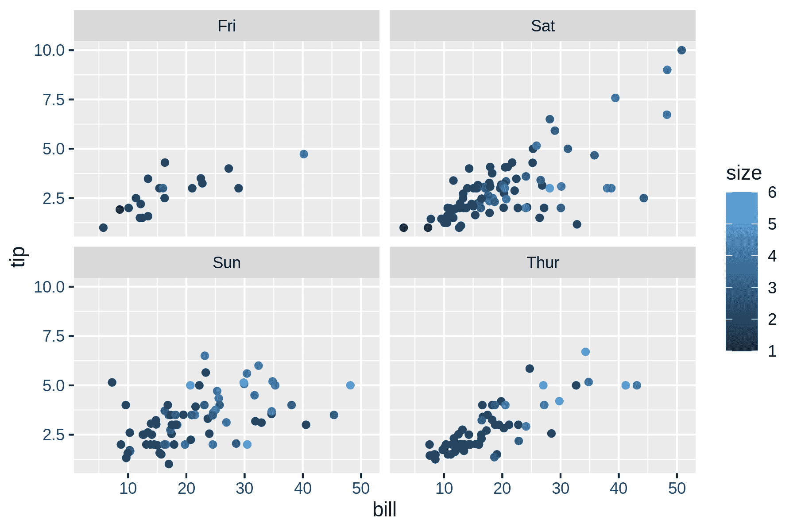

图 7.1:自己显示这个图像可能有些棘手 

根据您的设置，有不同的选项可用于显示图像。我知道有四种选择，每种都有自己的优缺点:(1)作为文本表示，(2)作为内嵌图像，(3)使用图像查看器，以及(4)使用浏览器。让我们快速浏览一遍。

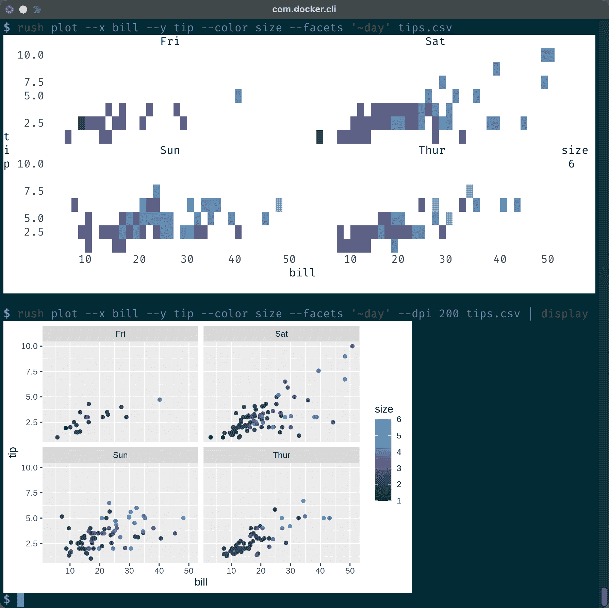

图 7.2:通过 ASCII 字符和 ANSI 转义序列(上图)和 iTerm2 内嵌图像协议(下图)在终端显示图像 

选项 1 是显示终端内的图像，如图 [7.2](chapter-7-exploring-data.html#fig:screenshot-display-ansi-and-inline)顶部所示。当标准输出没有重定向到文件时，此输出由`rush`生成。它基于 ASCII 字符和 ANSI 转义序列，因此在每个终端中都可用。根据你阅读本书的方式，当你运行这段代码时，你得到的输出可能与图 [7.2](chapter-7-exploring-data.html#fig:screenshot-display-ansi-and-inline)中的截图相符，也可能不相符。

```sh
$ rush plot --x bill --y tip --color size --facets '~day' tips.csv              
 Fri  Sat  10.0  * # 7.5  * # * 5.0  # * ### * # # # ### ## ## #####*####+ * ** # 2.5  # %### % #########*#*## # # t  size  i  Sun  Thur  6  p  10.0  1  7.5  = * ** * # * 5.0  ## # +#*# +* * # = ##* = = # +* 2.5  ######## # * ### # # ## #####* # ## ####* * #+ ###### # 10  20  30  40  50  10  20  30  40  50  bill 
```

如果你只看到 ASCII 字符，这意味着你阅读这本书的媒介不支持负责颜色的 ANSI 转义序列。幸运的是，如果您自己运行上面的命令，它看起来就像截图一样。

如图 [7.2](chapter-7-exploring-data.html#fig:screenshot-display-ansi-and-inline)底部所示，选项 2 也显示终端内的图像。这是 iTerm2 终端，仅适用于 macOS，通过一个小脚本(我将其命名为`display`)使用[内嵌图像协议](https://iterm2.com/documentation-images.html)。Docker 映像不包含该脚本，但是您可以轻松地安装它:

```sh
$ curl -s "https://iterm2.com/utilities/imgcat" > display && chmod u+x display
```

如果您没有在 macOS 上使用 iTerm2，可能有其他选项可以内联显示图像。请咨询你喜欢的搜索引擎。

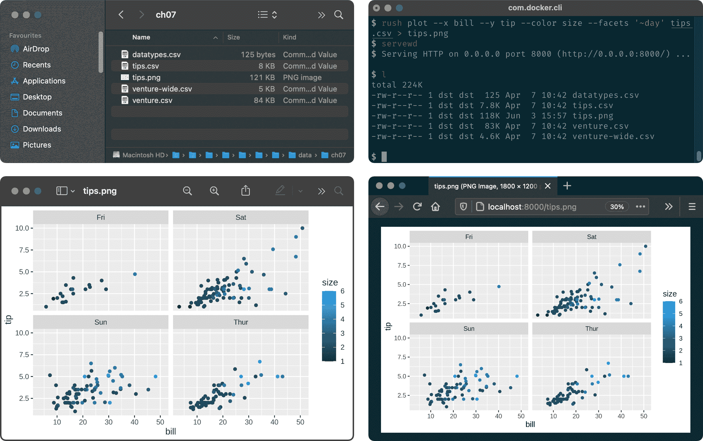

图 7.3:通过文件浏览器和图像浏览器(左)以及通过网络服务器和浏览器(右)在外部显示图像 

选项 3 是在图像查看器中手动打开图像(本例中为 *tips.csv* )。图 [7.3](chapter-7-exploring-data.html#fig:screenshot-display-preview-and-browser)在左边显示了 macOS 上的文件浏览器(Finder)和图像浏览器(Preview)。当你在本地工作时，这个选项总是有效的。当您在 Docker 容器中工作时，只有当您使用`-v`选项映射了一个本地目录时，才能从您的操作系统访问生成的映像。参见[第 2 章](chapter-2-getting-started.html#chapter-2-getting-started)了解如何操作的说明。此选项的一个优点是，当图像发生变化时，大多数图像查看器会自动更新显示，这允许您在微调可视化时进行快速迭代。

选项 4 是在浏览器中打开图像。图 [7.3](chapter-7-exploring-data.html#fig:screenshot-display-preview-and-browser)右侧是火狐显示*[http://localhost:8000/tips . png](http://localhost:8000/tips.png)*的截图。任何浏览器都可以，但是您需要另外两个先决条件才能使用这个选项。首先，您需要使用`-p`选项在 Docker 容器上创建一个可访问的端口(本例中为端口 8000)。(同样，参见[第 2 章](chapter-2-getting-started.html#chapter-2-getting-started)了解如何操作的说明。)其次，你需要启动一个 webserver。为此，Docker 容器有一个名为`servewd`的小工具，使用 Python 服务于当前工作目录:

```sh
$ bat $(which servewd)
───────┬────────────────────────────────────────────────────────────────────────
       │ File: /usr/bin/dsutils/servewd
───────┼────────────────────────────────────────────────────────────────────────
   1   │ #!/usr/bin/env bash
   2   │ ARGS="$@"
   3   │ python3 -m http.server ${ARGS} 2>/dev/null &
───────┴────────────────────────────────────────────────────────────────────────
```

你只需要从一个目录运行`servewd`一次(比如 */data/* )，它就会愉快地在后台运行。一旦你绘制了一些东西，你就可以在你的浏览器中访问 *localhost:8000* 并访问该目录及其所有子目录的内容。默认端口是 8000，但是您可以通过将它指定为`servewd`的参数来更改它:

```sh
$ servewd 9999
```

只要确保这个端口是可访问的。因为`servewd`在后台运行，所以需要按如下方式停止它:

```sh
$ pkill -f http.server
```

选项 4 也可以在远程机器上工作。

既然我们已经介绍了显示图像的四个选项，让我们继续实际创建一些。

### 7.4.2 匆忙绘图

当谈到创建数据可视化时，有太多的选择。就我个人而言，我是一个坚定的支持者`ggplot2`，这是一个 r 的可视化包。图形的底层语法伴随着一个一致的 API，允许您快速迭代地创建不同类型的漂亮数据可视化，而很少需要查阅文档。探索数据时一组受欢迎的属性。

我们并不真的着急，但我们也不想过多地摆弄任何单一的可视化。此外，我们希望尽可能多地使用命令行。幸运的是，我们还有`rush`，它允许我们从命令行`ggplot2`。图 [7.1](chapter-7-exploring-data.html#fig:plot-demo)中的数据可视化可以创建如下:

```sh
$ rush run --library ggplot2 'ggplot(df, aes(x = bill, y = tip, color = size)) +
 geom_point() + facet_wrap(~day)' tips.csv > tips.png
```

然而，你可能已经注意到了，我使用了一个非常不同的命令来创建 *tips.png*:

```sh
$ rush plot --x bill --y tip --color size --facets '~day' tips.csv > tips.png
```

虽然`ggplot2`的语法相对简洁，特别是考虑到它所提供的灵活性，但是有一个快速创建基本情节的捷径。该快捷方式可通过`rush`的`plot`子命令获得。这允许你创建漂亮的基本情节，而不需要学习 R 和图形的语法。

在引擎盖下，`rush plot`使用`ggplot2`包中的功能`qplot`。这是文件的第一部分:

```sh
$ R -q -e '?ggplot2::qplot' | trim 14
> ?ggplot2::qplot
qplot                 package:ggplot2                  R Documentation

Quick plot

Description:

     ‘qplot()’ is a shortcut designed to be familiar if you're used to
     base ‘plot()’. It's a convenient wrapper for creating a number of
     different types of plots using a consistent calling scheme. It's
     great for allowing you to produce plots quickly, but I highly
     recommend learning ‘ggplot()’ as it makes it easier to create
     complex graphics.

… with 108 more lines
```

我同意这个建议；一旦你读完这本书，学习`ggplot2`将是值得的，尤其是如果你想将任何探索性的数据可视化升级为适合交流的可视化。现在，当我们在命令行时，让我们走捷径。

如图 [7.2](chapter-7-exploring-data.html#fig:screenshot-display-ansi-and-inline)所示，`rush plot`可以用相同的语法创建图形可视化(由像素组成)和文本可视化(由 ASCII 字符和 ANSI 转义序列组成)。当`rush`检测到其输出通过管道传输到另一个命令(如`display`或重定向到一个文件，如 *tips.png* 时，它将产生一个图形可视化；否则它将产生文本可视化。

让我们花点时间通读一下`rush plot`的绘图和保存选项:

```sh
$ rush plot --help
rush: Quick plot

Usage:
  rush plot [options] [--] [<file>|-]

Reading options:
  -d, --delimiter <str>    Delimiter [default: ,].
  -C, --no-clean-names     No clean names.
  -H, --no-header          No header.

Setup options:
  -l, --library <name>     Libraries to load.
  -t, --tidyverse          Enter the Tidyverse.

Plotting options:
      --aes <key=value>    Additional aesthetics.
  -a, --alpha <name>       Alpha column.
  -c, --color <name>       Color column.
      --facets <formula>   Facet specification.
  -f, --fill <name>        Fill column.
  -g, --geom <geom>        Geometry [default: auto].
      --group <name>       Group column.
      --log <x|y|xy>       Variables to log transform.
      --margins            Display marginal facets.
      --post <code>        Code to run after plotting.
      --pre <code>         Code to run before plotting.
      --shape <name>       Shape column.
      --size <name>        Size column.
      --title <str>        Plot title.
  -x, --x <name>           X column.
      --xlab <str>         X axis label.
  -y, --y <name>           Y column.
      --ylab <str>         Y axis label.
  -z, --z <name>           Z column.

Saving options:
      --dpi <str|int>      Plot resolution [default: 300].
      --height <int>       Plot height.
  -o, --output <str>       Output file.
      --units <str>        Plot size units [default: in].
  -w, --width <int>        Plot width.

General options:
  -n, --dry-run            Only print generated script.
  -h, --help               Show this help.
  -q, --quiet              Be quiet.
      --seed <int>         Seed random number generator.
  -v, --verbose            Be verbose.
      --version            Show version.
```

最重要的选项是以 *`<name>`* 作为参数的绘图选项。例如，`--x`选项允许您指定应该使用哪一列来确定*事物*应该沿 x 轴放置在哪里。这同样适用于`--y`选项。`--color`和`--fill`选项用于指定您想要使用哪一列进行着色。你大概能猜到`--size`和`--alpha`选项是关于什么的。在我创建各种可视化效果时，其他常见选项将在各节中解释。注意，对于每个可视化，我首先显示其文本表示( ASCII 和 ANSI 字符)，然后显示其视觉表示(像素)。

### 7.4.3 创建条形图

条形图对于显示分类特征的值计数特别有用。以下是 tips 数据集中的*时间*要素的文本可视化:

```sh
$ rush plot --x time tips.csv           
 ******************************** ******************************** 150  ******************************** ******************************** ******************************** ******************************** 100  ******************************** ******************************** ******************************** ******************************** ******************************** ******************************** 50  ******************************** ******************************** ******************************** ******************************** ******************************** ******************************** ******************************** ******************************** 0  ******************************** ******************************** Dinner  Lunch  time 
```

图 [7.4](chapter-7-exploring-data.html#fig:plot-bar-image)显示了图形可视化，当输出被重定向到一个文件时，由`rush plot`创建。

```sh
$ rush plot --x time tips.csv > plot-bar.png

$ display plot-bar.png
```


图 7.4:条形图 

从这个柱状图我们可以得出的结论很简单:晚餐的数据点是午餐的两倍多。

### 7.4.4 创建直方图

连续变量的计数可以用直方图显示。这里，我使用了*时间*特性来设置填充颜色。因此，`rush plot`方便地创建了一个堆叠直方图。

```sh
$ rush plot --x tip --fill time tips.csv
 === === === 40  === === === === === === 30  === === === === time  ===== === Dinner  20  ==+++ === ===== Lunch  ==+++==== ===== === + ==+++==== ===== === === 10  +++++========== === === ====+++++++++=+++====+++== ===== ==+++++++++++++++++==+++++=+++====== ====== 0  ++++++++++++++++++++++++++++++++++++++++++++++++++++++++++++++++ 2.5  5.0  7.5  10.0  tip 
```

图 [7.5](chapter-7-exploring-data.html#fig:plot-histogram-image)显示了可视化图形。

允许我展现你可以会觉得有用的两种快捷语法. 两个惊叹号 (`!!`)把前述的命令行代替. 惊叹号和美元符号 (`!$`)把前面命令的最后部分代替, 就是文件名 *plot-histogram.png*. 你可以看到, 更新后的命令首先被 Z shell 打印， 所以你可以知道它到底执行了什么. 这两种快捷语法可以节省打字时间, 但它们不太容易被记住.

```sh
$ !! > plot-histogram.png
rush plot --x tip --fill time tips.csv > plot-histogram.png

$ display !$
display plot-histogram.png
```

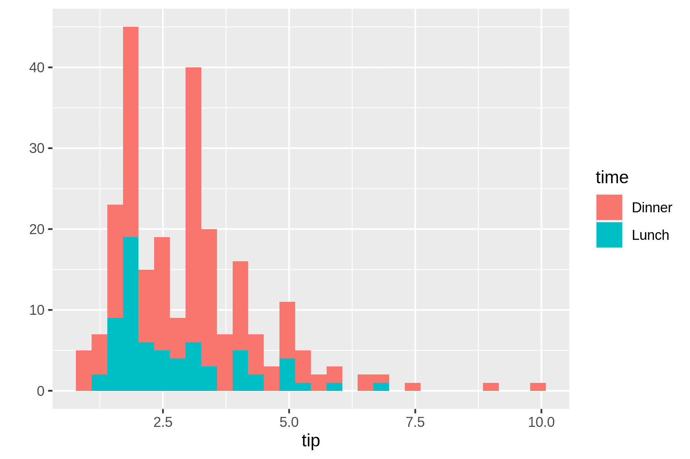

图 7.5:直方图 

该直方图显示，大多数小费在 2.5 美元左右。因为晚餐组和午餐组这两个组是相互叠加的，并且显示绝对计数，所以很难对它们进行比较。也许密度图可以对此有所帮助。

### 7.4.5 创建密度图

密度图对于可视化连续变量的分布非常有用。`rush plot`使用试探法来确定合适的几何图形，但您可以用`geom`选项覆盖它:

```sh
$ rush plot --x tip --fill time --geom density tips.csv                         
 0.5  @@@ @@+@@ 0.4  @+++@@ @@++++@ @+++++@@ @@ 0.3  @++++++@@@@=@@ @++++++++@@===@@ time  @+++++++++@@====@ Dinner  0.2  @+++++++++++@@@===@@ Lunch  @+++++++++++++@@@==@@ @ @++++++++++++++++@@@@@@@ 0.1  @@+++++++++++++++++++++@@@@@@@ ++++++++++++++++++++++++++@++@@@@ ++++++++++++++++++++++++++++++++@@@@@@@@@@@ 0.0  ++++++++++++++++++++++++++++++++++++++++++@@@@@@@@@@@@@@@@@@@@@@ 2.5  5.0  7.5  10.0  tip 
```

在这种情况下，与图 [7.6](chapter-7-exploring-data.html#fig:plot-density-image)中的视觉表示相比，文字表示确实显示了其局限性。

```sh
$ rush plot --x tip --fill time --geom density tips.csv > plot-density.png

$ display plot-density.png
```

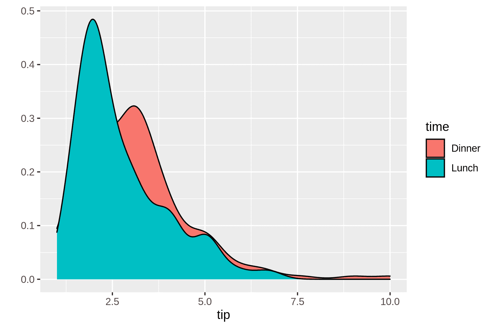

图 7.6:密度图 

### 7.4.6 快乐的小意外

你已经看到了三种类型的可视化。在`ggplot2`中，这些对应于功能`geom_bar`、`geom_histogram`和`geom_density`。geom 是 geometry 的缩写，表示实际绘制的内容。这个[`ggplot2`](https://ggplot2.tidyverse.org/)的备忘单很好地概述了可用的几何类型。可以使用的几何图形类型取决于您指定的柱(及其类型)。不是每个组合都有意义。以这个线图为例。

```sh
$ rush plot --x tip --y bill --color size --size day --geom path tips.csv       
 50  #* * ##### # == #*** ****##### # ### =**+ #*** *****#### 40  # ##** ####***+====== *****### #*# ###******###+#** ======****### day  ###################*****##*+*##*****####=# Fri  b  30  # *+++########**##==****+****####### Sat  i  # #** *##++####**#===*%=====####*##**# Sun  l  # # ######***#=####==########## ** Thur  l  20  # #########**#####****#####++ ########*########*###### # * size  ###################### ## * 5  10  ########### #### ##* %%## ## # % 2.5  5.0  7.5  10.0  tip 
```

这个快乐的小意外在图 [7.7](chapter-7-exploring-data.html#fig:plot-accident-image)的视觉表现中变得更加清晰。

```sh
$ rush plot --x tip --y bill --color size --size day --geom path tips.csv > plot
-accident.png

$ display plot-accident.png
```

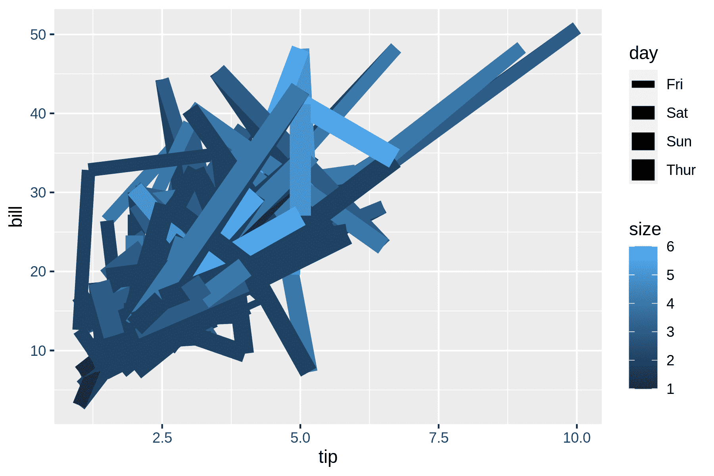

图 7.7:一个快乐的小意外 

*tips.csv* 中的行是独立的观察值，而在数据点之间画一条线假设它们是相连的。最好用散点图来形象化*小费*和*账单*之间的关系。

### 7.4.7 创建散点图

在指定两个连续特征时，几何图形为点的散点图恰好是默认设置:

```sh
$ rush plot --x bill --y tip --color time tips.csv                              
 10.0  = = 7.5  = = = + = t  + = = time  i  = = = == + Dinner  p  5.0  = = = + =+ = =+ + = Lunch  = = =+==+++= = = += + = = += =++= ======== = = = = == =====+=====+=++ === = == = = 2.5  ++=++++=+=+==== == === = = == =+ ===+ + == =++ = = = = = = = 10  20  30  40  50  bill 
```

注意每个点的颜色是用`--color`选项指定的(而不是用`--fill`选项)。直观表示见图 [7.8](chapter-7-exploring-data.html#fig:plot-scatter-image) 。

```sh
$ rush plot --x bill --y tip --color time tips.csv > plot-scatter.png

$ display plot-scatter.png
```

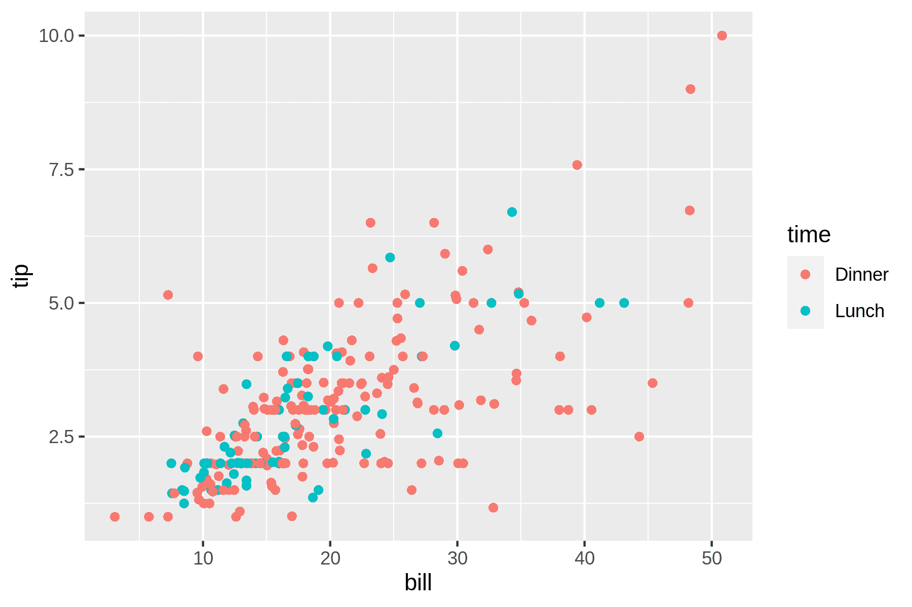

图 7.8:散点图 

从这个散点图中我们可以得出结论，账单金额和小费之间有关系。也许我们可以通过绘制趋势线从更高的层面来审视这些数据。

### 7.4.8 创建趋势线

如果您用 *`smooth`* 覆盖默认几何图形，您可以可视化趋势线。这些对于看到更大的画面是有用的。

```sh
$ rush plot --x bill --y tip --color time --geom smooth tips.csv                
 == ==== 7.5  ====== ======== ================== =======+++++++++====== t  5.0  ====+++++++++========== time  i  ====++++++================= Dinner  p  ===+++++++============= Lunch  == ==+++++++===== = 2.5  ==============++++==== ======++++++++=== ========== ===== 0.0  == 10  20  30  40  50  bill 
```

`rush plot`不能处理透明，所以在这种情况下，可视化表示(见图 [7.9](chapter-7-exploring-data.html#fig:plot-trend-image)要好得多。

```sh
$ rush plot --x bill --y tip --color time --geom smooth tips.csv > plot-trend.pn
g

$ display plot-trend.png
```

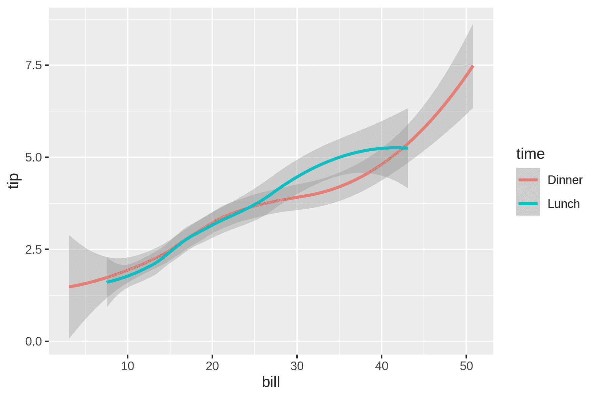

图 7.9:趋势线 

如果你喜欢将原始点与趋势线一起可视化，你需要借助于用`rush run`编写`ggplot2`代码(见图 [7.10](chapter-7-exploring-data.html#fig:plot-trend-points-image) )。

```sh
$ rush run --library ggplot2 'ggplot(df, aes(x = bill, y = tip, color = time)) +
 geom_point() + geom_smooth()' tips.csv > plot-trend-points.png

$ display plot-trend-points.png
```

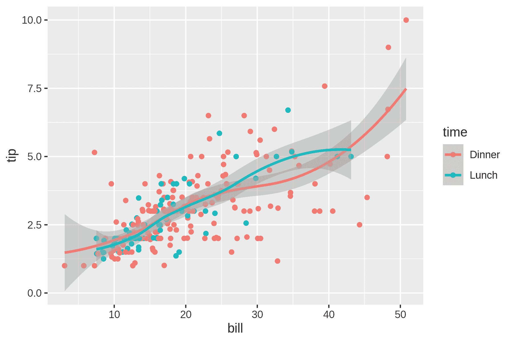

图 7.10:趋势线和原始点的组合 

### 7.4.9 创建盒状图

对于一个或多个特征，箱线图显示五个数字的摘要:最小值、最大值、样本中值以及第一个和第三个四分位数。在这种情况下，我们需要使用`[factor()](https://rdrr.io/r/base/factor.html)`函数将*大小*特征转换为分类特征，否则*账单*特征的所有值将被集中在一起。

```sh
$ rush plot --x 'factor(size)' --y bill --geom boxplot tips.csv                 
 50  % % % % % % % 40  % % % % % %%%%%%%%%% %%%%%%%%%% % % % % %%%%%%%%%% b  30  % % % %%%%%%%%%% %%%%%%%%%% i  % %%%%%%%%%%% %%%%%%%%%% l  % % % %%%%%%%%%% l  20  %%%%%%%%%% %%%%%%%%%%% % % %%%%%%%%%% %%%%%%%%%%% %%%%%%%%%% % 10  %%%%%%%%%% % %%%%%%%%%% 1  2  3  4  5  6  factor(size) 
```

虽然文字表现不算太差，但视觉表现要清晰得多(见图 [7.11](chapter-7-exploring-data.html#fig:plot-boxplot-image) )。

```sh
$ rush plot --x 'factor(size)' --y bill --geom boxplot tips.csv > plot-boxplot.p
ng

$ display plot-boxplot.png
```

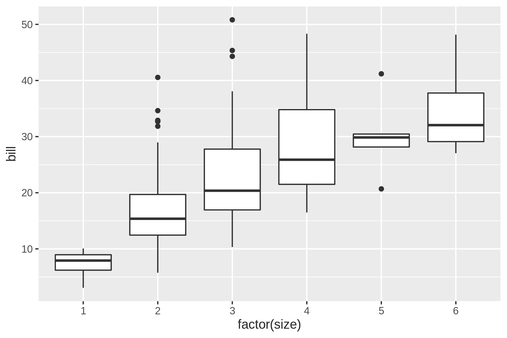

图 7.11:箱形图 

不出所料，这个方框图显示，平均而言，聚会规模越大，费用越高。

### 7.4.10 添加标签

默认标签基于列名(或规范)。在之前的图片中，标签 *`factor(size)`* 应该有所改进。使用`--xlab`和`--ylab`选项，您可以覆盖 x 轴和 y 轴的标签。可以使用`--title`选项添加标题。这里有一个小提琴图(这是一个盒子图和密度图的混搭)演示了这一点(另见图 [7.12](chapter-7-exploring-data.html#fig:plot-labels-image) )。

```sh
$ rush plot --x 'factor(size)' --y bill --geom violin --title 'Distribution of b
ill amount per party size' --xlab 'Party size' --ylab 'Bill (USD)' tips.csv     
 Distribution  of  bill  amount  per  party  size  50  % % %% %% % %% %% 40  % % %%% %%%%%% %% B  % % % % % %%%% i  % %%% % % %%%%%%%%%%%% % %% l  30  %% % % % %% %%%%% %%%%%% %%%%% l  %%% % % % % %% %% % %% %% % % %%%%%% (  20  %% %% % % %%%% U  % %% %% %% S  10  %%%%%%%%%%%% %%% %% %%% D  %%%%% %%%%% %%% )  %%%%%% 1  2  3  4  5  6  Party  size 
```

```sh
$ rush plot --x 'factor(size)' --y bill --geom violin --title 'Distribution of b
ill amount per party size' --xlab 'Party size' --ylab 'Bill (USD)' tips.csv > pl
ot-labels.png

$ display plot-labels.png
```

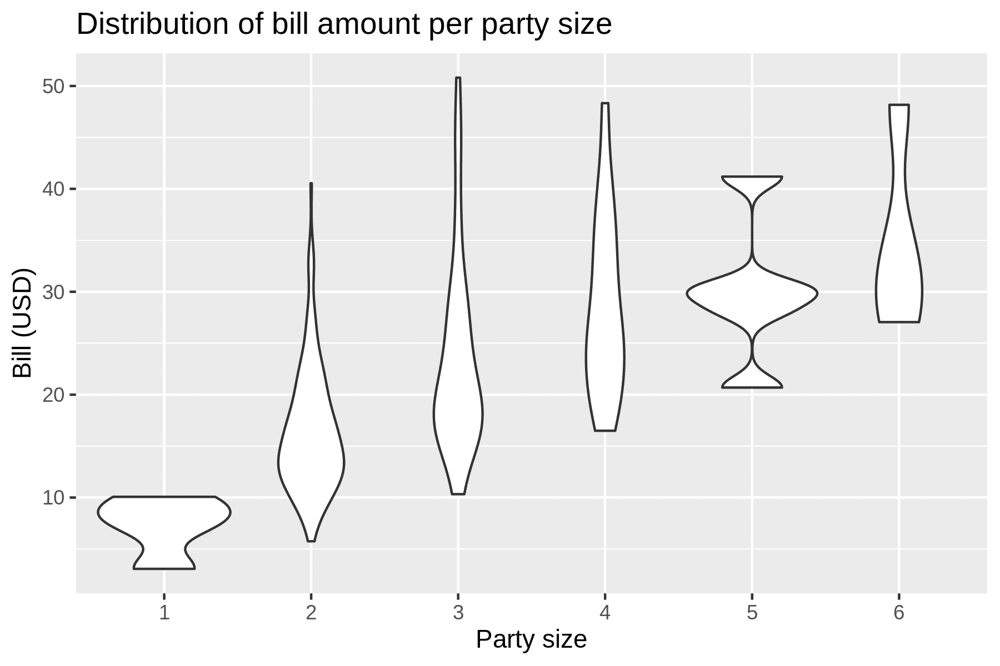

图 7.12:带有标题和标签的小提琴图 

如果你想与他人(或你未来的自己)分享，用适当的标签和标题来注释你的可视化特别有用，以便更容易理解正在显示的内容。

### 7.4.11 超越基本情节

虽然`rush plot`适合于在探索数据时创建基本的图表，但它肯定有其局限性。有时您需要更多的灵活性和复杂的选项，如多种几何图形、坐标转换和主题化。在这种情况下，可能值得了解更多关于`rush plot`利用其功能的底层包，即用于 R 的`ggplot2`包。当你对 Python 比对 R 更感兴趣时，还有 [`plotnine`包](https://plotnine.readthedocs.io)，它是用于 Python 的`ggplot2`的重新实现。

## 7.5 总结

在这一章中，我们已经研究了探索数据的各种方法。文本和图形数据可视化各有利弊。图形的质量显然要高得多，但是在命令行中查看可能有些棘手。这就是文本可视化派上用场的地方。由于有了`R`和`ggplot2`，至少`rush`有了创建这两种类型的一致语法。

下一章又是一个间奏曲章节，在这一章中，我将讨论如何提高命令和管道的速度。如果您迫不及待地想在第 9 章中开始对数据建模，请稍后阅读该章。

## 7.6 进行进一步探索

*   不幸的是，一本合适的教程超出了本书的范围。如果你想更好地可视化你的数据，我强烈建议你花一些时间去理解图形语法的力量和美丽。由 Hadley Wickham 和 Garrett Grolemund 所著的《数据科学的 R[](https://r4ds.had.co.nz/)*一书的第 3 章和第 28 章是很好的参考资料。*
**   说到第 3 章和第 28 章，我用 Plotnine 和 Pandas 把它们翻译成了 Python，以防你对 Python 比对 r 更感兴趣。*