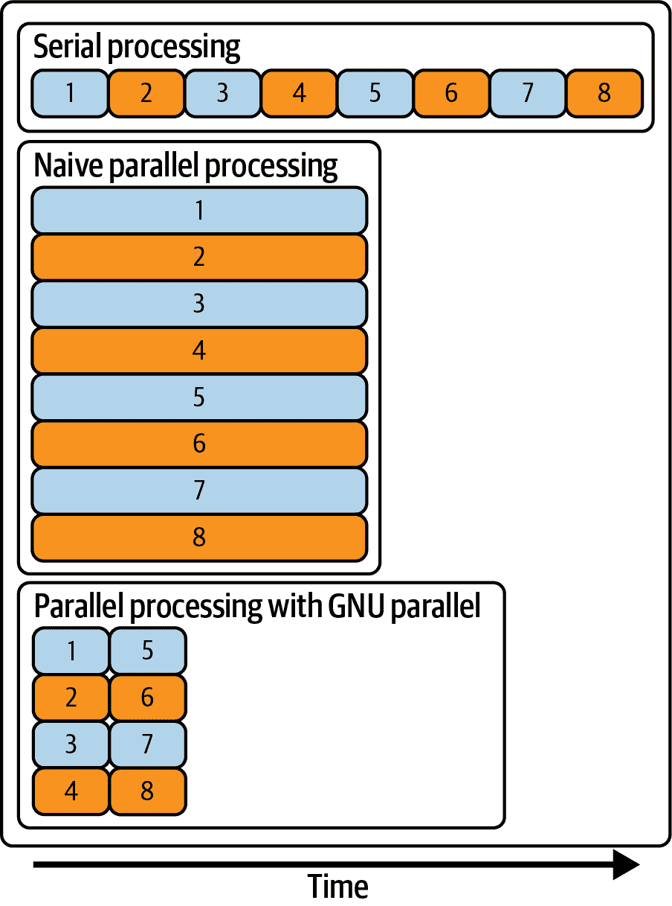
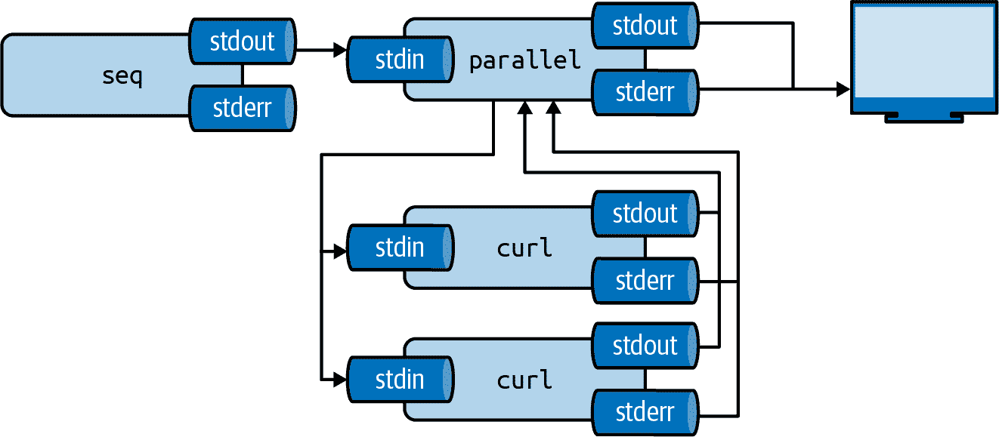

# 8 并行管道

> 原文：<https://datascienceatthecommandline.com/2e/chapter-8-parallel-pipelines.html>

在前面的章节中，我们一直在处理一次性处理整个任务的命令和管道。然而，在实践中，您可能会发现自己面临一个需要多次运行相同命令或管道的任务。例如，您可能需要:

*   抓取数百个网页
*   进行几十次 API 调用并转换它们的输出
*   为一系列参数值训练分类器
*   为数据集中的每对要素生成散点图

在上述任何一个例子中，都包含了某种形式的重复。使用您最喜欢的脚本或编程语言，您可以使用 for 循环或 while 循环来处理这个问题。在命令行上，您可能倾向于做的第一件事是按下`Up`来恢复之前的命令，如果需要的话对其进行修改，然后按下`Enter`来再次运行该命令。这样做两三次没问题，但是想象一下这样做几十次。这种方法很快变得繁琐、低效，并且容易出错。好消息是，您也可以在命令行上编写这样的循环。这就是本章的全部内容。

有时候，一个接一个地重复快速命令(以*序列*的方式)就足够了。当您拥有多个内核(甚至可能是多台机器)时，如果您能够利用这些内核就好了，尤其是当您面临数据密集型任务时。使用多个内核或机器时，总运行时间可能会显著减少。在这一章中，我将介绍一个非常强大的工具，叫做`parallel`  ，它可以处理好这一切。它使您能够对一系列参数(如数字、行和文件)应用命令或管道。另外，顾名思义，它允许您在*并行*中运行命令。

## 8.1 概述

本章讨论了几种加速需要多次运行命令和管道的任务的方法。我的主要目标是向你展示`parallel`的灵活性和力量。因为该工具可以与本书中讨论的任何其他工具相结合，所以它将积极地改变您使用命令行进行数据科学的方式。在本章中，您将了解:

*   对一系列数字、行和文件串行运行命令
*   将一个大任务分成几个小任务
*   并行运行管道
*   将管道分发到多台机器

本章从以下文件开始:

```sh
$ cd /data/ch08

$ l
total 20K
-rw-r--r-- 1 dst dst  126 Mar  3 10:51 emails.txt
-rw-r--r-- 1 dst dst   61 Mar  3 10:51 movies.txt
-rwxr-xr-x 1 dst dst  125 Mar  3 10:51 slow.sh*
-rw-r--r-- 1 dst dst 5.1K Mar  3 10:51 users.json
```

获取这些文件的说明在[第 2 章](chapter-2-getting-started.html#chapter-2-getting-started)中。任何其他文件都是使用命令行工具下载或生成的。

## 8.2 串行处理

在深入研究并行化之前，我将简要讨论串行循环。知道如何做到这一点是值得的，因为这个功能总是可用的，语法非常类似于其他编程语言中的循环，并且它将真正使您欣赏`parallel`。

从本章介绍中提供的例子中，我们可以提取三种类型的项目进行循环:数字、行和文件。这三种类型的项目将在接下来的三个小节中分别讨论。

### 8.2.1 数字循环

假设您需要计算 0 到 100 之间的每个偶数的平方。有一个叫做`bc`的工具，这是一个*基本计算器*，你可以用管道把一个方程。计算 4 的平方的命令如下所示:

```sh
$ echo "4^2" | bc
16
```

对于一次性计算，这就可以了。但是，正如介绍中提到的，你需要疯狂地按下`Up` ，改变数字，并按下`Enter` 50 次！在这种情况下，最好让 shell 通过使用 for 循环来为您完成困难的工作:

```sh
$ for i in {0..100..2}  # ➊
> do
> echo "$i^2" | bc      ➋
> done | trim
0
4
16
36
64
100
144
196
256
324
… with 41 more lines
```

➊z shell 有一个特性叫做大括号扩展，将`{0..100..2}`转换成一个由空格分隔的列表: `0 2 4 … 98 100` 。变量`i`在第一次迭代中赋值“0”，在第二次迭代中赋值“1”，依此类推。
➌ 这个变量的值可以通过在它前面加一个美元符号( `$` )来使用。shell 将在执行`echo`之前用它的值替换`$i` 。注意在`do`和`done`之间可以有多个命令。

虽然与您最喜欢的编程语言相比，语法可能显得有点奇怪，但是值得记住这一点，因为它在 shell 中总是可用的。稍后我将介绍一种更好、更灵活的重复命令的方式。

### 8.2.2 在线上循环

第二种可以循环的项目是行。这些行可以来自文件或标准输入。这是一种非常通用的方法，因为这些行可以包含任何内容，包括:数字、日期和电子邮件地址。

假设你想给你所有的联系人发一封电子邮件。让我们首先使用免费的[随机用户生成器 API](https://randomuser.me)生成一些假用户:

```sh
$ curl -s "https://randomuser.me/api/1.2/?results=5&seed=dsatcl2e" > users.json

$ < users.json jq -r '.results[].email' > emails

$ bat emails
───────┬────────────────────────────────────────────────────────────────────────
       │ File: emails
───────┼────────────────────────────────────────────────────────────────────────
   1   │ selma.andersen@example.com
   2   │ kent.clark@example.com
   3   │ ditmar.niehaus@example.com
   4   │ benjamin.robinson@example.com
   5   │ paulo.muller@example.com
───────┴────────────────────────────────────────────────────────────────────────
```

你可以用 while 循环遍历来自*电子邮件*的行:

```sh
$ while read line                         # ➊
> do
> echo "Sending invitation to ${line}."   ➋
> done < emails                           # ➌
Sending invitation to selma.andersen@example.com.
Sending invitation to kent.clark@example.com.
Sending invitation to ditmar.niehaus@example.com.
Sending invitation to benjamin.robinson@example.com.
Sending invitation to paulo.muller@example.com.
```

➊ 在这种情况下，您需要使用 while 循环，因为 Z shell 事先不知道输入包含多少行。
尽管在这种情况下*行*变量周围的花括号是不必要的(因为变量名不能包含句点)，但这仍然是一个好的做法。
➌ 这个重定向也可以放在`while`之前。

您还可以通过指定特殊的文件标准输入`/dev/stdin`，以交互方式向 while 循环提供输入。完成后按`Ctrl-D` 。

```sh
$ while read line; do echo "You typed: ${line}."; done < /dev/stdin
one
You typed: one.
two
You typed: two.
three
You typed: three.
```

但是这种方法有一个缺点，就是一旦你按下`Enter` ，那一行输入的`do`和`done`之间的命令会立即运行。没有回头路了。

### 8.2.3 文件循环

在这一节中，我将讨论我们经常需要循环的第三种类型的项目:文件。

为了处理特殊字符，使用`globbing`(即路径名扩展)代替`ls`  :

```sh
$ for chapter in /data/*
> do
> echo "Processing Chapter ${chapter}."
> done
Processing Chapter /data/ch02.
Processing Chapter /data/ch03.
Processing Chapter /data/ch04.
Processing Chapter /data/ch05.
Processing Chapter /data/ch06.
Processing Chapter /data/ch07.
Processing Chapter /data/ch08.
Processing Chapter /data/ch09.
Processing Chapter /data/ch10.
Processing Chapter /data/csvconf.
```

就像大括号展开一样，表达式`/data/`在被 for 循环处理之前，首先被 Z shell 展开成一个列表。

清单文件的一个更详细的替代是`find`  ，其中:

*   可以向下遍历目录
*   允许对诸如大小、访问时间和权限等属性进行详细搜索
*   处理特殊字符，如空格和换行符

例如，下面的`find`调用列出了目录`/data`下扩展名为`csv`且小于 2kb 的所有文件:

```sh
$ find /data -type f -name '*.csv' -size -2k
/data/ch03/tmnt-basic.csv
/data/ch03/tmnt-missing-newline.csv
/data/ch03/tmnt-with-header.csv
/data/ch05/irismeta.csv
/data/ch05/names-comma.csv
/data/ch05/names.csv
/data/ch07/datatypes.csv
```

## 8.3 并行处理

假设您有一个运行时间很长的工具，如下所示:

```sh
$ bat slow.sh
───────┬────────────────────────────────────────────────────────────────────────
       │ File: slow.sh
───────┼────────────────────────────────────────────────────────────────────────
   1   │ #!/bin/bash
   2   │ echo "Starting job $1" | ts # ➊
   3   │ duration=$((1+RANDOM%5)) ➋
   4   │ sleep $duration # ➌
   5   │ echo "Job $1 took ${duration} seconds" | ts
───────┴────────────────────────────────────────────────────────────────────────
```

➊`ts`增加一个时间戳。
➋ 魔法变量`RANDOM`调用一个内部 Bash 函数，返回一个 0 到 32767 之间的伪随机整数。将该整数除以 5 的余数加上 1 确保了*持续时间*在 1 和 5 之间。
➌ `sleep`暂停执行给定的秒数。

这个过程可能不会占用所有可用的资源。碰巧你需要运行这个命令很多次。例如，您需要下载一系列文件。

一种简单的并行化方法是在后台运行命令。让我们运行`slow.sh`三次:

```sh
$ for i in {A..C}; do
> ./slow.sh $i & # ➊
> done
[2] 385 ➋
[3] 387
[4] 390

$ Mar 03 10:52:01 Starting job A
Mar 03 10:52:01 Starting job B
Mar 03 10:52:01 Starting job C
Mar 03 10:52:02 Job A took 1 seconds

[2]    done       ./slow.sh $i
$ Mar 03 10:52:04 Job C took 3 seconds

[4]  + done       ./slow.sh $i
$ Mar 03 10:52:05 Job B took 4 seconds

[3]  + done       ./slow.sh $i
$
```

➊ “与”号(`&`)将命令发送到后台，允许 for 循环立即继续下一次迭代。
➋ 这一行显示了 Z shell 给定的作业号和进程 ID，可以用于更细粒度的作业控制。这个话题虽然强大，但超出了本书的范围。

记住并不是所有的东西都可以并行化. API 函数可能只有一个特定的数字, 或者一些命令，只可能有1个实例。.

图 [8.1](chapter-8-parallel-pipelines.html#fig:diagram-parallel-processing)从概念层面上说明了串行处理、简单并行处理和使用 GNU Parallel 的并行处理在并发进程数量和运行所有事务所花费的总时间方面的区别。



图 8.1:串行处理、简单并行处理和使用 GNU 并行的并行处理 

这种幼稚的方法有两个问题。首先，没有办法控制您同时运行多少个进程。如果您一次启动太多的作业，它们可能会竞争相同的资源，如 CPU、内存、磁盘访问和网络带宽。这可能会导致运行所有程序需要更长的时间。第二，很难区分哪个输出属于哪个输入。让我们看看更好的方法。

### 8.3.1 引入 GNU 并行

请允许我介绍一下`parallel`，这是一个命令行工具，允许您并行化和分发命令和管道。这个工具的美妙之处在于，现有的工具可以原样使用；它们不需要修改。

有2个命令行工具有相同的名字`parallel`. 如果你使用 Docker 镜像那么你已经安装了正确的命令行工具了. 否则, 你可能要运行`parallel --version`检查下是否安装了正确的版本. 结果应该为 “GNU parallel.”

在我深入讨论`parallel`的细节之前，这里有一个小笑话向你展示替换之前的 for 循环是多么容易:

```sh
$ seq 0 2 100 | parallel "echo {}^2 | bc" | trim
0
4
16
36
64
100
144
196
256
324
… with 41 more lines
```

这是`parallel`最简单的形式:要循环的项目通过标准输入传递，除了`parallel`需要运行的命令之外，没有任何参数。参见图 [8.2](chapter-8-parallel-pipelines.html#fig:diagram-parallel-output)了解`parallel`如何在进程间并发分配输入并收集它们的输出。



图 8.2: GNU Parallel 同时在进程间分配输入并收集它们的输出 

正如你所看到的，它基本上是一个 for 循环。这是另一个笑话，它取代了上一节中的 for 循环。

```sh
$ parallel --jobs 2 ./slow.sh ::: {A..C}
Mar 03 10:52:12 Starting job A
Mar 03 10:52:13 Job A took 1 seconds
Mar 03 10:52:12 Starting job B
Mar 03 10:52:16 Job B took 4 seconds
Mar 03 10:52:13 Starting job C
Mar 03 10:52:18 Job C took 4 seconds
```

这里，使用`--jobs`选项，我指定`parallel`最多可以同时运行两个作业。`slow.sh`的参数被指定为一个参数，而不是通过标准输入。

凭借多达 159 种不同的选项，`parallel`提供了大量的功能。(也许太多了。幸运的是，你只需要知道一小部分就能有效。如果您需要使用一个不常用的选项，手册页提供了很多信息。

### 8.3.2 指定输入

`parallel`最重要的参数是您希望为每个输入运行的命令或管道。问题是:输入项应该插入命令行的什么位置？如果不指定任何内容，那么输入项将被追加到管道的末尾。

```sh
$ seq 3 | parallel cowsay

 ___
< 1 >
 ---
        \   ^__^
         \  (oo)\_______
            (__)\       )\/\
                ||----w |
                ||     ||
 ___
< 2 >
 ---
        \   ^__^
         \  (oo)\_______
            (__)\       )\/\
                ||----w |
                ||     ||
 ___
< 3 >
 ---
        \   ^__^
         \  (oo)\_______
            (__)\       )\/\
                ||----w |
                ||     ||
```

以上与跑步相同:

```sh
$ cowsay 1 > /dev/null # ➊

$ cowsay 2 > /dev/null

$ cowsay 3 > /dev/null
```

➊ 因为输出和之前一样，所以我把它重定向到`/dev/null`来抑制它。

虽然这通常是可行的，但我建议您通过使用占位符来明确输入项应该插入到命令中的什么位置。在这种情况下，因为您想一次使用整个输入行(一个数字)，所以您只需要一个占位符。您用一对花括号(`[{}](https://rdrr.io/r/base/Paren.html)`)指定占位符，换句话说，指定输入项的位置:

```sh
$ seq 3 | parallel cowsay {} > /dev/null
```

有其他的方法提供`parallel`的输入. 我提倡用管道 (就像我在整章中做的那样)因为那是大多数命令行工具串联在一起的工具. 另外一个方法是用不常见的语法. 不得不说的是, 它们确实增加了新的功能, 比如遍历多个数组的所有组合, 所以如果想了解更多，读下`parallel`的帮助手册

当输入项是文件名时，有几个修饰符可以只使用文件名的一部分。例如，使用`{/}`，将只使用文件名的基本名称:

```sh
$ find /data/ch03 -type f | parallel echo '{#}\) \"{}\" has basename \"{/}\"' # ➊
1) "/data/ch03/tmnt-basic.csv" has basename "tmnt-basic.csv"
2) "/data/ch03/logs.tar.gz" has basename "logs.tar.gz"
3) "/data/ch03/tmnt-missing-newline.csv" has basename "tmnt-missing-newline.csv"
4) "/data/ch03/r-datasets.db" has basename "r-datasets.db"
5) "/data/ch03/top2000.xlsx" has basename "top2000.xlsx"
6) "/data/ch03/tmnt-with-header.csv" has basename "tmnt-with-header.csv"
```

➊ 括号(`)`)和引号(`"`)等字符在 shell 中有特殊的含义。要按字面意思使用它们，你要在它们前面加一个反斜杠`\`。这叫*转义*。

如果输入行有多个由分隔符分隔的部分，您可以向占位符添加数字。例如:

```sh
$ < input.csv parallel --colsep , "mv {2} {1}" > /dev/null
```

在这里，您可以应用相同的占位符修饰符。也可以重用相同的输入项。如果`parallel`的输入是一个带标题的 CSV 文件，那么您可以使用列名作为占位符:

```sh
$ < input.csv parallel -C, --header : "invite {name} {email}"
```

如果你想知道你的占位符是否设置正确, 你可以加上`--dryrun`选项. `parallel`将会打印出所有它将要执行的命令而不是真正的执行它们.

### 8.3.3 控制并发作业的数量

默认情况下，parallel 在每个 CPU 内核上运行一个作业。您可以使用`--jobs`或`-j`选项控制同时运行的任务数量。指定一个数字意味着许多作业将同时运行。如果你在数字前面加一个加号，那么`parallel`将运行`N`个任务加上 CPU 核心的数量。如果你在数字前面加一个减号，那么 parallel 将运行`N-M`个任务。其中`N`是 CPU 内核的数量。您还可以指定一个百分比，默认值为 CPU 核心数的 100%。并发运行的作业的最佳数量取决于您正在运行的实际命令。

```sh
$ seq 5 | parallel -j0 "echo Hi {}"
Hi 1
Hi 3
Hi 2
Hi 4
Hi 5
```

```sh
$ seq 5 | parallel -j200% "echo Hi {}"
Hi 1
Hi 2
Hi 3
Hi 4
Hi 5
```

如果您指定`-j1`，那么命令将串行运行。即使这不做正义的工具的名称，它仍然有它的用途。例如，当您需要访问一个一次只允许一个连接的 API 时。如果您指定了`-j0`，那么 parallel 将会并行运行尽可能多的作业。这可以与您的带&符号的循环相比较。这是不可取的。

### 8.3.4 记录和输出

为了保存每个命令的输出，您可能会尝试以下操作:

```sh
$ seq 5 | parallel "echo \"Hi {}\" > hi-{}.txt"
```

这将把输出保存到单独的文件中。或者，如果您想将所有内容保存到一个大文件中，您可以执行以下操作:

```sh
$ seq 5 | parallel "echo Hi {}" >> one-big-file.txt
```

然而，`parallel`提供了`--results`选项，它将输出存储在单独的文件中。对于每个作业，`parallel`创建三个文件: `seq`，保存作业编号，`stdout`，包含作业产生的输出，`stderr`，包含作业产生的任何错误。这三个文件根据输入值放在子目录中。

`parallel`仍然打印所有的输出，在这种情况下是多余的。您可以将标准输入和标准输出重定向到`/dev/null`，如下所示:

```sh
$ seq 10 | parallel --results outdir "curl 'https://anapioficeandfire.com/api/ch
aracters/{}' | jq -r '.aliases[0]'" 2>/dev/null 1>&2

$ tree outdir | trim outdir
└── 1
    ├── 1
    │   ├── seq
    │   ├── stderr
    │   └── stdout
    ├── 10
    │   ├── seq
    │   ├── stderr
    │   └── stdout
… with 34 more lines
```

参见图 [8.3](chapter-8-parallel-pipelines.html#fig:diagram-parallel-results)了解`--results`选项如何工作的图示概述。


图 8.3: GNU Parallel 使用`--results`选项将输出存储在单独的文件中 

当您并行运行多个作业时，作业运行的顺序可能与输入的顺序不一致。因此，工作的产出也是混杂的。要保持相同的顺序，请指定`--keep-order`选项或`-k`选项。

有时，记录哪个输入生成了哪个输出是很有用的。`parallel`允许您用`--tag`选项*标记*输出，这将为每一行添加输入项。

```sh
$ seq 5 | parallel --tag "echo 'sqrt({})' | bc -l"
1       1
2       1.41421356237309504880
3       1.73205080756887729352
4       2.00000000000000000000
5       2.23606797749978969640

$ parallel --tag --keep-order "echo '{1}*{2}' | bc -l" ::: 3 4 ::: 5 6 7
3 5     15
3 6     18
3 7     21
4 5     20
4 6     24
4 7     28
```

### 8.3.5 创建并行工具

我在本章开始时使用的`bc`工具本身并不是并行的。但是，您可以使用`parallel`将其并行化。Docker 图像包含一个名为`pbc`的工具。它的代码如下所示:

```sh
$ bat $(which pbc)
───────┬────────────────────────────────────────────────────────────────────────
       │ File: /usr/bin/dsutils/pbc
───────┼────────────────────────────────────────────────────────────────────────
   1   │ #!/bin/bash
   2   │ # pbc: parallel bc. First column of input CSV is mapped to {1}, second
       │ to {2}, and so forth.
   3   │ #
   4   │ # Example usage: paste -d, <(seq 100) <(seq 100 -1 1) | ./pbc 'sqrt({1}
       │ *{2})'
   5   │ #
   6   │ # Dependency: GNU parallel
   7   │ #
   8   │ # Author: http://jeroenjanssens.com
   9   │
  10   │ parallel -C, -k -j100% "echo '$1' | bc -l"
───────┴────────────────────────────────────────────────────────────────────────
```

这个工具也允许我们简化本章开头使用的代码。它可以同时处理逗号分隔的值:

```sh
$ seq 100 | pbc '{1}^2' | trim
1
4
9
16
25
36
49
64
81
100
… with 90 more lines

$ paste -d, <(seq 4) <(seq 4) <(seq 4) | pbc 'sqrt({1}+{2})^{3}'
1.41421356237309504880
4.00000000000000000000
14.69693845669906858905
63.99999999999999999969
```

## 8.4 分布式处理

有时你需要比你的本地机器更多的能量，即使它有所有的核心。幸运的是，`parallel`还可以利用远程机器的能力，这真的可以让你加快流水线的速度。

最棒的是`parallel`不必安装在远程机器上。所需要的就是你可以用*安全外壳*协议(或 SSH)连接到远程机器，这也是`parallel`用来分发你的管道的。(安装`parallel`很有帮助，因为它可以决定在每台远程机器上使用多少内核；稍后将详细介绍。)

首先，我将获得正在运行的 AWS EC2 实例的列表。如果您没有任何远程机器，也不用担心，您可以用`--sshlogin :`替换任何出现的`--slf hostnames`，它告诉`parallel`使用哪个远程机器。这样，您仍然可以遵循本节中的示例。

一旦您知道要接管哪些远程机器，我们将考虑三种类型的分布式处理:

*   在远程机器上运行普通命令
*   在远程机器之间直接分发本地数据
*   将文件发送到远程机器，处理它们，并检索结果

### 8.4.1 获取正在运行的 AWS EC2 实例列表

在本节中，我们将创建一个名为`hostnames`的文件，其中每行包含一个远程机器的主机名。我以亚马逊网络服务(AWS)为例。我假设您有一个 AWS 帐户，并且知道如何启动实例。如果你正在使用不同的云计算服务(比如谷歌云平台或微软 Azure )，或者如果你有自己的服务器，请确保在继续下一部分之前，你自己创建了一个*主机名*文件。

您可以使用 AWS API 的命令行接口`aws`获得正在运行的 AWS EC2 实例的列表。有了`aws`，你几乎可以用在线 AWS 管理控制台做所有你能做的事情。

命令`aws ec2 describe-instances`以 JSON 格式返回关于所有 EC2 实例的大量信息(更多信息请参见[在线文档](https://awscli.amazonaws.com/v2/documentation/api/latest/reference/ec2/describe-instances.html))。您可以使用`jq`提取相关字段:

```sh
$ aws ec2 describe-instances | jq '.Reservations[].Instances[] | {public_dns: .P
ublicDnsName, state: .State.Name}'
```

EC2 实例的可能状态有: `pending` ， `running` ， `shutting-down` ， `terminated` ， `stopping`和`stopped` 。因为您只能将管道分发到正在运行的实例，所以您可以按如下方式过滤掉未运行的实例:

```sh
> aws ec2 describe-instances | jq -r '.Reservations[].Instances[] | select(.Stat
e.Name=="running") | .PublicDnsName' | tee hostnames
ec2-54-88-122-140.compute-1.amazonaws.com
ec2-54-88-89-208.compute-1.amazonaws.com
```

(如果没有`-r`或`--raw-output`选项，主机名就会被双引号括起来。)输出被保存到*主机名*，以便我稍后可以将它传递给`parallel`。

如上所述，`parallel`采用了`ssh`来连接到远程机器。如果您想连接到 EC2 实例，而不是每次都键入凭证，那么您可以将类似下面的文本添加到文件 *~/中。ssh/config* 。

```sh
$ bat ~/.ssh/config
───────┬────────────────────────────────────────────────────────────────────────
       │ File: /home/dst/.ssh/config
───────┼────────────────────────────────────────────────────────────────────────
   1   │ Host *.amazonaws.com
   2   │         IdentityFile ~/.ssh/MyKeyFile.pem
   3   │         User ubuntu
───────┴────────────────────────────────────────────────────────────────────────
```

根据您运行的发行版，您的用户名可能不同于`ubuntu` 。

### 8.4.2 在远程机器上运行命令

分布式处理的第一种风格是在远程机器上运行普通命令。让我们首先通过在每个 EC2 实例上运行工具`hostname`来仔细检查一下`parallel`是否在工作:

```sh
$ parallel --nonall --sshloginfile hostnames hostname
ip-172-31-23-204
ip-172-31-23-205
```

这里，`--sshloginfile`或`--slf`选项用于引用文件*主机名* 。`--nonall`选项指示`parallel`在不使用任何参数的情况下，在*主机名*文件中的每台远程机器上执行相同的命令。记住，如果您没有任何远程机器可以利用，您可以用`--sshlogin :`替换`--slf hostnames`，这样命令就可以在您的本地机器上运行:

```sh
$ parallel --nonall --sshlogin : hostname
data-science-toolbox
```

在每台远程机器上运行相同的命令一次，每台机器只需要一个内核。如果您想将传入的参数列表分发给`parallel`，那么它可能会使用多个内核。如果没有明确指定核心的数量，`parallel`将尝试确定这一点。

```sh
$ seq 2 | parallel --slf hostnames echo 2>&1
bash: parallel: command not found
parallel: Warning: Could not figure out number of cpus on ec2-54-88-122-140.comp
ute-1.amazonaws.com (). Using 1.
1
2
```

在本例中，我在两台远程机器中的一台上安装了`parallel`。我收到一条警告消息，指出在其中一个上找不到`parallel`。因此，`parallel`无法确定核心的数量，将默认使用一个核心。当您收到此警告消息时，您可以执行以下四项操作之一:

*   不要担心，每台机器使用一个内核会让您很开心
*   通过`--jobs`或`-j`选项指定每台机器的工作数量
*   指定每台机器要使用的内核数量，例如，如果您想要两个内核，可以在*主机名*文件中的每个主机名前面加上`2/`
*   使用软件包管理器安装`parallel`。例如，如果远程机器都运行 Ubuntu:

```sh
$ parallel --nonall --slf hostnames "sudo apt-get install -y parallel"
```

### 8.4.3 在远程机器间分发本地数据

分布式处理的第二种风格是在远程机器之间直接分发本地数据。假设您有一个非常大的数据集，您想使用多台远程机器来处理它。为了简单起见，让我们对 1 到 1000 之间的所有整数求和。首先，让我们通过使用`wc`打印远程机器的主机名和它接收到的输入的长度，来仔细检查您的输入实际上是被分发的:

```sh
$ seq 1000 | parallel -N100 --pipe --slf hostnames "(hostname; wc -l) | paste -s
d:"
ip-172-31-23-204:100
ip-172-31-23-205:100
ip-172-31-23-205:100
ip-172-31-23-204:100
ip-172-31-23-205:100
ip-172-31-23-204:100
ip-172-31-23-205:100
ip-172-31-23-204:100
ip-172-31-23-205:100
ip-172-31-23-204:100
```

非常好。您可以看到您的 1000 个数字平均分布在 100 个子集上(由`-N100`指定)。现在，您可以对所有这些数字求和了:

```sh
$ seq 1000 | parallel -N100 --pipe --slf hostnames "paste -sd+ | bc" | paste -sd

500500
```

在这里，您还可以立即对从远程机器上获得的 10 笔金额进行求和。让我们通过在没有`parallel`的情况下进行相同的计算来检查答案是否正确:

```sh
$ seq 1000 | paste -sd+ | bc
500500
```

很好，这很有效。如果您有一个想要在远程机器上执行的更大的管道，您也可以将它放在一个单独的脚本中，并用`parallel`上传。我将通过创建一个名为`add`的非常简单的命令行工具来演示这一点:

```sh
$ echo '#!/usr/bin/env bash' > add

$ echo 'paste -sd+ | bc' >> add

$ bat add
───────┬────────────────────────────────────────────────────────────────────────
       │ File: add
───────┼────────────────────────────────────────────────────────────────────────
   1   │ #!/usr/bin/env bash
   2   │ paste -sd+ | bc
───────┴────────────────────────────────────────────────────────────────────────

$ chmod u+x add

$ seq 1000 | ./add
500500
```

使用`--basefile`选项，`parallel`首先将文件*上传到所有远程机器，然后运行作业:*

```sh
$ seq 1000 |
> parallel -N100 --basefile add --pipe --slf hostnames './add' |
> ./add
500500
```

对 1000 个数求和当然只是一个玩具例子。另外，在本地进行会快得多。尽管如此，我还是希望从这里可以清楚地看到`parallel`可以变得无比强大。

### 8.4.4 在远程机器上处理文件

分布式处理的第三种风格是将文件发送到远程机器，处理它们，并检索结果。假设您想统计纽约市每个区接到 311 服务电话的频率。您的本地机器上还没有这些数据，所以让我们首先从免费的 [NYC 开放数据 API](https://data.cityofnewyork.us/)中获取这些数据:

```sh
$ seq 0 100 900 | parallel  "curl -sL 'http://data.cityofnewyork.us/resource/erm
2-nwe9.json?\$limit=100&\$offset={}' | jq -c '.[]' | gzip > nyc-{#}.json.gz"
```

现在有 10 个包含压缩 JSON 数据的文件:

```sh
$ l nyc*json.gz
-rw-r--r-- 1 dst dst 16K Mar  3 10:55 nyc-10.json.gz
-rw-r--r-- 1 dst dst 14K Mar  3 10:53 nyc-1.json.gz
-rw-r--r-- 1 dst dst 15K Mar  3 10:53 nyc-2.json.gz
-rw-r--r-- 1 dst dst 16K Mar  3 10:54 nyc-3.json.gz
-rw-r--r-- 1 dst dst 15K Mar  3 10:54 nyc-4.json.gz
-rw-r--r-- 1 dst dst 15K Mar  3 10:53 nyc-5.json.gz
-rw-r--r-- 1 dst dst 15K Mar  3 10:54 nyc-6.json.gz
-rw-r--r-- 1 dst dst 15K Mar  3 10:54 nyc-7.json.gz
-rw-r--r-- 1 dst dst 15K Mar  3 10:54 nyc-8.json.gz
-rw-r--r-- 1 dst dst 16K Mar  3 10:54 nyc-9.json.gz
```

注意，`jq -c '.[]'`用于展平 JSON 对象的数组，这样每行有一个对象，每个文件总共有 100 行。使用`zcat`  ，你直接打印一个压缩文件的内容:

```sh
$ zcat nyc-1.json.gz | trim
{"unique_key":"53497809","created_date":"2022-03-02T01:59:41.000","agency":"EDC…
{"unique_key":"53496727","created_date":"2022-03-02T01:59:28.000","agency":"NYP…
{"unique_key":"53501332","created_date":"2022-03-02T01:58:14.000","agency":"NYP…
{"unique_key":"53502331","created_date":"2022-03-02T01:58:12.000","agency":"NYP…
{"unique_key":"53496515","created_date":"2022-03-02T01:56:51.000","agency":"NYP…
{"unique_key":"53501441","created_date":"2022-03-02T01:56:44.000","agency":"NYP…
{"unique_key":"53502239","created_date":"2022-03-02T01:54:11.000","agency":"NYP…
{"unique_key":"53495487","created_date":"2022-03-02T01:54:07.000","agency":"NYP…
{"unique_key":"53497370","created_date":"2022-03-02T01:53:59.000","agency":"NYP…
{"unique_key":"53502342","created_date":"2022-03-02T01:53:01.000","agency":"NYP…
… with 90 more lines
```

让我们看看一行 JSON 看起来像什么:

```sh
$ zcat nyc-1.json.gz | head -n 1
{"unique_key":"53497809","created_date":"2022-03-02T01:59:41.000","agency":"EDC"
,"agency_name":"Economic Development Corporation","complaint_type":"Noise - Heli
copter","descriptor":"Other","location_type":"Above Address","incident_zip":"100
03","incident_address":"103 2 AVENUE","street_name":"2 AVENUE","cross_street_1":
"EAST    6 STREET","cross_street_2":"NICHOLAS FIGUEROA WAY","intersection_street
_1":"EAST    6 STREET","intersection_street_2":"NICHOLAS FIGUEROA WAY","address_
type":"ADDRESS","city":"NEW YORK","landmark":"2 AVENUE","status":"In Progress","
community_board":"03 MANHATTAN","bbl":"1004620030","borough":"MANHATTAN","x_coor
dinate_state_plane":"987442","y_coordinate_state_plane":"204322","open_data_chan
nel_type":"ONLINE","park_facility_name":"Unspecified","park_borough":"MANHATTAN"
,"latitude":"40.7274928080516","longitude":"-73.98848345588063","location":{"lat
itude":"40.7274928080516","longitude":"-73.98848345588063","human_address":"{\"a
ddress\": \"\", \"city\": \"\", \"state\": \"\", \"zip\": \"\"}"},":@computed_re
gion_efsh_h5xi":"11724",":@computed_region_f5dn_yrer":"70",":@computed_region_ye
ji_bk3q":"4",":@computed_region_92fq_4b7q":"50",":@computed_region_sbqj_enih":"5
"}
```

如果您要获得本地机器上每个区的服务呼叫总数，您可以运行以下命令:

```sh
$ zcat nyc*json.gz | # ➊
> jq -r '.borough' | ➋
> tr '[A-Z] ' '[a-z]_' | # ➌
> sort | uniq -c | sort -nr | ➍
> awk '{print $2","$1}' | ➎
> header -a borough,count | ➏
> csvlook
│ borough       │ count │
├───────────────┼───────┤
│ brooklyn      │   300 │
│ queens        │   235 │
│ manhattan     │   235 │
│ bronx         │   191 │
│ staten_island │    38 │
│ unspecified   │     1 │
```

➊ 使用`zcat`展开所有压缩文件。
➋ 对于每个呼叫，使用`jq`提取行政区的名称。
➌ 将区名转换成小写，并用下划线替换空格(因为`awk`默认情况下会在空格上拆分)。
➍ 用`sort`和`uniq`统计每个区的出现次数。
➎ 反转两列，用逗号分隔，用`awk`分隔。
➏ 使用`header`添加表头。

想象一下，您自己的机器非常慢，您根本无法在本地执行这个管道。您可以使用`parallel`在远程机器之间分发本地文件，让它们进行处理，并检索结果:

```sh
$ ls *.json.gz | # ➊
> parallel -v --basefile jq \ ➋
> --trc {.}.csv \ # ➌
> --slf hostnames \ ➍
> "zcat {} | ./jq -r '.borough' | tr '[A-Z] ' '[a-z]_' | sort | uniq -c | awk '{
print \$2\",\"\$1}' > {.}.csv" ➎
```

➊ 打印文件列表，并通过管道将其输入`parallel`
➋ 将`jq`二进制传输到每个远程机器。幸运的是，`jq`没有附属国。这个文件随后将从远程机器上删除，因为我指定了`--trc`选项(这意味着`--cleanup`选项)。注意流水线用的是`./jq`而不仅仅是`jq`。这是因为管道需要使用上传的版本，而不是可能在或可能不在搜索路径上的版本。
➌ 命令行参数`--trc {.}.csv`是`--transfer --return {.}.csv --cleanup`的简称。(替换字符串`{.}`被没有最后扩展名的输入文件名替换。)在这里，这意味着 JSON 文件被传输到远程机器，CSV 文件被返回到本地机器，并且这两个文件都将在远程机器的每个作业之后被删除
➍ 指定一个主机名列表。记住，如果你想在本地尝试一下，你可以指定`--sshlogin :`而不是`--slf hostnames`
➎ 注意`awk`表达式中的转义。引用有时会很棘手。在这里，美元符号和双引号被转义。如果引用变得太混乱，记得你把管道放到一个单独的命令行工具中，就像我用`add`做的那样

在这个过程中，如果您在一台远程机器上运行`ls`，您会看到`parallel`确实传输(并清理)了二进制文件`jq`、JSON 文件和 CSV 文件:

```sh
$ ssh $(head -n 1 hostnames) ls
```

每个 CSV 文件看起来都像这样:

```sh
> cat nyc-1.json.csv
bronx,3
brooklyn,5
manhattan,24
queens,3
staten_island,2
```

您可以使用`rush`和 tidyverse 对每个 CSV 文件中的计数求和:

```sh
$ cat nyc*csv | header -a borough,count |
> rush run -t 'group_by(df, borough) %>% summarize(count = sum(count))' - |
> csvsort -rc count | csvlook
│ borough       │ count │
├───────────────┼───────┤
│ brooklyn      │   300 │
│ manhattan     │   235 │
│ queens        │   235 │
│ bronx         │   191 │
│ staten_island │    38 │
│ unspecified   │     1 │
```

或者，如果您喜欢使用 SQL 来汇总结果，您可以使用第 5 章中讨论的`csvsql`:

```sh
$ cat nyc*csv | header -a borough,count |
> csvsql --query 'SELECT borough, SUM(count) AS count FROM stdin GROUP BY boroug
h ORDER BY count DESC' |
> csvlook
│ borough       │ count │
├───────────────┼───────┤
│ brooklyn      │   300 │
│ queens        │   235 │
│ manhattan     │   235 │
│ bronx         │   191 │
│ staten_island │    38 │
│ unspecified   │     1 │
```

## 8.5 总结

作为一名数据科学家，您需要处理数据，有时会处理大量数据。这意味着有时您需要多次运行一个命令，或者将数据密集型命令分布到多个内核上。在本章中，我已经向您展示了并行化命令是多么容易。是一个非常强大和灵活的工具，可以加速普通命令行工具并分发它们。它提供了许多功能，在这一章中，我只能够触及表面。在下一章中，我将介绍 OSEMN 模型的第四步:数据建模。

## 8.6 进行进一步探索

*   一旦你对`parallel`及其最重要的选项有了基本的了解，我推荐你看看[的在线教程](https://www.gnu.org/software/parallel/parallel_tutorial.html)。您将学习如何指定不同的输入方式，保存所有作业的日志，以及如何超时、恢复和重试作业。正如本教程中 Ole 葛覃的创建者所说，“你的命令行会喜欢它的。”