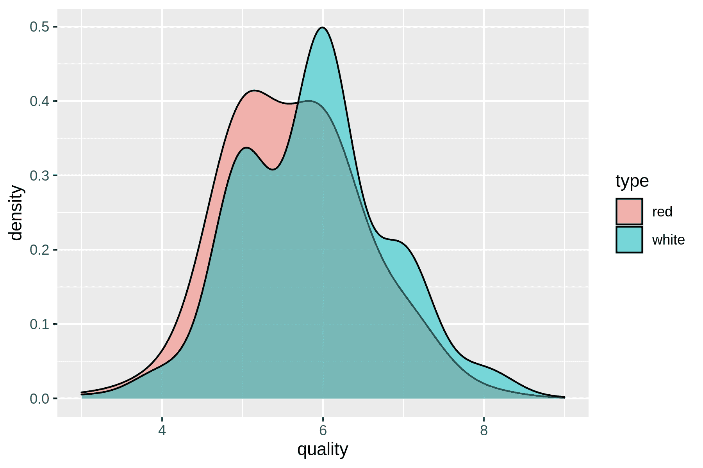
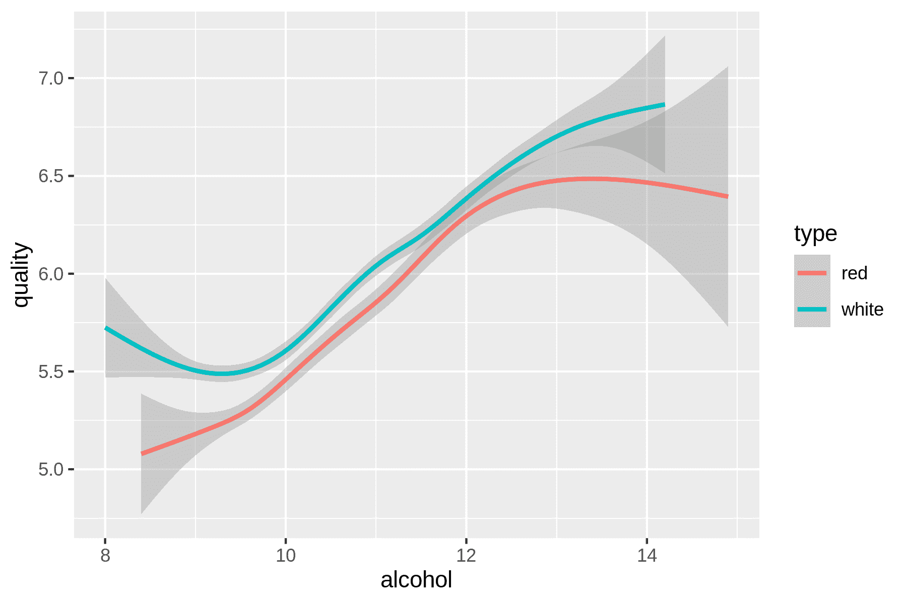
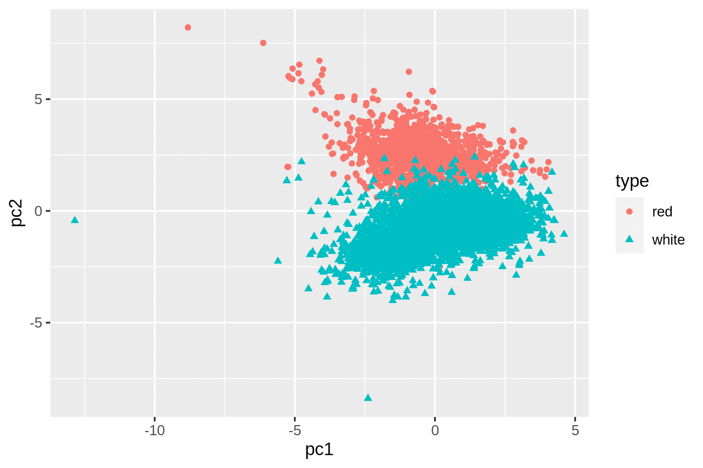
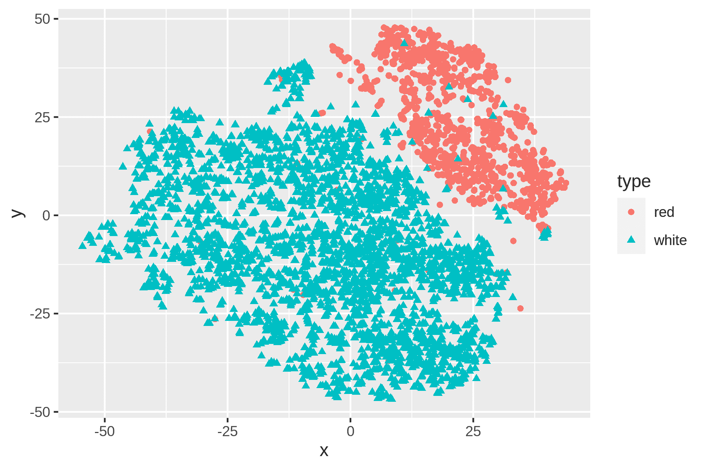
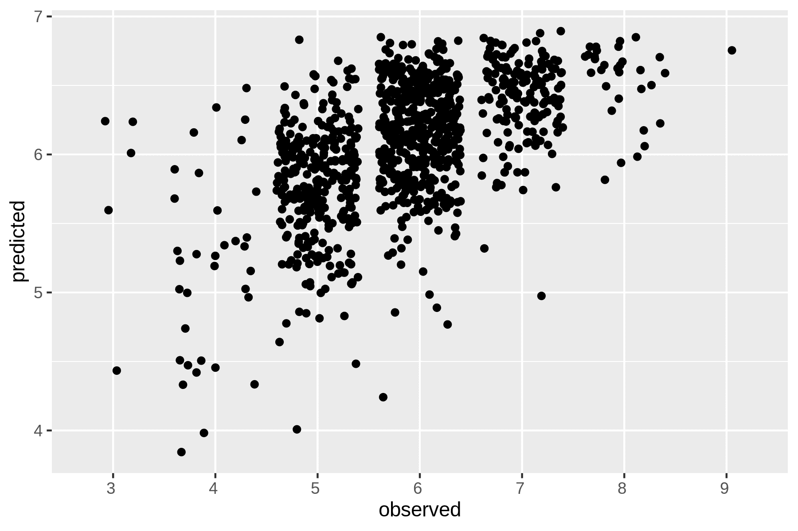

# 9 建模数据

> 原文：<https://datascienceatthecommandline.com/2e/chapter-9-modeling-data.html>

在本章中，我们将执行 OSEMN 模型的第四步:数据建模。一般来说，模型是对数据的抽象或更高层次的描述。建模有点像创建可视化，因为我们从单个数据点后退一步来看更大的画面。

可视化以形状、位置和颜色为特征:我们可以通过观察来解释它们。另一方面，模型的内在特征是数字，这意味着计算机可以使用它们来做一些事情，比如对新的数据点进行预测。(我们仍然可以将模型可视化，以便我们可以尝试理解它们，并了解它们的表现。)

在本章中，我将考虑三种常用于数据建模的算法:

*   降维
*   回归
*   分类

这些算法来自统计学和机器学习领域，所以我要稍微改变一下词汇。假设我有一个 CSV 文件，也称为*数据集* 。除了标题，每一行都被认为是一个*数据点* 。每个数据点都有一个或多个*特征* ，或者已经被测量的属性。有时候，一个数据点也有一个*标签* ，一般来说就是一个判断或者结果。当我在下面介绍葡萄酒数据集时，这变得更加具体。

第一种类型的算法(维度缩减)通常是无监督的，这意味着它们仅基于数据集的特征来创建模型。最后两种类型的算法(回归和分类)根据定义是监督算法，这意味着它们也将标签合并到模型中。

这章不是介绍机器学习，那意味着我会跳过很多细节. 我的建议是你在使用到自己的数据集之前熟悉下算法. 这章的末尾我推荐了一些关于机器学习的书籍.

## 9.1 概述

在本章中，您将学习如何:

*   使用`tapkee`减少数据集的维数。
*   预测白酒质量用`vw`  。
*   使用`skll`将葡萄酒分类为红葡萄酒或白葡萄酒。

本章从以下文件开始:

```sh
$ cd /data/ch09

$ l
total 4.0K
-rw-r--r-- 1 dst dst 503 Mar  3 10:55 classify.cfg
```

获取这些文件的说明在[第 2 章](chapter-2-getting-started.html#chapter-2-getting-started)中。任何其他文件都是使用命令行工具下载或生成的。

## 请再来点酒！

在这一章中，我将使用一组品酒师对名为 vinho verde 的葡萄牙红酒和白酒的记录。每个数据点代表一种葡萄酒。每种葡萄酒都有 11 个理化特性:(1)固定酸度，(2)挥发性酸度，(3)柠檬酸，(4)残糖，(5)氯化物，(6)游离二氧化硫，(7)总二氧化硫，(8)密度，(9) pH 值，(10)硫酸盐，和(11)酒精。还有一个总体质量分数在 0(很差)到 10(优秀)之间，这是葡萄酒专家至少三次评价的中位数。关于这个数据集的更多信息可以在 [UCI 机器学习库](http://archive.ics.uci.edu/ml/datasets/Wine+Quality)获得。

数据集被分成两个文件:一个用于白葡萄酒，一个用于红葡萄酒。第一步是使用`curl`获得这两个文件(当然还有`parallel`，因为我没有一整天的时间):

```sh
$ parallel "curl -sL http://archive.ics.uci.edu/ml/machine-learning-databases/wi
ne-quality/winequality-{}.csv > wine-{}.csv" ::: red white
```

三重冒号只是将数据传递给`parallel`的另一种方式。

让我们检查这两个文件，并计算行数:

```sh
$ < wine-red.csv nl | ➊
> fold | ➋
> trim
     1  "fixed acidity";"volatile acidity";"citric acid";"residual sugar";"chlor
ides";"free sulfur dioxide";"total sulfur dioxide";"density";"pH";"sulphates";"a
lcohol";"quality"
     2  7.4;0.7;0;1.9;0.076;11;34;0.9978;3.51;0.56;9.4;5
     3  7.8;0.88;0;2.6;0.098;25;67;0.9968;3.2;0.68;9.8;5
     4  7.8;0.76;0.04;2.3;0.092;15;54;0.997;3.26;0.65;9.8;5
     5  11.2;0.28;0.56;1.9;0.075;17;60;0.998;3.16;0.58;9.8;6
     6  7.4;0.7;0;1.9;0.076;11;34;0.9978;3.51;0.56;9.4;5
     7  7.4;0.66;0;1.8;0.075;13;40;0.9978;3.51;0.56;9.4;5
     8  7.9;0.6;0.06;1.6;0.069;15;59;0.9964;3.3;0.46;9.4;5
… with 1592 more lines

$ < wine-white.csv nl | fold | trim
     1  "fixed acidity";"volatile acidity";"citric acid";"residual sugar";"chlor
ides";"free sulfur dioxide";"total sulfur dioxide";"density";"pH";"sulphates";"a
lcohol";"quality"
     2  7;0.27;0.36;20.7;0.045;45;170;1.001;3;0.45;8.8;6
     3  6.3;0.3;0.34;1.6;0.049;14;132;0.994;3.3;0.49;9.5;6
     4  8.1;0.28;0.4;6.9;0.05;30;97;0.9951;3.26;0.44;10.1;6
     5  7.2;0.23;0.32;8.5;0.058;47;186;0.9956;3.19;0.4;9.9;6
     6  7.2;0.23;0.32;8.5;0.058;47;186;0.9956;3.19;0.4;9.9;6
     7  8.1;0.28;0.4;6.9;0.05;30;97;0.9951;3.26;0.44;10.1;6
     8  6.2;0.32;0.16;7;0.045;30;136;0.9949;3.18;0.47;9.6;6
… with 4891 more lines

$ wc -l wine-{red,white}.csv
  1600 wine-red.csv
  4899 wine-white.csv
  6499 total
```

➊ 为了清晰起见，我使用`nl`来添加行号。
➋ 为了看到整个标题，我用了`fold`。

乍一看，这些数据似乎很干净。尽管如此，让我们擦洗它，使它更符合大多数命令行工具的期望。具体来说，我将:

*   将标题转换为小写。
*   用逗号替换分号。
*   用下划线替换空格。
*   删除不必要的引号。

工具`tr`可以处理所有这些事情。看在过去的份上，这次让我们使用 for 循环来处理这两个文件:

```sh
$ for COLOR in red white; do
> < wine-$COLOR.csv tr '[A-Z]; ' '[a-z],_' | tr -d \" > wine-${COLOR}-clean.csv
> done
```

让我们通过合并这两个文件来创建一个数据集。我将使用`csvstack`添加一个名为`type`的列，第一个文件的行将为“红色”，第二个文件的行为“白色”:

```sh
$ csvstack -g red,white -n type wine-{red,white}-clean.csv | ➊
> xsv select 2-,1 > wine.csv ➋
```

➊ 新列*类型*由`csvstack`放置在开头。
➋ 有些算法假设标签是最后一列，所以我用`xsv`把列*类型*移到最后。

检查该数据集中是否有任何缺失值是一种很好的做法，因为大多数机器学习算法都无法处理它们:

```sh
$ csvstat wine.csv --nulls
  1\. fixed_acidity: False
  2\. volatile_acidity: False
  3\. citric_acid: False
  4\. residual_sugar: False
  5\. chlorides: False
  6\. free_sulfur_dioxide: False
  7\. total_sulfur_dioxide: False
  8\. density: False
  9\. ph: False
 10\. sulphates: False
 11\. alcohol: False
 12\. quality: False
 13\. type: False
```

太棒了。如果有任何缺失值，我们可以用该特性的平均值或最常见值来填充它们。另一种不太微妙的方法是删除至少有一个缺失值的数据点。出于好奇，我们来看看红葡萄酒和白葡萄酒的质量分布是什么样的。

```sh
$ rush run -t 'ggplot(df, aes(x = quality, fill = type)) + geom_density(adjust =
 3, alpha = 0.5)' wine.csv > wine-quality.png

$ display wine-quality.png
```



(#fig:plot_wine_quality)使用密度图比较红葡萄酒和白葡萄酒的质量

从密度图中，你可以看到白葡萄酒的质量越来越高。这是否意味着白葡萄酒总体上比红葡萄酒好，或者白葡萄酒专家比红葡萄酒专家更容易给出更高的分数？这是数据没有告诉我们的。或者酒精和质量之间可能有某种关系？让我们用`rush`来了解一下:

```sh
$ rush plot --x alcohol --y quality --color type --geom smooth wine.csv > wine-a
lcohol-vs-quality.png

$ display wine-alcohol-vs-quality.png
```



(# fig:plot _ wine _ alcohol _ vs _ quality)葡萄酒的酒精含量与其质量之间的关系

找到了。咳咳，我们继续做模特吧，好吗？

## 9.3 使用 Tapkee 进行降维

降维的目标是将高维数据点映射到更低维的映射上。挑战是在低维映射上保持相似的数据点紧密地在一起。正如我们在上一节中看到的，我们的葡萄酒数据集包含 13 个特征。我将坚持二维，因为这是直观的。

降维通常被认为是探索的一部分。当有太多的特征需要绘制时，这很有用。你可以做一个散点图矩阵，但是一次只能显示两个特征。它也可以作为其他机器学习算法的预处理步骤。

大多数降维算法是无监督的。这意味着他们不使用数据点的标签来构建低维映射。

在本节中，我将介绍两种技术:PCA，代表主成分分析  和 t-SNE，代表 t-分布式随机邻居嵌入  。

### 9.3.1 介绍 Tapkee

Tapkee 是一个降维的 C++模板库  。该库包含许多降维算法的实现，包括:

*   局部线性嵌入
*   Isomap
*   多维排列
*   污染控制局(Pollution Control Agency)
*   t 雪

关于这些算法的更多信息可以在 [Tapkee 的网站](http://tapkee.lisitsyn.me/)上找到。虽然 Tapkee 主要是一个可以包含在其他应用程序中的库，但它也提供了一个命令行工具`tapkee`。我将使用它对我们的葡萄酒数据集进行降维。

### 9.3.2 线性和非线性映射

首先，我将使用标准化来扩展特性，使得每个特性都同等重要。当应用机器学习算法时，这通常会导致更好的结果。

为了扩展，我使用了`rush`和`tidyverse`包。

```sh
$ rush run --tidyverse --output wine-scaled.csv \
> 'select(df, -type) %>% ➊
> scale() %>% ➋
> as_tibble() %>% ➌
> mutate(type = df$type)' wine.csv ➍

$ csvlook wine-scaled.csv
│ fixed_acidity │ volatile_acidity │ citric_acid │ residual_sugar │ chlorides │…
├───────────────┼──────────────────┼─────────────┼────────────────┼───────────┤…
│        0.142… │           2.189… │     -2.193… │        -0.745… │    …
│        0.451… │           3.282… │     -2.193… │        -0.598… │    …
│        0.451… │           2.553… │     -1.917… │        -0.661… │    …
│        3.074… │          -0.362… │      1.661… │        -0.745… │    …
│        0.142… │           2.189… │     -2.193… │        -0.745… │    …
│        0.142… │           1.946… │     -2.193… │        -0.766… │    …
│        0.528… │           1.581… │     -1.780… │        -0.808… │    …
│        0.065… │           1.885… │     -2.193… │        -0.892… │    …
… with 6489 more lines
```

➊ 我需要临时删除列 `type` ，因为`[scale()](https://rdrr.io/r/base/scale.html)`只对数字列有效。
➋`[scale()](https://rdrr.io/r/base/scale.html)`函数接受数据帧，但返回一个矩阵。
➌ 函数`as_tibble()`将矩阵转换回数据帧。
➍ 最后，我把 `type` 一栏加回去。

现在，我们应用两种降维技术，并使用`Rio-scatter`可视化映射:

```sh
$ xsv select '!type' wine-scaled.csv | ➊
> header -d | ➋
> tapkee --method pca | ➌
> tee wine-pca.txt | trim
-0.568882,3.34818
-1.19724,3.22835
-0.952507,3.23722
-1.60046,1.67243
-0.568882,3.34818
-0.556231,3.15199
-0.53894,2.28288
1.104,2.56479
0.231315,2.86763
-1.18363,1.81641
… with 6487 more lines
```

➊ 取消选择列 `type`
➋ 删除标题
➌ 应用 PCA

```sh
$ < wine-pca.txt header -a pc1,pc2 | ➊
> paste -d, - <(xsv select type wine-scaled.csv) | ➋
> tee wine-pca.csv | csvlook
│      pc1 │     pc2 │ type  │
├──────────┼─────────┼───────┤
│  -0.569… │  3.348… │ red   │
│  -1.197… │  3.228… │ red   │
│  -0.953… │  3.237… │ red   │
│  -1.600… │  1.672… │ red   │
│  -0.569… │  3.348… │ red   │
│  -0.556… │  3.152… │ red   │
│  -0.539… │  2.283… │ red   │
│   1.104… │  2.565… │ red   │
… with 6489 more lines
```

➊ 加回表头 `pc1` 和 `pc2`
➋ 加回列 `type`

现在我们可以创建一个散点图:

```sh
$ rush plot --x pc1 --y pc2 --color type --shape type wine-pca.csv > wine-pca.pn
g

$ display wine-pca.png
```



图 9.1:使用 PCA 进行线性降维 

让我们用同样的方法执行 t-SNE:

```sh
$ xsv select '!type' wine-scaled.csv | ➊
> header -d | ➋
> tapkee --method t-sne | ➌
> header -a x,y | ➍
> paste -d, - <(xsv select type wine-scaled.csv) | ➎
> rush plot --x x --y y --color type --shape type > wine-tsne.png ➏
```

➊ 取消选择列 `type`
➋ 删除表头
➌ 应用 t-SNE
➍ 添加回表头与列`x``y`
➎添加回列 `type`
➏ 创建散点图

```sh
$ display wine-tsne.png
```



图 9.2:使用 t-SNE 进行非线性降维 

我们可以看到，在根据红葡萄酒和白葡萄酒的物理化学特性来区分红葡萄酒和白葡萄酒方面，t-SNE 比 PCA 做得更好。这些散点图验证了数据集具有一定的结构；特征和标签之间是有关系的。知道了这一点，我很乐意通过应用监督机器学习来前进。我将从回归任务开始，然后继续分类任务。

## 9.4 用 Vowpal Wabbit 进行回归

在这一部分，我将创建一个模型，根据白葡萄酒的物理化学性质来预测白葡萄酒的质量。因为质量是一个介于 0 和 10 之间的数字，所以我们可以将此视为一个回归任务。

为此，我将使用 Vowpal Wabbit，或`vw`。

### 9.4.1 准备数据

与 CSV 不同，`vw`有自己的数据格式。工具`csv2vw`顾名思义，可以将 CSV 转换成这种格式。`--label`选项用于指示哪一列包含标签。让我们来看看结果:

```sh
$ csv2vw wine-white-clean.csv --label quality | trim
6 | alcohol:8.8 chlorides:0.045 citric_acid:0.36 density:1.001 fixed_acidity:7 …
6 | alcohol:9.5 chlorides:0.049 citric_acid:0.34 density:0.994 fixed_acidity:6.…
6 | alcohol:10.1 chlorides:0.05 citric_acid:0.4 density:0.9951 fixed_acidity:8.…
6 | alcohol:9.9 chlorides:0.058 citric_acid:0.32 density:0.9956 fixed_acidity:7…
6 | alcohol:9.9 chlorides:0.058 citric_acid:0.32 density:0.9956 fixed_acidity:7…
6 | alcohol:10.1 chlorides:0.05 citric_acid:0.4 density:0.9951 fixed_acidity:8.…
6 | alcohol:9.6 chlorides:0.045 citric_acid:0.16 density:0.9949 fixed_acidity:6…
6 | alcohol:8.8 chlorides:0.045 citric_acid:0.36 density:1.001 fixed_acidity:7 …
6 | alcohol:9.5 chlorides:0.049 citric_acid:0.34 density:0.994 fixed_acidity:6.…
6 | alcohol:11 chlorides:0.044 citric_acid:0.43 density:0.9938 fixed_acidity:8.…
… with 4888 more lines
```

在这种格式中，每行是一个数据点。该行以标签开始，后跟管道符号，然后是由空格分隔的要素名称/值对。虽然与 CSV 格式相比，这种格式可能显得过于冗长，但它确实提供了更多的灵活性，例如权重、标签、名称空间和稀疏的特征表示。对于葡萄酒数据集，我们不需要这种灵活性，但在将`vw`应用于更复杂的问题时，这可能会很有用。这篇[文章](https://github.com/VowpalWabbit/vowpal_wabbit/wiki/Input-format)更详细地解释了`vw`格式。

一个是我们创建的，或者说是*训练的*回归模型，它可以用来预测新的、看不见的数据点。换句话说，如果我们给模型一种它从未见过的酒，它可以预测，或者*测试*，它的质量。为了正确评估这些预测的准确性，我们需要留出一些不会用于训练的数据。通常将完整数据集的 80%用于训练，剩下的 20%用于测试。

我可以这样做，首先使用`split`将完整的数据集分成五个相等的部分。我使用`wc`验证每个部分的数据点数量。

```sh
$ csv2vw wine-white-clean.csv --label quality |
> shuf | ➊
> split -d -n r/5 - wine-part-

$ wc -l wine-part-*
   980 wine-part-00
   980 wine-part-01
   980 wine-part-02
   979 wine-part-03
   979 wine-part-04
  4898 total
```

➊ 工具`shuf`对数据集进行随机化，以确保训练和测试都具有相似的质量分布。

现在，我可以将第一部分(so 20%)用于测试集`wine-test.vw`，并将其余四部分(so 80%)合并到训练集`wine-train.vw`:

```sh
$ mv wine-part-00 wine-test.vw

$ cat wine-part-* > wine-train.vw

$ rm wine-part-*

$ wc -l wine-*.vw
   980 wine-test.vw
  3918 wine-train.vw
  4898 total
```

现在我们准备使用`vw`训练一个模型。

### 9.4.2 训练模型

工具`vw`接受许多不同的选项(将近 400 个！).幸运的是，你不需要全部都有效。为了注释我在这里使用的选项，我将把每个选项放在单独的一行上:

```sh
$ vw \
> --data wine-train.vw \ ➊
> --final_regressor wine.model \ ➋
> --passes 10 \ ➌
> --cache_file wine.cache \ ➍
> --nn 3 \ ➎
> --quadratic :: \ ➏
> --l2 0.000005 \ ➐
> --bit_precision 25 ➑
creating quadratic features for pairs: ::
WARNING: any duplicate namespace interactions will be removed
You can use --leave_duplicate_interactions to disable this behaviour.
using l2 regularization = 5e-06
final_regressor = wine.model
Num weight bits = 25
learning rate = 0.5
initial_t = 0
power_t = 0.5
decay_learning_rate = 1
creating cache_file = wine.cache
Reading datafile = wine-train.vw
num sources = 1
Enabled reductions: gd, generate_interactions, nn, scorer
average  since         example        example  current  current  current
loss     last          counter         weight    label  predict features
16.000000 16.000000            1            1.0   4.0000   0.0000       78
16.640850 17.281700            2            2.0   5.0000   0.8429       78
19.862713 23.084575            4            4.0   7.0000   1.4240       78
17.263957 14.665201            8            8.0   5.0000   2.1202       78
14.425717 11.587478           16           16.0   6.0000   2.8387       78
11.653072 8.880427           32           32.0   6.0000   3.9516       78
7.180206 2.707339           64           64.0   7.0000   4.8593       78
4.043363 0.906520          128          128.0   6.0000   5.5736       78
2.438232 0.833101          256          256.0   6.0000   5.8213       78
1.600178 0.762125          512          512.0   6.0000   6.0160       78
1.165957 0.731735         1024         1024.0   6.0000   6.0026       78
0.968015 0.770074         2048         2048.0   5.0000   6.0260       78
0.802674 0.802674         4096         4096.0   5.0000   5.3271       78 h
0.736162 0.669649         8192         8192.0   5.0000   5.4833       78 h
0.687028 0.637895        16384        16384.0   8.0000   5.5832       78 h
0.639125 0.591222        32768        32768.0   5.0000   5.8400       78 h

finished run
number of examples per pass = 3527
passes used = 10
weighted example sum = 35270.000000
weighted label sum = 207590.000000
average loss = 0.590422 h
best constant = 5.885738
total feature number = 2749620
```

➊ 文件`wine-train.vw`用于训练模型。
➋ 模型，或*回归量*，将存储在文件`wine.model`中。
➌ 培训次数。
➍ 进行多遍时需要缓存。
➎ 使用一个有三个隐藏单元的神经网络。
➏ 基于所有输入特征创建并使用二次特征。任何重复都将被`vw`删除。
➐ 使用 l2 正规化。
➑ 使用 25 位来存储特征。

现在我已经训练了一个回归模型，让我们用它来做预测。

### 9.4.3 测试模型

该模型存储在文件`wine.model`中。为了使用该模型进行预测，我再次运行`vw`,但是现在使用了一组不同的选项:

```sh
$ vw \
> --data wine-test.vw \ ➊
> --initial_regressor wine.model \ ➋
> --testonly \ ➌
> --predictions predictions \ ➍
> --quiet ➎

$ bat predictions | trim
5.638143
5.072958
4.776097
5.619643
4.331424
5.306047
5.895846
6.500000
5.143466
6.041055
… with 970 more lines
```

➊ 文件`wine-test.vw`用于测试模型。
➋ 使用存储在文件`wine.model`中的模式。
➌ 忽略标签信息，只进行测试。
➍ 这些预测存储在一个名为*预测*的文件中。
➎ 不输出诊断和进度更新。

让我们使用`paste`将文件*预测*中的预测与文件`wine-test.vw`中的真实值或*观察值*相结合。使用`awk`，我可以将预测值与观察值进行比较，并计算平均绝对误差(MAE)。当预测白葡萄酒的质量时，MAE 告诉我们`vw`平均有多远。

```sh
$ paste -d, predictions <(cut -d '|' -f 1 wine-test.vw) |
> tee results.csv |
> awk -F, '{E+=sqrt(($1-$2)^2)} END {print "MAE: " E/NR}' |
> cowsay ➊
 ____________
< MAE: 0.603 >
 ------------
        \   ^__^
         \  (oo)\_______
            (__)\       )\/\
                ||----w |
                ||     ||
```

因此，这些预测平均误差约为 0.6 个百分点。让我们用`rush plot`可视化观察值和预测值之间的关系:

```sh
$ < results.csv header -a "predicted,observed" |
> rush plot --x observed --y predicted --geom jitter > wine-regression.png

$ display wine-regression.png
```



图 9.3:用 Vowpal Wabbit 进行回归 

我可以想象，用于训练模型的选项可能有点多。让我们看看当我使用所有默认值时`vw`的表现如何:

```sh
$ vw -d wine-train.vw -f wine2.model --quiet ➊

$ vw -data wine-test.vw -i wine2.model -t -p predictions --quiet ➋

$ paste -d, predictions <(cut -d '|' -f 1 wine-test.vw) | ➌
> awk -F, '{E+=sqrt(($1-$2)^2)} END {print "MAE: " E/NR}'
MAE: 0.615643
```

➊ 训练回归模型
T3】➋检验回归模型
T6】➌计算平均绝对误差

显然，使用默认值时，MAE 要高 0.04，这意味着预测稍微差一些。

在这一部分，我只能触及`vw`所能做的事情的表面。它接受如此多的选项是有原因的。除了回归之外，它还支持二元分类、多类分类、强化学习和潜在的狄利克雷分配。其网站包含许多教程和文章，以了解更多信息。

## 9.5 使用 SciKit-Learn 实验室进行分类

在这一部分，我将训练一个分类模型，或者说*分类器* ，它可以预测一款葡萄酒是红葡萄酒还是白葡萄酒。虽然我们可以使用`vw`来做这件事，但我想演示另一个工具:SciKit-Learn Laboratory (SKLL)。顾名思义，它构建在 SciKit-Learn 之上，SciKit-Learn 是一个流行的 Python 机器学习包。SKLL 本身是一个 Python 包，它提供了`run_experiment`工具，这使得从命令行使用 SciKit-Learn 成为可能。我使用别名`skll`而不是`run_experiment`，因为我发现它更容易记住，因为它对应于包名:

```sh
$ alias skll=run_experiment

$ skll
usage: run_experiment [-h] [-a NUM_FEATURES] [-A] [-k] [-l] [-m MACHINES]
                      [-q QUEUE] [-r] [-v] [--version]
                      config_file [config_file ...]
run_experiment: error: the following arguments are required: config_file
```

### 9.5.1 准备数据

`skll`期望位于不同目录中的训练和测试数据集具有相同的文件名。因为它的预测不一定与原始数据集的顺序相同，所以我添加了一个列 `id` ，它包含一个惟一的标识符，这样我就可以将预测与正确的数据点匹配起来。让我们创建一个平衡的数据集:

```sh
$ NUM_RED="$(< wine-red-clean.csv wc -l)" ➊

$ csvstack -n type -g red,white \ ➋
> wine-red-clean.csv \
> <(< wine-white-clean.csv body shuf | head -n $NUM_RED) |
> body shuf |
> nl -s, -w1 -v0 | ➌
> sed '1s/0,/id,/' | ➍
> tee wine-balanced.csv | csvlook
│    id │ type  │ fixed_acidity │ volatile_acidity │ citric_acid │ residual_sug…
├───────┼───────┼───────────────┼──────────────────┼─────────────┼─────────────…
│     1 │ red   │          6.00 │            0.500 │        0.04 │           2.…
│     2 │ white │          8.00 │            0.270 │        0.57 │          10.…
│     3 │ red   │         10.10 │            0.280 │        0.46 │           1.…
│     4 │ red   │          8.90 │            0.840 │        0.34 │           1.…
│     5 │ red   │          8.70 │            0.780 │        0.51 │           1.…
│     6 │ red   │         12.80 │            0.300 │        0.74 │           2.…
│     7 │ red   │          6.60 │            0.695 │        0.00 │           2.…
│     8 │ red   │          6.40 │            0.560 │        0.15 │           1.…
… with 3190 more lines
```

➊ 在变量 `NUM_RED` 中存储红酒的数量。➋ 将所有红酒与随机抽取的白葡萄酒混合。
➌ 在每行前使用`nl`添加“行号”。
➍ 将第一行的“0”替换为“id ”,这样它就是一个正确的列名。

让我们将这个平衡的数据集分成一个训练集和一个测试集:

```sh
$ mkdir -p {train,test}

$ HEADER="$(< wine-balanced.csv header)" 
$ < wine-balanced.csv header -d | shuf | split -d -n r/5 - wine-part-

$ wc -l wine-part-*
   640 wine-part-00
   640 wine-part-01
   640 wine-part-02
   639 wine-part-03
   639 wine-part-04
  3198 total

$ cat wine-part-00 | header -a $HEADER > test/features.csv && rm wine-part-00

$ cat wine-part-* | header -a $HEADER > train/features.csv && rm wine-part-*

$ wc -l t*/features.csv
   641 test/features.csv
  2559 train/features.csv
  3200 total
```

现在我有了一个平衡的训练数据集和一个平衡的测试数据集，我可以继续构建一个分类器。

### 9.5.2 运行实验

在`skll`中训练一个分类器是通过在配置文件中定义一个实验来完成的。它由几个部分组成，例如，指定在哪里寻找数据集，哪些分类器这里是我将使用的配置文件`classify.cfg`:

```sh
$ bat classify.cfg
───────┬────────────────────────────────────────────────────────────────────────
       │ File: classify.cfg
───────┼────────────────────────────────────────────────────────────────────────
   1   │ [General]
   2   │ experiment_name = wine
   3   │ task = evaluate
   4   │
   5   │ [Input]
   6   │ train_directory = train
   7   │ test_directory = test
   8   │ featuresets = [["features"]]
   9   │ feature_scaling = both
  10   │ label_col = type
  11   │ id_col = id
  12   │ shuffle = true
  13   │ learners = ["KNeighborsClassifier", "LogisticRegression", "DecisionTree
       │ Classifier", "RandomForestClassifier"]
  14   │ suffix = .csv
  15   │
  16   │ [Tuning]
  17   │ grid_search = false
  18   │ objectives = ["neg_mean_squared_error"]
  19   │ param_grids = [{}, {}, {}, {}]
  20   │
  21   │ [Output]
  22   │ logs = output
  23   │ results = output
  24   │ predictions = output
  25   │ models = output
───────┴────────────────────────────────────────────────────────────────────────
```

我使用`skll`运行实验:

```sh
$ skll -l classify.cfg 2>/dev/null
```

选项`-l`指定在本地模式下运行。`skll`还提供了在集群上运行实验的可能性。运行一个实验所需的时间取决于所选算法的复杂性和数据的大小。

### 9.5.3 解析结果

一旦所有分类器被训练和测试，结果可以在目录*输出*中找到:

```sh
$ ls -1 output
wine_features_DecisionTreeClassifier.log
wine_features_DecisionTreeClassifier.model
wine_features_DecisionTreeClassifier_predictions.tsv
wine_features_DecisionTreeClassifier.results
wine_features_DecisionTreeClassifier.results.json
wine_features_KNeighborsClassifier.log
wine_features_KNeighborsClassifier.model
wine_features_KNeighborsClassifier_predictions.tsv
wine_features_KNeighborsClassifier.results
wine_features_KNeighborsClassifier.results.json
wine_features_LogisticRegression.log
wine_features_LogisticRegression.model
wine_features_LogisticRegression_predictions.tsv
wine_features_LogisticRegression.results
wine_features_LogisticRegression.results.json
wine_features_RandomForestClassifier.log
wine_features_RandomForestClassifier.model
wine_features_RandomForestClassifier_predictions.tsv
wine_features_RandomForestClassifier.results
wine_features_RandomForestClassifier.results.json
wine.log
wine_summary.tsv
```

`skll`为每个分类器生成四个文件:一个日志，两个结果，一个预测。我提取算法名称，并使用以下 SQL 查询按其准确性对它们进行排序:

```sh
$ < output/wine_summary.tsv csvsql --query "SELECT learner_name, accuracy FROM s
tdin ORDER BY accuracy DESC" | csvlook -I
│ learner_name           │ accuracy  │
├────────────────────────┼───────────┤
│ LogisticRegression     │ 0.9953125 │
│ RandomForestClassifier │ 0.9953125 │
│ KNeighborsClassifier   │ 0.99375   │
│ DecisionTreeClassifier │ 0.984375  │
```

这里的相关列是 `accuracy` ，表示被正确分类的数据点的百分比。由此我们看到，实际上所有的算法都表现得非常好。RandomForestClassifier 是性能最好的算法，紧随其后的是 KNeighborsClassifier。

每个 JSON 文件都包含一个混淆矩阵，让您进一步了解每个分类器的性能。混淆矩阵是一个表格，其中列指的是真实标签(红色和白色)，行指的是预测标签。对角线上的数字越大，意味着预测越正确。使用`jq`,我可以打印每个分类器的名称，并提取相关的混淆矩阵:

```sh
$ jq -r '.[] | "\(.learner_name):\n\(.result_table)\n"' output/*.json
DecisionTreeClassifier:
+-------+-------+---------+-------------+----------+-------------+
|       |   red |   white |   Precision |   Recall |   F-measure |
+=======+=======+=========+=============+==========+=============+
|   red | [317] |       2 |       0.975 |    0.994 |       0.984 |
+-------+-------+---------+-------------+----------+-------------+
| white |     8 |   [313] |       0.994 |    0.975 |       0.984 |
+-------+-------+---------+-------------+----------+-------------+
(row = reference; column = predicted)

KNeighborsClassifier:
+-------+-------+---------+-------------+----------+-------------+
|       |   red |   white |   Precision |   Recall |   F-measure |
+=======+=======+=========+=============+==========+=============+
|   red | [318] |       1 |       0.991 |    0.997 |       0.994 |
+-------+-------+---------+-------------+----------+-------------+
| white |     3 |   [318] |       0.997 |    0.991 |       0.994 |
+-------+-------+---------+-------------+----------+-------------+
(row = reference; column = predicted)

LogisticRegression:
+-------+-------+---------+-------------+----------+-------------+
|       |   red |   white |   Precision |   Recall |   F-measure |
+=======+=======+=========+=============+==========+=============+
|   red | [317] |       2 |       0.997 |    0.994 |       0.995 |
+-------+-------+---------+-------------+----------+-------------+
| white |     1 |   [320] |       0.994 |    0.997 |       0.995 |
+-------+-------+---------+-------------+----------+-------------+
(row = reference; column = predicted)

RandomForestClassifier:
+-------+-------+---------+-------------+----------+-------------+
|       |   red |   white |   Precision |   Recall |   F-measure |
+=======+=======+=========+=============+==========+=============+
|   red | [317] |       2 |       0.997 |    0.994 |       0.995 |
+-------+-------+---------+-------------+----------+-------------+
| white |     1 |   [320] |       0.994 |    0.997 |       0.995 |
+-------+-------+---------+-------------+----------+-------------+
(row = reference; column = predicted)

```

当您有两个以上的类别时，混淆矩阵特别有用，这样您就可以看到发生了哪种错误分类，以及错误分类的成本对于每个类别来说是不同的。

从使用的角度来看，有趣的是考虑到`vw`和`skll`采用两种不同的方法。`vw`使用命令行选项，而`skll`需要一个单独的文件。这两种方法各有利弊。虽然命令行选项支持更多的特别用法，但配置文件可能更容易复制。然后，正如我们已经看到的，用任意数量的选项调用`vw`可以很容易地放在脚本或`Makefile`中。相反，让`skll`接受不需要配置文件的选项就不那么简单了。

## 9.6 摘要

在这一章中，我们已经研究了建模数据。通过例子，我深入研究了三种不同的机器学习任务，即无监督的降维以及有监督的回归和分类。不幸的是，一本合适的机器学习教程超出了本书的范围。在下一节中，如果你想了解更多关于机器学习的知识，我有一些建议。这是我在本书中涉及的 OSEMN 数据科学模型的第四步，也是最后一步。下一章是最后一个间奏曲章节，将是关于在其他地方利用命令行。

## 9.7 进行进一步探索

*   Sebastian Raschka 和 Vahid Mirjalili 所著的《Python 机器学习》一书全面概述了机器学习以及如何使用 Python 来应用它。
*   Jared Lander 的《R for everybody》后面的章节解释了如何使用 R 完成各种机器学习任务。
*   如果你想更深入地了解机器学习，我强烈推荐你阅读克里斯托弗·毕晓普的《模式识别和机器学习》和大卫·麦凯的《信息论、推理和学习算法》。
*   如果您有兴趣了解更多关于 t-SNE 算法的信息，我推荐关于它的原始文章:Laurens van der Maaten 和 Geoffrey Hinton 撰写的《使用 T-SNE 可视化数据》。