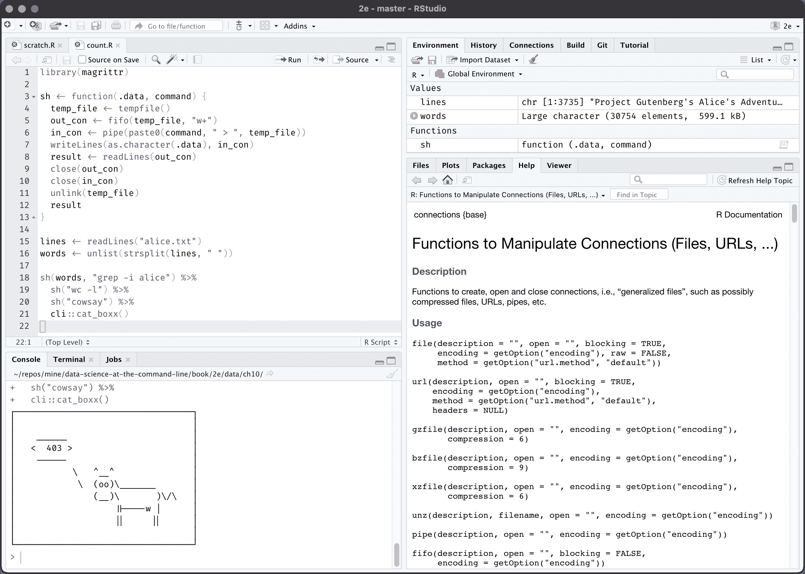
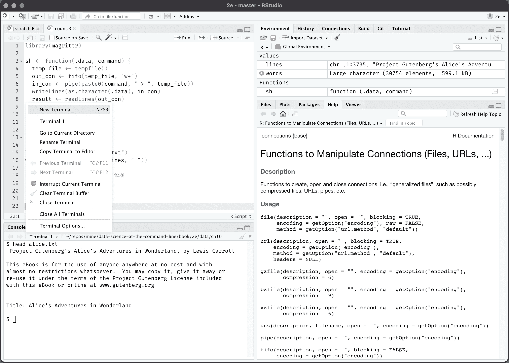

# 10 多语言数据科学

> 原文：<https://datascienceatthecommandline.com/2e/chapter-10-polyglot-data-science.html>

通晓多种语言的人。在我看来，通晓多种语言的数据科学家是指使用多种编程语言、工具和技术来获取、清理、探索和建模数据的人。

命令行刺激了多语言方法。命令行并不关心工具是用哪种编程语言编写的，只要它们遵循 Unix 的理念。我们在第 4 章中非常清楚地看到了这一点，在那里我们用 Bash、Python 和 R 创建了命令行工具。此外，我们直接在 CSV 文件上执行 SQL 查询，并从命令行执行 R 表达式。简而言之，在没有完全意识到的情况下，我们已经在做多语言数据科学了！

在这一章中，我将进一步翻转它。我将向您展示如何在各种编程语言和环境中利用命令行。因为说实话，我们不会把整个数据科学生涯都花在命令行上。对于我来说，当我分析一些数据时，我经常使用 RStudio IDE，当我实现一些东西时，我经常使用 Python。我利用一切有助于我完成工作的东西。

我感到欣慰的是，命令行通常触手可及，无需切换到不同的应用程序。它允许我快速运行命令，而无需切换到单独的应用程序，也不会中断我的工作流程。比如用`curl`下载文件，用`head`检查一段数据，用`git`创建备份，用`make`编译一个网站。一般来说，没有命令行，通常需要大量代码或者根本无法完成的任务。

## 10.1 概述

在本章中，您将学习如何:

*   在 JupyterLab 和 RStudio IDE 中运行终端
*   在 Python 和 R 中与任意命令行工具交互
*   在 Apache Spark 中使用 shell 命令转换数据

本章从以下文件开始:

```sh
$ cd /data/ch10

$ l
total 180K
drwxr-xr-x 2 dst dst 4.0K Mar  3 11:02 __pycache__/
-rw-r--r-- 1 dst dst 164K Mar  3 11:02 alice.txt
-rwxr--r-- 1 dst dst  408 Mar  3 11:02 count.py*
-rw-r--r-- 1 dst dst  460 Mar  3 11:02 count.R
-rw-r--r-- 1 dst dst 1.7K Mar  3 11:02 Untitled1337.ipynb
```

获取这些文件的说明在[第 2 章](chapter-2-getting-started.html#chapter-2-getting-started)中。任何其他文件都是使用命令行工具下载或生成的。

## 10.2 聚瞳

Project Jupyter 是一个开源项目，诞生于 2014 年的 IPython 项目，因为它发展到支持跨所有编程语言的交互式数据科学和科学计算。Jupyter 支持 40 多种编程语言，包括 Python、R、Julia 和 Scala。在这一节中，我将重点介绍 Python。

该项目包括 JupyterLab、Jupyter 笔记本和 Jupyter 控制台。我将从 Jupyter 控制台开始，因为它是以交互方式使用 Python 的最基本的控制台。这里有一个 Jupyter 控制台会话，演示了利用命令行的几种方法。

```sh
$ jupyter console
Jupyter console 6.4.0

Python 3.9.4 (default, Apr  4 2021, 19:38:44)
Type 'copyright', 'credits' or 'license' for more information
IPython 7.23.0 -- An enhanced Interactive Python. Type '?' for help.

In [1]: ! date # ➊
Sun May  2 01:45:06 PM CEST 2021

In [2]: ! pip install --upgrade requests
Requirement already satisfied: requests in /home/dst/.local/lib/python3.9/site-p
ackages (2.25.1)
Collecting requests
  Using cached requests-2.25.1-py2.py3-none-any.whl (61 kB)
  Downloading requests-2.25.0-py2.py3-none-any.whl (61 kB)
     |████████████████████████████████| 61 kB 2.1 MB/s
Requirement already satisfied: urllib3<1.27,>=1.21.1 in /home/dst/.local/lib/pyt
hon3.9/site-packages (from requests) (1.26.4)
Requirement already satisfied: certifi>=2017.4.17 in /home/dst/.local/lib/python
3.9/site-packages (from requests) (2020.12.5)
Requirement already satisfied: chardet<5,>=3.0.2 in /usr/lib/python3/dist-packag
es (from requests) (4.0.0)
Requirement already satisfied: idna<3,>=2.5 in /home/dst/.local/lib/python3.9/si
te-packages (from requests) (2.10)

In [3]: ! head alice.txt
Project Gutenberg's Alice's Adventures in Wonderland, by Lewis Carroll

This eBook is for the use of anyone anywhere at no cost and with
almost no restrictions whatsoever.  You may copy it, give it away or
re-use it under the terms of the Project Gutenberg License included
with this eBook or online at www.gutenberg.org

Title: Alice's Adventures in Wonderland

In [4]: len(open("alice.txt").read().strip().split("\n")) # ➋
Out[4]: 3735

In [5]: total_lines = ! < alice.txt wc -l

In [6]: total_lines
Out[6]: ['3735']

In [7]: int(total_lines[0]) ➌
Out[7]: 3735

In [8]: url = "https://www.gutenberg.org/files/11/old/11.txt"

In [9]: import requests # ➍

In [10]: with open("alice2.txt", "wb") as f:
 ...:    response = requests.get(url)
 ...:    f.write(response.content)
 ...: 

In [11]: ! curl '{url}' > alice3.txt ➎
  % Total    % Received % Xferd  Average Speed   Time    Time     Time  Current
                                 Dload  Upload   Total   Spent    Left  Speed
100  163k  100  163k    0     0   211k      0 --:--:-- --:--:-- --:--:--  211k

In [12]: ! ls alice*txt
alice2.txt  alice3.txt  alice.txt

In [13]: ! rm -v alice{2,3}.txt ➏
zsh:1: no matches found: alice(2, 3).txt

In [14]: ! rm -v alice{{2,3}}.txt
removed 'alice2.txt'
removed 'alice3.txt'

In [15]: lower = ["foo", "bar", "baz"]

In [16]: upper = ! echo '{"\n".join(lower)}' | tr '[a-z]' '[A-Z]' ➐

In [17]: upper
Out[17]: ['FOO', 'BAR', 'BAZ']

In [18]: exit
Shutting down kernel 
```

➊ 你可以运行任意的 shell 命令和管道比如`date`或者`pip`来安装一个 Python 包。
➋ 对比这一行 Pyton 代码，统计 *alice.txt* 中的行数与其下面`wc`的调用数。
➌ 注意，标准输出是以字符串列表的形式返回的，所以为了使用 *total_lines* 的值，获取第一项并将其转换为整数。
➍ 比较这个单元格和下一个要下载文件的单元格，调用它下面的`curl`。➎ 你可以用花括号将 Python 变量作为 shell 命令的一部分。➏:如果你想用字面上的花括号，就打两次。➐ 使用 Python 变量作为标准输入是可以做到的，但是正如你所看到的，变得相当棘手。

Jupyter Notebook 本质上是一个基于浏览器的 Jupyter 控制台版本。它支持利用命令行的相同方式，包括感叹号和 bash magic。最大的区别是，笔记本不仅可以包含代码，还可以包含标记文本、等式和数据可视化。由于这个原因，它在数据科学家中非常受欢迎。Jupyter Notebook 是一个独立的项目和环境，但我想使用 JupyterLab 来处理笔记本，因为它提供了一个更完整的 IDE。

图 Figure [10.1](chapter-10-polyglot-data-science.html#fig:jupyterlab)是 JupyterLab 的截图，显示了文件浏览器(左)、代码编辑器(中)、笔记本(右)、终端(下)。后三者都展示了利用命令行的方法。代码是我将在下一节讨论的内容。这个特殊的笔记本与我刚才讨论的控制台会话非常相似。终端为您运行命令行工具提供了一个完整的外壳。请注意，这个终端、代码和笔记本之间不可能有交互。因此，这个终端与打开一个单独的终端应用程序没有什么不同，但是当您在 Docker 容器内或远程服务器上工作时，它仍然很有帮助。


图 10.1:带有文件浏览器、代码编辑器、笔记本和终端的 JupyterLab 屏幕截图的这个 notebook 也包含了个叫做`%%bash`的单元,它可以让你写多行的 Bash 脚本. 因为使用 Python 变量更难, 我不推荐你使用这个方法. 你最好用一个单独的文件创建 Bash 脚本,并且用感叹号来执行它 (`!`).

## 10.3 Python

`subprocess`模块允许您从 Python 运行命令行工具，并连接到它们的标准输入和输出。相对于旧的`os.system()`功能，推荐使用该模块。默认情况下，它不在 shell 中运行，但是可以用`run()`函数的`shell`参数来改变它。

```sh
$ 6;1R6;1R6;1R6;1R6;1R6;1R6;1R6;1R6;1R6;1R6;1R6;1R6;1R6;1R6;1R6;1R6;1Rbat count.
py
zsh: command not found: 6
zsh: command not found: 1R6
zsh: command not found: 1R6
zsh: command not found: 1R6
zsh: command not found: 1R6
zsh: command not found: 1R6
zsh: command not found: 1R6
zsh: command not found: 1R6
zsh: command not found: 1R6
zsh: command not found: 1R6
zsh: command not found: 1R6
zsh: command not found: 1R6
zsh: command not found: 1R6
zsh: command not found: 1R6
zsh: command not found: 1R6
zsh: command not found: 1R6
zsh: command not found: 1R6
zsh: command not found: 1Rbat
```

➊ 利用命令行的推荐方式是使用`subprocess`模块的`run()`功能。
➋ 打开文件 *文件名*
➌ 将整个文本拆分成单词
➍ 运行命令行工具`grep`，其中 *单词* 作为标准输入传递。
➎ 标准输出为一个长字符串。在这里，我将它拆分到每个换行符上，以计算 *模式* 出现的次数。

这个命令行工具的用法如下:

```sh
$ ./count.py alice.txt alice
403
```

注意，第 15 行的`run`调用的第一个参数是一个字符串列表，其中第一项是命令行工具的名称，其余项是参数。这不同于传递单个字符串。这也意味着您没有任何其他的 shell 语法来支持诸如重定向和管道之类的事情。

## 10.4 R

在 R 中，有几种方法可以利用命令行。

在下面的例子中，我启动了一个 R 会话，并使用`[system2()](https://rdrr.io/r/base/system2.html)`函数计算字符串 *爱丽丝* 在书 *爱丽丝漫游奇境记* 中出现的次数。

```sh
$ R --quiet
> lines <- readLines("alice.txt") # ➊
> head(lines)
[1] "Project Gutenberg's Alice's Adventures in Wonderland, by Lewis Carroll"
[2] ""
[3] "This eBook is for the use of anyone anywhere at no cost and with"
[4] "almost no restrictions whatsoever.  You may copy it, give it away or"
[5] "re-use it under the terms of the Project Gutenberg License included"
[6] "with this eBook or online at www.gutenberg.org"
> words <- unlist(strsplit(lines, " ")) # ➋
> head(words)
[1] "Project"     "Gutenberg's" "Alice's"     "Adventures"  "in"
[6] "Wonderland,"
> alice <- system2("grep", c("-i", "alice"), input = words, stdout = TRUE) ➌
> head(alice)
[1] "Alice's" "Alice's" "ALICE'S" "ALICE'S" "Alice"   "Alice"
> length(alice) # ➍
```

➊ 读入文件 *alice.txt*
➋ 将文本拆分成单词
➌ 调用命令行工具`grep`只保留与字符串 *alice* 匹配的行。字符向量 *单词* 作为标准输入传递。
➍ 统计字符向量中的元素个数 *爱丽丝*

`[system2()](https://rdrr.io/r/base/system2.html)`的一个缺点是，它首先将字符向量写入一个文件，然后将其作为标准输入传递给命令行工具。当处理大量数据和大量调用时，这可能会有问题。

最好使用命名管道，因为这样就不会有数据写入磁盘，这样效率会高得多。这可以通过`[pipe()](https://rdrr.io/r/base/connections.html)`和`[fifo()](https://rdrr.io/r/base/connections.html)`功能完成。感谢吉姆·海斯特的建议。下面的代码演示了这一点:

```sh
> out_con <- fifo("out", "w+") # ➊
> in_con <- pipe("grep b > out") # ➋
> writeLines(c("foo", "bar"), in_con) ➌
> readLines(out_con) # ➍
[1] "bar"
```

➊ 函数`[fifo()](https://rdrr.io/r/base/connections.html)`创建一个特殊的先进先出文件，称为 *out* 。这只是对管道连接的引用(就像 stdin 和 stdout 一样)。实际上没有数据写入磁盘。
➋ 工具`grep`将只保留包含 a *b* 的行，并将它们写入命名管道 *输出* 。
➌ 将两个值写入 shell 命令的标准输入。
➍ 读取`grep`产生的标准输出作为字符向量。
➎ 清理连接并删除特殊文件。

因为这需要相当多的样板代码(创建连接、写、读、清理)，所以我写了一个助手函数`sh()`。使用`magrittr`包中的管道操作符(`%>%`，我将多个 shell 命令链接在一起。

```sh
> library(magrittr)
>
> sh <- function(.data, command) {
+   temp_file <- tempfile()
+   out_con <- fifo(temp_file, "w+")
+   in_con <- pipe(paste0(command, " > ", temp_file))
+   writeLines(as.character(.data), in_con)
+   result <- readLines(out_con)
+   close(out_con)
+   close(in_con)
+   unlink(temp_file)
+   result
+ }
>
> lines <- readLines("alice.txt")
> words <- unlist(strsplit(lines, " "))
>
> sh(words, "grep -i alice") %>%
+   sh("wc -l") %>%
+   sh("cowsay") %>%
+   cli::cat_boxx()
┌──────────────────────────────────┐
│                                  │
│    _____                         │
│   < 403 >                        │
│    -----                         │
│           \   ^__^               │
│            \  (oo)\_______       │
│               (__)\       )\/\   │
│                   ||----w |      │
│                   ||     ||      │
│                                  │
└──────────────────────────────────┘
>
> q("no")
```

## 10.5 工作室

RStudio IDE 可以说是使用 r 的最流行的环境。当您打开 RStudio 时，您将首先看到 console 选项卡:



图 10.2:打开控制台选项卡时的 RStudio IDE 

“终端”选项卡紧挨着“控制台”选项卡。如果提供完整的外壳:



图 10.3:打开“终端”选项卡的 RStudio IDE 

注意，就像 JupyterLab 一样，这个终端没有连接到控制台或任何 R 脚本。

## 10.6 阿帕奇 Spark

Apache Spark 是一个集群计算框架。当无法将数据存储在内存中时，你会求助于这只 800 磅重的大猩猩。Spark 本身是用 Scala 编写的，但是你也可以从 Python 使用 [PySpark](https://spark.apache.org/docs/latest/api/python/index.html)和从 R 使用 [SparkR](https://spark.apache.org/docs/latest/sparkr.html)或 [sparklyr](https://spark.rstudio.com/)与它交互。

数据处理和机器学习管道是通过一系列转换和一个最终动作来定义的。其中一个转换是`[pipe()](https://rdrr.io/r/base/connections.html)`转换，它允许您通过 shell 命令(比如 Bash 或 Perl 脚本)运行整个数据集。数据集中的项被写入标准输入，标准输出作为字符串的 RDD 返回。

在下面的会话中，我启动了一个 Spark shell，并再次计算了 *爱丽丝漫游奇境记* 中 *爱丽丝* 出现的次数。

```sh
$ spark-shell --master local[6]
Spark context Web UI available at http://3d1bec8f2543:4040
Spark context available as 'sc' (master = local[6], app id = local-16193763).
Spark session available as 'spark'.
Welcome to
      ____              __
     / __/__  ___ _____/ /__
    _\ \/ _ \/ _ `/ __/  '_/
   /___/ .__/\_,_/_/ /_/\_\   version 3.1.1
      /_/

Using Scala version 2.12.10 (OpenJDK 64-Bit Server VM, Java 11.0.10)
Type in expressions to have them evaluated.
Type :help for more information.

scala> val lines = sc.textFile("alice.txt") # ➊
lines: org.apache.spark.rdd.RDD[String] = alice.txt MapPartitionsRDD[1] at textF
ile at <console>:24

scala> lines.first()
res0: String = Project Gutenberg's Alice's Adventures in Wonderland, by Lewis Ca
rroll

scala> val words = lines.flatMap(line => line.split(" ")) # ➋
words: org.apache.spark.rdd.RDD[String] = MapPartitionsRDD[2] at flatMap at <con
sole>:25

scala> words.take(5)
res1: Array[String] = Array(Project, Gutenberg's, Alice's, Adventures, in)

scala> val alice = words.pipe("grep -i alice") ➌
alice: org.apache.spark.rdd.RDD[String] = PipedRDD[3] at pipe at <console>:25

scala> alice.take(5)
res2: Array[String] = Array(Alice's, Alice's, ALICE'S, ALICE'S, Alice)

scala> val counts = alice.pipe("wc -l") # ➍
counts: org.apache.spark.rdd.RDD[String] = PipedRDD[4] at pipe at <console>:25

scala> counts.collect()
res3: Array[String] = Array(64, 72, 94, 93, 67, 13) ➎

scala> counts.map(x => x.toInt).reduce(_ + _) ➏
res4: Int = 403

scala> sc.textFile("alice.txt").flatMap(line => line.split(" ")).pipe("grep -i a
lice").pipe("wc -l").map(x => x.toInt).reduce(_ + _)
res5: Int = 403 ➐ 
```

➊ 读取 *alice.txt* 使得每一行都是一个元素。
➋ 在空格上拆分各个元素。换句话说，每一行都被拆分成单词。
➌ 通过`grep`管道传输每个分区，只保留与字符串 *alice* 匹配的元素。
➍ 管每个分区通过`wc`来统计元素的数量。
➎ 每个分区有一个计数。➏将所有的计数相加得到最终的计数。注意，元素首先需要从字符串转换成整数。
➐ 将上述步骤组合成一个单一命令。

The `[pipe()](https://rdrr.io/r/base/connections.html)` transformation is also available in PySpark, SparkR, and sparklyr.

如果您想在管道中使用定制的命令行工具，那么您需要确保它存在于集群中的所有节点上(称为执行器)。一种方法是在使用`spark-submit`提交 Spark 应用程序时，用`--files`选项指定文件名。

Matei Zaharia 和 Bill Chambers(Apache Spark 的原作者)在他们的书 *Spark:权威指南* 中提到，这个`pipe`方法可能是 Spark 更有趣的方法之一。”那是相当的赞美！我认为 Apache Spark 的开发者增加了利用一项 50 年前的技术的能力，这太棒了。

## 10.7 总结

在本章中，你学习了在其他情况下使用命令行的几种方法，包括编程语言和其他环境。重要的是要认识到命令行并不存在于真空中。最重要的是你使用工具，有时结合使用，可靠地完成工作。

既然我们已经学完了所有的四个奥赛门章节和四个间奏曲章节，是时候总结一下了，在最后一章中结束。

## 10.8 进行进一步探索

*   也有不使用命令行直接集成两种编程语言的方法。例如，R 中的 [`reticulate`包](https://rstudio.github.io/reticulate/)允许你直接与 Python 交互。